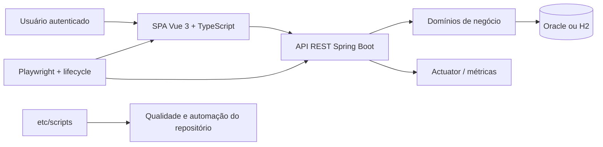
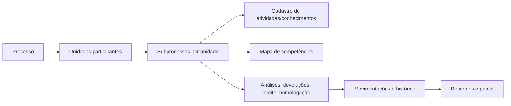

# SGC - Sistema de Gestão de Competências

Sistema corporativo para conduzir ciclos de **mapeamento**, **revisão** e **diagnóstico** de competências nas unidades organizacionais. O repositório reúne uma API Spring Boot, uma SPA Vue, uma suíte E2E Playwright e um toolkit de automação usado no desenvolvimento e na governança técnica do projeto.

## Visão executiva

O SGC opera sobre a hierarquia organizacional do órgão e trata cada unidade participante como um **subprocesso** dentro de um **processo** maior.

- **Mapeamento**: coleta atividades, conhecimentos e consolida o mapa inicial da unidade.
- **Revisão**: reaproveita o mapa vigente e conduz ajustes/homologações em novo ciclo.
- **Diagnóstico**: prepara a jornada de autoavaliação/monitoramento sobre competências já estruturadas.

Do ponto de vista arquitetural, o sistema é um **monólito modular no backend** com contratos REST e um **frontend SPA modular** que consome respostas já orientadas à interface.



## Mapa do repositório

```text
sgc/
├── backend/                 # API REST, regras de negócio, segurança, persistência e testes Java
├── frontend/                # SPA Vue 3, stores Pinia, componentes e testes Vitest
├── e2e/                     # Suíte Playwright, fixtures, helpers e lifecycle local
├── etc/
│   ├── docs/                # Guias técnicos e regras operacionais
│   ├── reqs/                # Regras de acesso e requisitos/CDUs de referência
│   └── scripts/             # CLI de automação e auditoria do projeto
├── deploy/                  # Artefatos auxiliares de implantação
├── compose.hom.yaml         # Stack de homologação
├── compose.monitoring.yaml  # Stack complementar de monitoramento
├── build.gradle.kts         # Orquestração Gradle raiz
└── package.json             # Comandos raiz para lint, typecheck, Vitest e Playwright
```

## Arquitetura em alto nível

### Backend

O backend está em `backend/src/main/java/sgc` e é organizado por domínio:

| Domínio | Responsabilidade principal |
|---|---|
| `processo` | ciclo macro do processo: criação, início, finalização, painel e ações em bloco |
| `subprocesso` | execução por unidade, workflow, contexto de tela, histórico, permissões estruturadas e validações |
| `mapa` | manutenção de mapas, atividades, conhecimentos, impactos e sugestões |
| `organizacao` | usuários, unidades, hierarquia, contexto autenticado e atribuições temporárias |
| `seguranca` | login, JWT, sanitização de entrada e `SgcPermissionEvaluator` |
| `alerta` | alertas da UI, notificações e fila/worker de e-mail |
| `relatorio` | relatórios de andamento e mapas vigentes |
| `parametros` | parâmetros/configurações dinâmicas |
| `feedback` | recebimento e gestão de feedbacks com screenshot |
| `comum` | infraestrutura compartilhada, exceções, config, monitoramento e modelo base |
| `e2e` | endpoints e adaptações exclusivas do perfil de testes E2E |

Padrões estruturais importantes:

- controllers REST em `...Controller`
- contratos HTTP em `dto/`
- entidades e repositórios em `model/`
- regras de negócio em `service/`
- DTOs expostos no lugar de entidades JPA
- testes arquiteturais com ArchUnit reforçando essas fronteiras

### Frontend

O frontend está em `frontend/src` e espelha os principais domínios do backend:

| Área | Papel |
|---|---|
| `views/` | telas dos casos de uso |
| `components/` | componentes reutilizáveis por domínio (`cadastro`, `mapa`, `processo`, `layout`, `administracao`...) |
| `stores/` | estado global com Pinia setup stores |
| `services/` | integração HTTP com a API |
| `composables/` | orquestração de fluxo, formulários, cache e tratamento de erro |
| `router/` | rotas modulares (`main.routes.ts`, `processo.routes.ts`, `unidade.routes.ts`) |
| `types/` | contratos TypeScript |
| `utils/` | utilitários transversais, incluindo logger e normalização de erros |

### Regra de acesso do sistema

A segurança funcional segue dois eixos centrais, implementados no backend e refletidos na UI:

- **leitura**: baseada na **hierarquia** da unidade responsável;
- **escrita**: baseada na **localização atual** do subprocesso.

Essa regra é centralizada no `SgcPermissionEvaluator` e complementada por serviços especializados de contexto e permissão.

## Fluxo conceitual do domínio



## Perfis e ambientes

### Perfis da aplicação

- `local`: desenvolvimento backend local
- `e2e`: automação com H2, `seed.sql` e endpoints `/e2e/*`
- `hom`: homologação
- `prod`: produção

### Banco e execução

- **H2** em memória para testes e fluxo E2E
- **Oracle** nos perfis de homologação/produção
- frontend servido por Vite em desenvolvimento e copiado para `backend/src/main/resources/static` no build integrado

## Como executar

### Pré-requisitos

- JDK 25
- Node.js 22+
- npm 11+

### Setup inicial

```bash
npm install
npm --prefix frontend install
npm --prefix etc/scripts install
```

### Backend

```bash
./gradlew :backend:bootRun -PENV=e2e
```

API em `http://localhost:10000`.

### Frontend

```bash
npm --prefix frontend run dev
```

SPA em `http://localhost:5173`.

### Stack E2E completa

```bash
node e2e/lifecycle.js
```

Esse script sobe backend, frontend e SMTP local, com suporte a `SGC_PERFIL=e2e|hom`.

## Build e empacotamento

### Build integrado

```bash
./gradlew build
```

A raiz usa tarefas Gradle para:

1. instalar dependências do frontend;
2. gerar `frontend/dist`;
3. copiar o build para `backend/src/main/resources/static`;
4. empacotar o backend com frontend embutido.

### Builds isolados

```bash
./gradlew :backend:build
./gradlew :frontend:buildVue
npm --prefix frontend run build:hom
npm --prefix frontend run build:prod
```

## Estratégia de testes

### Backend

Localização: `backend/src/test/java/sgc`

- `integracao/`: cenários CDU, testes de fluxo e regressões integradas sobre `BaseIntegrationTest`
- `arquitetura/`: regras ArchUnit
- testes `@WebMvcTest`: contrato e segurança de controllers
- testes de repositório/modelo por domínio
- suporte compartilhado em `testutils/`, `fixture/`, `util/`

Comando principal:

```bash
./gradlew --no-daemon --no-configuration-cache :backend:test
```

### Frontend

Localização principal: `frontend/src/__tests__` e testes co-localizados em subpastas `__tests__`

- testes de views e fluxos de tela
- testes de stores, router e infraestrutura HTTP
- testes de componentes e acessibilidade pontual

Comandos principais:

```bash
npm run typecheck
npm run lint
npm run test:unit
```

### E2E

Localização: `e2e/`

- arquivos `cdu-XX.spec.ts` mapeando casos de uso
- helpers por responsabilidade
- fixtures para autenticação, banco e preparação de estado
- `lifecycle.js` para subir a infra local

Comando principal:

```bash
npm run test:e2e
```

## Observabilidade e operação

- `application.yml` expõe Actuator por perfil
- perfis `hom` e `prod` habilitam `metrics`, `logfile` e `prometheus`
- `MonitoramentoAspect` e `FiltroMonitoramentoHttp` permitem diagnosticar lentidão
- `compose.monitoring.yaml` complementa a stack com Prometheus/Grafana

## Convenções relevantes do projeto

- código, mensagens e documentação em **Português brasileiro**
- usar **`codigo`** em vez de `id`
- backend com sufixos `Controller`, `Service`, `Repo`, `Dto`, `Mapper`
- exceções com prefixo `Erro`
- frontend com componentes em `PascalCase` e stores `use{Nome}Store`
- endpoints REST com ações explícitas via `POST` para mutações (`/atualizar`, `/excluir`, `/iniciar`...)

## Documentação por área

- [backend/README.md](backend/README.md)
- [frontend/README.md](frontend/README.md)
- [e2e/README.md](e2e/README.md)
- [etc/scripts/README.md](etc/scripts/README.md)
- [etc/reqs/regras-acesso.md](etc/reqs/regras-acesso.md)
- [etc/docs/regras-e2e.md](etc/docs/regras-e2e.md)
- [AGENTS.md](AGENTS.md)
