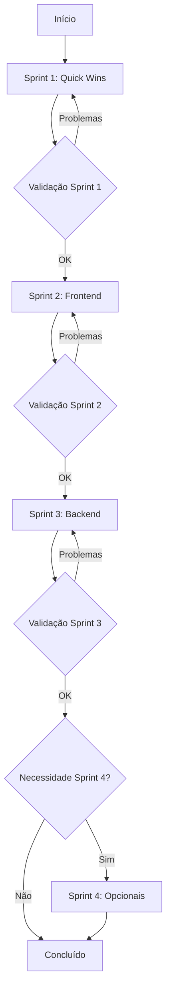

# 📚 Índice de Documentação de Refatorações - SGC

**Data de Criação:** 26 de Janeiro de 2026  
**Versão:** 1.0

---

## 📋 Visão Geral

Este índice consolida toda a documentação relacionada ao plano de refatorações do Sistema de Gestão de Competências (
SGC). Os documentos foram criados a partir da análise detalhada do `optimization-report.md` e organizados em sprints
executáveis.

---

## 🗂️ Estrutura da Documentação

### 📊 Documentos de Análise

| Documento                  | Descrição                                    | Tamanho | Link                            |
|----------------------------|----------------------------------------------|---------|---------------------------------|
| **optimization-report.md** | Relatório completo de análise de otimizações | 41KB    | [Ver](./optimization-report.md) |
| **refactoring-tracker.md** | Tracking consolidado de progresso            | 6KB     | [Ver](./refactoring-tracker.md) |

### 🚀 Documentos de Sprints

| Sprint       | Documento               | Duração             | Ações   | Prioridade          | Link                             |
|--------------|-------------------------|---------------------|---------|---------------------|----------------------------------|
| **Sprint 1** | backend-sprint-1.md     | 1-2 dias            | 5 ações | 🔴 Alta             | [Ver](./backend-sprint-1.md)     |
| **Sprint 2** | frontend-sprint-2.md    | 3-5 dias            | 3 ações | 🔴 Alta             | [Ver](./frontend-sprint-2.md)    |
| **Sprint 3** | backend-sprint-3.md     | 5-10 dias           | 3 ações | 🟡 Média            | [Ver](./backend-sprint-3.md)     |
| **Sprint 4** | otimizacoes-sprint-4.md | Conforme necessário | 3 ações | 🟢 Baixa (Opcional) | [Ver](./otimizacoes-sprint-4.md) |

---

## 🎯 Resumo por Sprint

### Sprint 1 - Quick Wins (Backend)

**Objetivo:** Remover complexidade desnecessária, ganhos rápidos  
**Duração:** 1-2 dias  
**Prioridade:** 🔴 Alta

**Ações:**

1. ✅ Alterar `FetchType.EAGER` → `LAZY` em UsuarioPerfil
2. ✅ Remover override de `findAll()` em AtividadeRepo
3. ✅ Remover cache de unidades (CacheConfig)
4. ✅ Converter subquery → JOIN em AtividadeRepo
5. ✅ Extrair `flattenTree` para utilitário compartilhado

**Resultado Esperado:**

- Código mais limpo
- ~35-40 linhas removidas
- Performance 10-20% melhor
- Base sólida para sprints futuras

---

### Sprint 2 - Consolidação Frontend

**Objetivo:** Frontend mais consistente, menos requisições HTTP  
**Duração:** 3-5 dias  
**Prioridade:** 🔴 Alta

**Ações:**

1. ✅ Criar composable `useErrorHandler` para stores
2. ✅ Consolidar queries duplicadas (AtividadeRepo, CompetenciaRepo)
3. ✅ Backend retornar dados completos (eliminar cascata de reloads)

**Resultado Esperado:**

- ~550 linhas de código eliminadas
- 25-40% menos requisições HTTP
- 40-60% latência reduzida
- Código DRY

---

### Sprint 3 - Refatoração Backend

**Objetivo:** Arquitetura mais clara, SRP respeitado  
**Duração:** 5-10 dias  
**Prioridade:** 🟡 Média

**Ações:**

1. ✅ Decompor `UnidadeFacade` em 3 services
2. ✅ Dividir `SubprocessoWorkflowService` (775 linhas)
3. ✅ Consolidar AtividadeService + CompetenciaService

**Resultado Esperado:**

- Arquivos > 500 linhas: 2 → 0
- SRP respeitado
- Melhor testabilidade
- Código mais manutenível

---

### Sprint 4 - Otimizações Opcionais

**Objetivo:** Refinamentos apenas se necessário  
**Duração:** Conforme necessidade  
**Prioridade:** 🟢 Baixa (Opcional)

**Ações:**

1. ⚠️ Implementar cache HTTP parcial (SE UX exigir)
2. ⚠️ Adicionar @EntityGraph (SE surgir N+1)
3. ⚠️ Decompor stores grandes (SE manutenção dificultar)

**Resultado Esperado:**

- Implementar APENAS com necessidade demonstrada
- Princípio YAGNI aplicado
- Medir antes e depois

---

## 📊 Métricas Consolidadas

### Baseline (Antes das Refatorações)

**Backend:**

- Classes > 500 linhas: 2 arquivos
- FetchType.EAGER: 2 ocorrências
- Código duplicado: ~800-1000 linhas
- Queries N+1: ~5 problemas
- Configuração de cache: 1 arquivo

**Frontend:**

- Stores > 300 linhas: 1 arquivo
- Código duplicado (error handling): ~500 linhas
- Requisições em cascata: ~3 por ação
- Código duplicado (flattenTree): 2+ ocorrências

### Metas (Após Todas as Sprints)

**Backend:**

- ✅ Classes > 500 linhas: 0 arquivos
- ✅ FetchType.EAGER: 0 ocorrências
- ✅ Redução de código: 800-1000 linhas
- ✅ Queries N+1: 0 problemas
- ✅ Configuração de cache: 0 arquivos

**Frontend:**

- ✅ Redução de requisições HTTP: 25-40%
- ✅ Código duplicado: ~500 linhas economizadas
- ✅ Cascata de reloads: Eliminada
- ✅ Error handling: Centralizado

**Performance:**

- ✅ Tempo de resposta: Melhoria de 20-35%
- ✅ Uso de memória: Redução de 10-15%

---

## 🔄 Fluxo de Execução Recomendado



**Ordem de Execução:**

1. **Sprint 1** (obrigatória) - Fundação limpa
2. **Sprint 2** (obrigatória) - Frontend otimizado
3. **Sprint 3** (recomendada) - Backend estruturado
4. **Sprint 4** (opcional) - Apenas se necessário

---

## ✅ Checklist Geral de Validação

### Por Sprint

- [ ] Todas as ações da sprint implementadas
- [ ] Testes unitários passam (100%)
- [ ] Testes E2E passam (100%)
- [ ] Nenhuma regressão de funcionalidade
- [ ] Código mais simples que antes
- [ ] Performance igual ou melhor
- [ ] Documentação atualizada
- [ ] Code review aprovado

### Geral (Após Todas as Sprints)

- [ ] Todas as métricas de baseline atingidas
- [ ] Redução de código confirmada
- [ ] Performance melhorada (medida)
- [ ] Arquitetura mais clara
- [ ] SRP respeitado
- [ ] Código DRY
- [ ] Testes mantidos/melhorados

---

## 📖 Guia de Uso para Agentes IA

### Como Usar Esta Documentação

1. **Ler optimization-report.md primeiro**
    - Entender contexto completo
    - Conhecer problemas identificados
    - Compreender filosofia (YAGNI, KISS, DRY)

2. **Consultar refactoring-tracker.md**
    - Ver status atual de cada ação
    - Entender dependências entre ações
    - Acompanhar progresso

3. **Executar sprints em ordem**
    - Começar pela Sprint 1
    - Seguir passos detalhados em cada documento
    - Validar antes de prosseguir

4. **Documentar decisões**
    - Atualizar tracker após cada ação
    - Registrar problemas encontrados
    - Documentar desvios do plano

### Estrutura de Cada Documento de Sprint

Todos os documentos de sprint seguem a mesma estrutura:

1. **Cabeçalho** - Objetivo, duração, foco
2. **Sumário de Ações** - Tabela consolidada
3. **Detalhamento de Cada Ação**:
    - Contexto
    - Problema identificado
    - Solução proposta
    - Passos para execução por IA
    - Critérios de validação
4. **Checklist de Validação da Sprint**
5. **Métricas de Sucesso**
6. **Próximos Passos**

### Comandos Importantes

**Backend:**

```bash
# Executar testes
./gradlew :backend:test

# Compilar
./gradlew :backend:build

# Testes específicos
./gradlew :backend:test --tests "*Unidade*"
```

**Frontend:**

```bash
# TypeCheck
npm run typecheck

# Lint
npm run lint

# Testes unitários
npm run test:unit

# Testes E2E
npm run test:e2e
```

---

## 🎯 Princípios e Filosofia

### YAGNI (You Aren't Gonna Need It)

Não otimizar até que problema seja demonstrado com dados reais.

### KISS (Keep It Simple, Stupid)

Código simples > código "inteligente".

### DRY (Don't Repeat Yourself)

Duplicação é pior que abstração moderada.

### SRP (Single Responsibility Principle)

Classes/Serviços com responsabilidade única.

### Measure, Don't Assume

Medir performance antes e depois. Não otimizar por "achismo".

---

## 📞 Suporte e Dúvidas

Para dúvidas sobre:

- **Arquitetura:** Consultar `backend/etc/docs/ARCHITECTURE.md`
- **ADRs:** Consultar `backend/etc/docs/adr/`
- **Padrões:** Consultar `AGENTS.md` e `GEMINI.md`
- **Testes E2E:** Consultar `/regras/e2e_regras.md`

---

## 📝 Histórico de Versões

| Versão | Data       | Mudanças                                          |
|--------|------------|---------------------------------------------------|
| 1.0    | 26/01/2026 | Criação inicial do índice e documentação completa |

---

**Mantido por:** Equipe de Desenvolvimento SGC  
**Versão Atual:** 1.0
