# 🎯 Test Coverage Restoration - Quick Start Guide

> **Mission:** Restore backend test coverage from current state to **>90% branch**, **>99% line/instruction** coverage.

---

## 📚 Documentation Structure

This effort has comprehensive documentation split into focused files:

| Document | Purpose | Read This If... |
|----------|---------|-----------------|
| **[test-coverage-plan.md](test-coverage-plan.md)** | Complete execution plan (35KB) | You're executing the plan or need full context |
| **[coverage-tracking.md](coverage-tracking.md)** | Live progress tracking (16KB) | You want to see current status and metrics |
| **[TEST-COVERAGE-README.md](TEST-COVERAGE-README.md)** ⭐ | This file - Quick start | You want a 5-minute overview |

---

## ⚡ TL;DR - Executive Summary

### The Problem
- Hundreds of backend tests were removed during refactoring
- Test coverage dropped significantly
- Need to restore coverage systematically with **valuable** tests

### The Solution
- 4-phase execution plan (9-15 days estimated)
- Focus on behavior testing, not implementation
- AI-agent friendly with detailed checklists
- Incremental delivery with continuous tracking

### The Goal
```
✅ BRANCH Coverage:      ≥90%
✅ LINE Coverage:        ≥99%
✅ INSTRUCTION Coverage: ≥99%
```

---

## 🚀 Quick Start (3 Steps)

### Step 1: Prerequisites

**Required:**
- Java 21 (project uses Spring Boot 4.0)
- Node.js (for coverage analysis scripts)
- Access to repository at `/home/runner/work/sgc/sgc`

**Check your setup:**
```bash
java --version    # Should be 21
node --version    # Any recent version
./gradlew --version
```

### Step 2: Establish Baseline

**Run these commands:**
```bash
cd /home/runner/work/sgc/sgc

# Run all existing tests
./gradlew :backend:test

# Generate coverage report
./gradlew :backend:jacocoTestReport

# Analyze gaps
node backend/etc/scripts/super-cobertura.js --run
```

**Document in [coverage-tracking.md](coverage-tracking.md):**
- Current BRANCH %
- Current LINE %
- Current INSTRUCTION %
- Top 20 files with lowest coverage (from `cobertura_lacunas.json`)

### Step 3: Choose Your Path

**Option A: Full Systematic Execution** (Recommended)
- Follow [test-coverage-plan.md](test-coverage-plan.md) phases 0-4
- Update [coverage-tracking.md](coverage-tracking.md) after each module
- Estimated: 9-15 days

**Option B: Quick Wins First** (Pragmatic)
- Start with Phase 1, critical modules only: `processo`, `subprocesso`, `seguranca`
- Get to >80% coverage quickly
- Expand later
- Estimated: 5-7 days

**Option C: AI Agent Delegation** (Scalable)
- Each module can be delegated to an AI agent
- Provide agent with: module name + [test-coverage-plan.md](test-coverage-plan.md) sections
- Agent executes and reports back
- Estimated: 3-5 days (parallel execution)

---

## 📋 The 4 Phases (Overview)

```mermaid
graph LR
    A[Phase 0<br/>Preparation<br/>1-2 days] --> B[Phase 1<br/>Foundation<br/>3-5 days]
    B --> C[Phase 2<br/>Integration<br/>2-3 days]
    C --> D[Phase 3<br/>Edge Cases<br/>2-3 days]
    D --> E[Phase 4<br/>Verification<br/>1-2 days]
    E --> F[✅ >90% Coverage]
```



### Phase 0: Preparation
**Why:** Clean code before measuring  
**What:** Remove redundant null checks, configure exclusions, establish baseline  
**Output:** Baseline metrics documented

### Phase 1: Foundation (Unit Tests)
**Why:** Core business logic coverage  
**What:** Test Services, Facades, Validators  
**Focus:** `processo`, `subprocesso`, `seguranca`, `mapa`, `organizacao`  
**Output:** >80% coverage on critical modules

### Phase 2: Integration Tests
**Why:** Validate end-to-end flows  
**What:** Test with Spring Context + H2 database  
**Focus:** Main workflows, persistence, events  
**Output:** 5-10 integration tests per module

### Phase 3: Edge Cases & Error Handling
**Why:** Robustness and reliability  
**What:** Test validations, exceptions, invalid states  
**Focus:** All `ErroNegocio` and `ErroValidacao` throws  
**Output:** >85% branch coverage

### Phase 4: Verification & Polish
**Why:** Achieve final goals  
**What:** Close gaps, improve quality, validate  
**Focus:** Remaining gaps, test quality, performance  
**Output:** >90% branch, >99% line/instruction ✅

---

## 🎯 Priority Modules (CRITICAL)

Work on these first to get maximum ROI:

| Module | Priority | Why Critical | Files | Est. Gap |
|--------|----------|--------------|-------|----------|
| **processo** | 🔴 CRITICAL | Central orchestrator of all workflows | ~35 | HIGH |
| **subprocesso** | 🔴 CRITICAL | State machine core | ~40 | HIGH |
| **seguranca.acesso** | 🔴 CRITICAL | Access control (security!) | ~25 | MEDIUM |
| **mapa** | 🔴 CRITICAL | Core domain (competencies) | ~30 | MEDIUM |
| **organizacao** | 🟡 HIGH | Hierarchical structure base | ~30 | MEDIUM |

---

## 🛠️ Essential Tools & Scripts

All scripts located in: `/backend/etc/scripts/`

### Coverage Analysis
```bash
# Detailed coverage table
node backend/etc/scripts/analisar-cobertura.js

# Gap analysis with prioritization
node backend/etc/scripts/super-cobertura.js --run
# Output: cobertura_lacunas.json
```

### Code Cleanup (Phase 0)
```bash
# Find redundant null checks
node backend/etc/scripts/auditar-verificacoes-null.js
# Output: null-checks-audit.txt, null-checks-analysis.md
```

### Test Prioritization
```bash
# Prioritize by complexity
node backend/etc/scripts/analisar-complexidade.js

# Prioritize by complexity + missing tests
python3 backend/etc/scripts/prioritize_tests.py
```

### Gradle Commands
```bash
# Run all tests
./gradlew :backend:test

# Only unit tests (fast)
./gradlew :backend:unitTest

# Only integration tests
./gradlew :backend:integrationTest

# Generate coverage report
./gradlew :backend:jacocoTestReport

# Verify coverage meets goals
./gradlew :backend:jacocoTestCoverageVerification

# Full quality check
./gradlew :backend:check
```

---

## 📖 Test Writing Guidelines (Quick Reference)

### ✅ DO: Test Behavior
```java
@Test
@DisplayName("deve alterar status para INICIADO")
void deveAlterarStatusParaIniciado() {
    Processo p = criarProcessoPendente();
    when(repo.findByCodigo(codigo)).thenReturn(Optional.of(p));
    
    service.iniciar(codigo);
    
    assertThat(p.getStatus()).isEqualTo(StatusProcesso.INICIADO);
}
```

### ❌ DON'T: Test Implementation
```java
@Test
void testIniciar() {
    service.iniciar(codigo);
    verify(repo, times(1)).findByCodigo(codigo);  // ❌ Too specific
    verify(repo, times(1)).save(any());           // ❌ Implementation detail
}
```

### ✅ DO: One Concept Per Test
```java
@Nested
@DisplayName("Criar Processo")
class CriarTest {
    @Test void deveRetornarProcessoNaoNulo() { /* ... */ }
    @Test void deveDefinirTituloCorretamente() { /* ... */ }
    @Test void deveDefinirStatusPendente() { /* ... */ }
}
```

### ❌ DON'T: Multiple Unrelated Asserts
```java
@Test
void testCriar() {
    ProcessoResponse r = service.criar(req);
    assertNotNull(r);              // If this fails,
    assertEquals("T", r.getTitulo());  // these don't run
    assertEquals(StatusProcesso.PENDENTE, r.getStatus());
    assertNotNull(r.getDataCriacao());
}
```

**Full patterns:** See [test-coverage-plan.md § Estratégia de Teste](test-coverage-plan.md#estratégia-de-teste)

---

## 📊 Success Metrics

### Primary (REQUIRED)
- ✅ BRANCH Coverage ≥90%
- ✅ LINE Coverage ≥99%
- ✅ INSTRUCTION Coverage ≥99%

### Secondary (DESIRED)
- ⏱️ Unit tests execute in <30s
- ⏱️ Integration tests execute in <2min
- ⏱️ Total test suite executes in <5min
- 📏 Zero tests with >5 unrelated assertions
- 📝 Zero tests without `@DisplayName`

### Quality Indicators
- No `verify()` calls for implementation details
- All tests use `@Nested` for organization
- All `@DisplayName` in Portuguese describing behavior
- All `throw new Erro*()` statements covered

---

## 🚨 Common Pitfalls (Avoid These)

1. **Testing Getters/Setters**
   - ❌ Don't test Lombok-generated code
   - ✅ Exclude DTOs and simple entities

2. **Testing MapStruct Mappers**
   - ❌ Don't test auto-generated `*MapperImpl`
   - ✅ Already excluded in `build.gradle.kts`

3. **Over-Mocking**
   - ❌ Don't mock everything
   - ✅ Use integration tests for complex interactions

4. **Brittle Tests**
   - ❌ Don't verify internal call counts
   - ✅ Test observable behavior only

5. **Giant Test Methods**
   - ❌ Don't put 10+ asserts in one test
   - ✅ Split into focused tests with `@Nested`

---

## 📞 Need Help?

### Documentation
- **Full Plan:** [test-coverage-plan.md](test-coverage-plan.md)
- **Tracking:** [coverage-tracking.md](coverage-tracking.md)
- **Test Quality Guide:** [backend/etc/docs/GUIA-MELHORIAS-TESTES.md](backend/etc/docs/GUIA-MELHORIAS-TESTES.md)
- **Backend Patterns:** [backend/etc/regras/backend-padroes.md](backend/etc/regras/backend-padroes.md)
- **Project Docs:** [DOCUMENTACAO.md](DOCUMENTACAO.md)

### Architecture References
- **Facade Pattern:** [ADR-001](backend/etc/docs/adr/ADR-001-facade-pattern.md)
- **Events Pattern:** [ADR-002](backend/etc/docs/adr/ADR-002-unified-events.md)
- **Security:** [ADR-003](backend/etc/docs/adr/ADR-003-security-architecture.md)
- **DTOs:** [ADR-004](backend/etc/docs/adr/ADR-004-dto-pattern.md)

### Questions & Issues
- **Blocked?** Document in [coverage-tracking.md § Bloqueios](coverage-tracking.md#-bloqueios-e-impedimentos)
- **Complex code?** Check `analisar-complexidade.js` output - might need refactoring first
- **Unclear behavior?** Consult module README in `/backend/src/main/java/sgc/<module>/README.md`

---

## 🎓 Best Practices Summary

1. **Start with Critical Modules:** processo → subprocesso → seguranca
2. **Test Behavior, Not Implementation:** Focus on what, not how
3. **Keep Tests Fast:** Unit tests <100ms, integration <1s
4. **One Concept Per Test:** Use `@Nested` and `@DisplayName`
5. **Update Tracking:** Document progress in [coverage-tracking.md](coverage-tracking.md)
6. **Run Coverage Frequently:** `./gradlew :backend:jacocoTestReport` after each module
7. **Validate Incrementally:** Don't wait until the end to check coverage
8. **Learn from Existing Tests:** Check `/backend/src/test/` for patterns

---

## ✨ Quick Win Checklist

If you only have 1 day, do this:

- [ ] Run baseline coverage (`jacocoTestReport`)
- [ ] Run `super-cobertura.js --run` to identify worst gaps
- [ ] Pick top 3 files with lowest coverage from critical modules
- [ ] Write tests for those 3 files following patterns
- [ ] Re-run coverage to validate improvement
- [ ] Document baseline and progress in `coverage-tracking.md`

This gives you experience with the process and immediate ROI.

---

**Last Updated:** 2026-02-01  
**Status:** 🟢 Ready for Execution  
**Next Action:** Establish baseline coverage metrics

---

_Remember: The goal is **valuable tests** that protect against regressions, not just hitting a coverage number. Quality over quantity._ ✨
