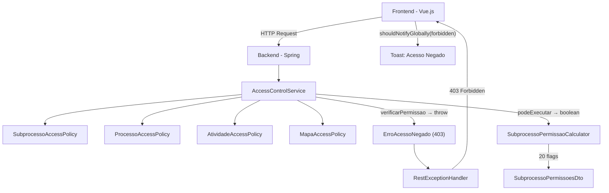

# Relatório: Problemas de Controle de Acesso — Avisos de "Acesso Negado"

**Data:** 2026-02-10  
**Objetivo:** Identificar por que usuários recebem avisos intrusivos de "Acesso Negado" e propor soluções para tornar o controle de acesso transparente.

---

## Resumo Executivo

O mecanismo de controle de acesso do SGC possui uma arquitetura sólida no backend, com políticas bem definidas para cada domínio. Porém, **a integração entre backend e frontend apresenta lacunas** que fazem com que ações proibidas sejam apresentadas ao usuário e depois rejeitadas com um erro 403, gerando a experiência intrusiva de "Acesso Negado".

O problema central é: **o frontend deveria esconder ações inacessíveis, não exibi-las e depois mostrar erro.**

---

## Arquitetura Atual



O backend oferece **dois caminhos**:
- `verificarPermissao()` → lança `ErroAcessoNegado` (403) — usado em operações de escrita
- `podeExecutar()` → retorna `boolean` — usado para calcular permissões de UI

O problema surge quando o **frontend não consome adequadamente as permissões** e o **backend lança exceções em contextos de visualização**.

---

## Achados

### 🔴 Problema 1: Guards client-side duplicados e desincronizados

**Localização:** [useProcessoView.ts](file:///Users/leonardo/sgc/frontend/src/composables/useProcessoView.ts)

O composable `useProcessoView` implementa **verificações de permissão client-side** que duplicam e divergem da lógica do backend:

```typescript
// useProcessoView.ts - Linhas 34-47
const mostrarBotoesBloco = computed(() => {
    return perfilStore.isAdmin || perfilStore.perfis.includes(Perfil.GESTOR);
});

const podeHomologarBloco = computed(() => {
    return perfilStore.isAdmin && unidadesElegiveisPorAcao.value.homologar.length > 0;
});

const podeDisponibilizarBloco = computed(() => {
    return perfilStore.isAdmin && unidadesElegiveisPorAcao.value.disponibilizar.length > 0;
});
```

Enquanto o backend já calcula essas permissões via [ProcessoDetalheBuilder](file:///Users/leonardo/sgc/backend/src/main/java/sgc/processo/service/ProcessoDetalheBuilder.java):

```java
// ProcessoDetalheBuilder.java - Linhas 36-38
.podeFinalizar(accessControlService.podeExecutar(usuario, Acao.FINALIZAR_PROCESSO, processo))
.podeHomologarCadastro(accessControlService.podeExecutar(usuario, Acao.HOMOLOGAR_CADASTRO_EM_BLOCO, processo))
.podeHomologarMapa(accessControlService.podeExecutar(usuario, Acao.HOMOLOGAR_MAPA_EM_BLOCO, processo))
```

> [!CAUTION]
> As verificações client-side usam apenas o perfil local, ignorando regras complexas do backend como hierarquia de unidades. Isso causa divergências: o botão aparece, mas a ação é negada pelo backend.

---

### 🔴 Problema 2: `ProcessoAcoes` usa perfil em vez de permissões do servidor

**Localização:** [ProcessoAcoes.vue](file:///Users/leonardo/sgc/frontend/src/components/ProcessoAcoes.vue)

```vue
<!-- ProcessoAcoes.vue - Linhas 8, 17, 27 -->
<BButton v-if="perfil === 'GESTOR'" ...>Aceitar em bloco</BButton>
<BButton v-if="perfil === 'ADMIN'" ...>Homologar em bloco</BButton>
<BButton v-if="perfil === 'ADMIN' && situacaoProcesso === 'EM_ANDAMENTO'" ...>Finalizar processo</BButton>
```

O componente **ignora completamente** os flags `podeFinalizar`, `podeHomologarCadastro` e `podeHomologarMapa` já calculados pelo backend e disponíveis no DTO `ProcessoDetalheDto`.

---

### 🔴 Problema 3: `abrirDetalhesUnidade` implementa controle client-side

**Localização:** [useProcessoView.ts](file:///Users/leonardo/sgc/frontend/src/composables/useProcessoView.ts#L114-L135)

```typescript
async function abrirDetalhesUnidade(row: any) {
    const isPropriaUnidade = perfilStore.unidadeSelecionada === row.codigo;
    const temPermissao = perfilStore.isAdmin ||
                       perfilStore.perfis.includes(Perfil.GESTOR) ||
                       perfilStore.perfilSelecionado === Perfil.GESTOR ||
                       (perfilStore.perfis.includes(Perfil.CHEFE) && isPropriaUnidade) ||
                       (perfilStore.perfilSelecionado === Perfil.CHEFE && isPropriaUnidade);

    if (!temPermissao) return; // Silencioso no clique, mas...
    // ...o backend lança 403 ao tentar obterDetalhes()
}
```

Esta função silenciosamente bloqueia cliques para usuários sem permissão, mas **mesmo quando permite a navegação**, o backend pode lançar 403 em [SubprocessoContextoService.obterDetalhes()](file:///Users/leonardo/sgc/backend/src/main/java/sgc/subprocesso/service/SubprocessoContextoService.java#L82-L83) — porque as regras client-side são mais simples que as do backend (não consideram hierarquia em detalhes).

---

### 🟡 Problema 4: Erros 403 tratados como notificação global intrusiva

**Localização:** [apiError.ts](file:///Users/leonardo/sgc/frontend/src/utils/apiError.ts#L147-L148)

```typescript
// apiError.ts - Linha 148
export function shouldNotifyGlobally(normalized: NormalizedError): boolean {
  return ['unauthorized', 'forbidden', 'network', 'unexpected'].includes(normalized.kind);
}
```

Quando um 403 ocorre, ele é classificado como `'forbidden'` e `shouldNotifyGlobally` retorna `true`, resultando em um **toast global** com título "Acesso Negado" — a experiência intrusiva reportada pelo usuário.

> [!IMPORTANT]
> O próprio [ESTRATEGIA-ERROS.md](file:///Users/leonardo/sgc/frontend/etc/docs/ESTRATEGIA-ERROS.md) define que erros 403 devem ser exibidos como `<BAlert>` inline (linha 186), mas `shouldNotifyGlobally` contradiz essa orientação.

---

### 🟡 Problema 5: `verificarPermissao` usado em contextos de visualização

**Localização:** [SubprocessoContextoService.java](file:///Users/leonardo/sgc/backend/src/main/java/sgc/subprocesso/service/SubprocessoContextoService.java#L82-L83)

```java
// SubprocessoContextoService.java - Linhas 82-83, 110-111
public SubprocessoDetalheDto obterDetalhes(Subprocesso sp, Usuario usuarioAutenticado) {
    accessControlService.verificarPermissao(usuarioAutenticado, Acao.VISUALIZAR_SUBPROCESSO, sp);
    // ...
}

public SubprocessoCadastroDto obterCadastro(Long codSubprocesso) {
    accessControlService.verificarPermissao(usuario, Acao.VISUALIZAR_SUBPROCESSO, sp);
    // ...
}
```

Operações de **leitura/visualização** lançam `ErroAcessoNegado` (403), o que causa erros intrusivos quando o usuário tenta abrir uma página de detalhes. O `verificarPermissao` é adequado para operações mutantes, mas **para visualização deveria degradar graciosamente**.

---

### 🟢 O que já funciona bem

| Componente | Status |
|---|---|
| [SubprocessoPermissaoCalculator](file:///Users/leonardo/sgc/backend/src/main/java/sgc/subprocesso/service/SubprocessoPermissaoCalculator.java) | ✅ Calcula 20 flags via `podeExecutar` |
| [CadAtividades.vue](file:///Users/leonardo/sgc/frontend/src/views/CadAtividades.vue) | ✅ Usa `permissoes?.podeEditarMapa`, `permissoes?.podeDisponibilizarCadastro` |
| [SubprocessoCards.vue](file:///Users/leonardo/sgc/frontend/src/components/SubprocessoCards.vue) | ✅ Usa `permissoes.podeEditarMapa`, `permissoes.podeVisualizarDiagnostico` |
| [SubprocessoHeader.vue](file:///Users/leonardo/sgc/frontend/src/components/SubprocessoHeader.vue) | ✅ Usa flags como `podeAlterarDataLimite`, `podeReabrirCadastro` |
| [VisMapa.vue](file:///Users/leonardo/sgc/frontend/src/views/VisMapa.vue) + [useVisMapa.ts](file:///Users/leonardo/sgc/frontend/src/composables/useVisMapa.ts) | ✅ Usa `podeValidarMapa`, `podeAceitarMapa`, `podeDevolverMapa` do servidor |

---

## Proposta de Solução

### Fase 1: Frontend — Usar permissões do servidor (elimina maioria dos problemas)

#### 1.1 Refatorar `ProcessoAcoes.vue`

Substituir guards baseados em perfil por flags do `ProcessoDetalheDto`:

```diff
 <BButton
-    v-if="perfil === 'ADMIN' && situacaoProcesso === 'EM_ANDAMENTO'"
+    v-if="podeFinalizar"
     @click="emit('finalizar')"
 >Finalizar processo</BButton>
```

O componente precisará receber as novas props `podeFinalizar`, `podeHomologarBloco`, etc.

#### 1.2 Refatorar `useProcessoView.ts`

Substituir computed properties baseadas em perfil por flags do DTO:

```diff
-const mostrarBotoesBloco = computed(() => {
-    return perfilStore.isAdmin || perfilStore.perfis.includes(Perfil.GESTOR);
-});
+const mostrarBotoesBloco = computed(() => {
+    return processo.value?.podeHomologarCadastro || processo.value?.podeHomologarMapa || false;
+});
```

#### 1.3 Refatorar `abrirDetalhesUnidade`

Remover a lógica client-side manual e confiar nas permissões do servidor ou simplesmente permitir a navegação (o servidor já protege):

```diff
 async function abrirDetalhesUnidade(row: any) {
     if (!row.clickable) return;
-    const temPermissao = perfilStore.isAdmin || ...;
-    if (!temPermissao) return;
     await router.push({...});
 }
```

---

### Fase 2: Frontend — Tratar 403 como erro inline, não toast global

#### 2.1 Reclassificar `forbidden` em `shouldNotifyGlobally`

```diff
 export function shouldNotifyGlobally(normalized: NormalizedError): boolean {
-  return ['unauthorized', 'forbidden', 'network', 'unexpected'].includes(normalized.kind);
+  return ['unauthorized', 'network', 'unexpected'].includes(normalized.kind);
 }
```

Com esta mudança, erros 403 serão tratados como **erros inline**, exibidos via o `ErrorAlert` (`<BAlert>`) já presente em vários views — conforme o padrão definido no [ESTRATEGIA-ERROS.md](file:///Users/leonardo/sgc/frontend/etc/docs/ESTRATEGIA-ERROS.md).

---

### Fase 3: Backend — Adicionar permissões faltantes ao `ProcessoDetalheDto`

O `ProcessoDetalheBuilder` já calcula 3 flags. Adicionar flags para ações em bloco que o frontend precisa:

```diff
 ProcessoDetalheDto dto = ProcessoDetalheDto.builder()
     .podeFinalizar(accessControlService.podeExecutar(usuario, Acao.FINALIZAR_PROCESSO, processo))
     .podeHomologarCadastro(...)
     .podeHomologarMapa(...)
+    .podeAceitarCadastroBloco(accessControlService.podeExecutar(usuario, Acao.VISUALIZAR_PROCESSO, processo))
+    .podeDisponibilizarMapaBloco(accessControlService.podeExecutar(usuario, Acao.DISPONIBILIZAR_MAPA, ...) /* verificar se faz sentido no contexto de Processo */)
     .build();
```

> [!NOTE]
> Algumas permissões de bloco dependem da situação dos subprocessos individuais, não do processo. Essas já são computadas corretamente no frontend via `unidadesElegiveisPorAcao` e podem continuar assim — desde que o guard de visibilidade dos botões use os flags do servidor em vez do perfil local.

---

### Fase 4 (Opcional): Backend — Degradação graciosa em leituras

Para endpoints de visualização, considerar retornar "acesso limitado" em vez de 403:

```java
// Em SubprocessoContextoService.obterDetalhes()
if (!accessControlService.podeExecutar(usuario, Acao.VISUALIZAR_SUBPROCESSO, sp)) {
    return SubprocessoDetalheDto.semPermissao(sp.getCodigo());
}
```

Isso eliminaria o cenário onde o usuário navega para uma página e recebe 403, e poderia mostrar uma mensagem amigável como "Você não tem permissão para visualizar este subprocesso."

---

## Priorização

| Prioridade | Ação | Impacto | Esforço |
|---|---|---|---|
| 🔴 Alta | 2.1 — Reclassificar 403 como inline | Elimina toasts intrusivos | Baixo |
| 🔴 Alta | 1.2 — Refatorar `useProcessoView` | Elimina botões visíveis mas inacessíveis | Médio |
| 🔴 Alta | 1.1 — Refatorar `ProcessoAcoes` | Elimina "Finalizar" visível sem permissão | Baixo |
| 🟡 Média | 1.3 — Refatorar `abrirDetalhesUnidade` | Remove lógica duplicada | Baixo |
| 🟡 Média | Fase 3 — Flags no `ProcessoDetalheDto` | Suporta guards server-side completos | Médio |
| 🟢 Baixa | Fase 4 — Degradação graciosa | Experiência de leitura melhor | Alto |
