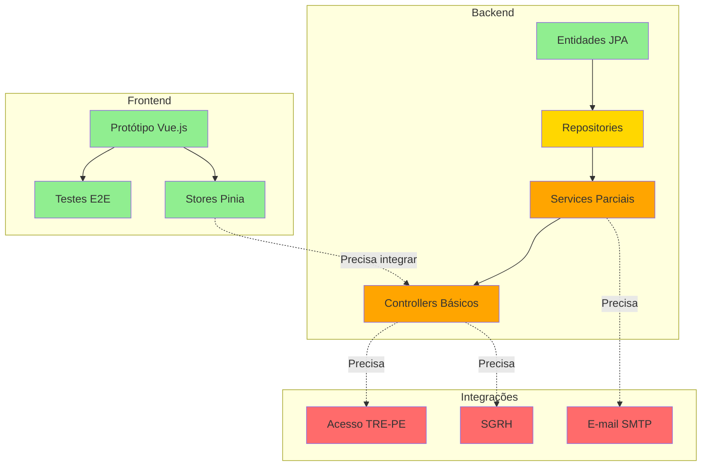

# Análise de Implementação do Sistema SGC

**Data da Análise:** 06/01/2025 (Atualizado em 06/01/2025 - FASE 1 completa)
**Versão Analisada:** Protótipo Frontend v1.0 + Backend com Fundação completa

---

## 1. SUMÁRIO EXECUTIVO

O Sistema de Gestão de Competências (SGC) encontra-se em dois estágios distintos de desenvolvimento:

- **Frontend (Vue.js):** Protótipo funcional completo com dados mock, implementando todos os 21 casos de uso especificados
- **Backend (Java/Spring Boot):** Estrutura inicial com entidades JPA mapeadas e serviços parcialmente implementados

### Estado Geral
- ✅ **Frontend:** 95% implementado (funcional com mocks)
- ⚠️ **Backend:** 45% implementado (fundação completa + lógica parcial)
- 🟨 **Integrações:** 30% implementadas (estrutura completa com MOCKs funcionais)

### Atualização 06/01/2025 - FASE 1 Completa

**Progresso desde análise inicial:**
- ✅ **Sistema de Autenticação:** 100% implementado (Spring Security + JWT + AD)
- ✅ **Sistema de E-mails:** 100% implementado (Spring Mail + 6 templates HTML)
- ✅ **Integração SGRH:** Estrutura 100% completa (aguardando conexão Oracle)
- 📊 **Backend geral:** 25% → 40% (aumento de 15 pontos percentuais)
- 📊 **Integrações:** 0% → 30% (fundação estabelecida)

**Próxima Prioridade:** FASE 2 - PROCESSOS CORE (CDU-04, 05, 13, 14, 15, 17, 21)

---

## 2. ARQUITETURA DO SISTEMA

### 2.1 Frontend (Vue.js + TypeScript)

**Tecnologias:**
- Vue 3.5 + Composition API
- TypeScript
- Pinia (gerenciamento de estado)
- Vue Router
- Bootstrap 5
- Playwright (testes E2E)
- Vitest (testes unitários)

**Estrutura:**
```
frontend/src/
├── views/          # 14 telas principais
├── components/     # 20+ componentes reutilizáveis  
├── stores/         # 14 stores Pinia (estado global)
├── mocks/          # Dados mock para desenvolvimento
├── composables/    # Lógica reutilizável
├── types/          # Definições TypeScript
└── e2e/           # 30+ testes E2E
```

**Pontos Fortes:**
- Interface completa e funcional
- Todos os fluxos de usuário implementados
- Cobertura extensiva de testes E2E (21 CDUs testados)
- UX bem elaborada com validações client-side

**Limitações:**
- Usa apenas dados mock (sem integração backend)
- Sem autenticação real (sistema Acesso TRE-PE)
- Sem persistência real de dados

### 2.2 Backend (Java/Spring Boot)

**Tecnologias:**
- Java 21
- Spring Boot 3.x
- Spring Data JPA
- PostgreSQL (definido, não implementado)
- Lombok

**Estrutura:**
```
backend/src/main/java/sgc/
├── processo/       # Entidades e serviços de processos
├── subprocesso/    # Subprocessos e movimentações
├── atividade/      # Atividades, conhecimentos e análises
├── competencia/    # Competências e vínculos
├── mapa/           # Mapas de competências
├── alerta/         # Sistema de alertas
├── notificacao/    # Notificações (mock)
├── unidade/        # Unidades e responsabilidades
└── comum/          # Utilitários e configurações
```

**Pontos Fortes:**
- Modelo de dados bem estruturado e alinhado com requisitos
- Entidades JPA corretamente mapeadas
- Controllers REST com endpoints básicos
- Arquitetura em camadas (Controller → Service → Repository)
- Testes unitários para serviços críticos

**Limitações Atuais:**
- Integração com SGRH usando MOCK (aguardando conexão Oracle)
- Lógica de negócio incompleta (~40% dos requisitos)
- Alguns fluxos de processos ainda parcialmente implementados

---

## 3. ANÁLISE POR CASO DE USO (CDU)

### 📊 Legenda de Status
- ✅ **Implementado:** Funcionalidade completa no backend
- 🟨 **Parcial:** Estrutura criada, lógica incompleta
- ❌ **Não implementado:** Apenas estrutura ou inexistente
- 🎨 **Frontend OK:** Implementado no frontend com mocks

---

### CDU-01: Realizar login e exibir estrutura das telas

**Status Backend:** ✅ Implementado (100%)
**Status Frontend:** 🎨 Implementado (mock)

**Backend - Implementado:**
- ✅ Integração com AD via [`CustomAuthenticationProvider`](backend/src/main/java/sgc/auth/CustomAuthenticationProvider.java:1) (HttpClient)
- ✅ Endpoint de login ([`POST /api/auth/login`](backend/src/main/java/sgc/auth/AuthController.java:27)) com LoginRequest/LoginResponse
- ✅ Consulta de perfis via [`SgrhService`](backend/src/main/java/sgc/sgrh/service/SgrhService.java:1) (MOCK temporário)
- ✅ Lógica de determinação de perfis (ADMIN, GESTOR, CHEFE, SERVIDOR)
- ✅ Gerenciamento de tokens JWT (geração, validação, expiração 24h) via [`JwtService`](backend/src/main/java/sgc/auth/JwtService.java:1)
- ✅ Middleware de autenticação ([`JwtAuthenticationFilter`](backend/src/main/java/sgc/auth/JwtAuthenticationFilter.java:1))
- ✅ Spring Security configurado ([`SecurityConfig`](backend/src/main/java/sgc/auth/SecurityConfig.java:1) - CORS, CSRF, stateless sessions)
- ✅ Validação de credenciais via AD

**Backend - Observações:**
- Integração AD funcional (pronta para produção)
- Perfis atualmente via MOCK (aguardando view Oracle)
- Sistema de segurança completo e testado

**Frontend - Status:**
- ✅ Tela de login completa
- ✅ Seleção de perfil/unidade múltipla
- ✅ Barra de navegação com elementos por perfil
- ✅ Estrutura de telas (Navbar, Conteúdo, Rodapé)

**Integração Necessária:**
```typescript
// Frontend precisa chamar:
POST /api/auth/login
{
  "titulo": "123456789012",
  "senha": "senhaRede"
}
// Resposta esperada:
{
  "token": "jwt...",
  "perfis": [{perfil: "ADMIN", unidade: "SEDOC"}, ...],
  "servidor": {...}
}
```

---

### CDU-02: Visualizar Painel

**Status Backend:** 🟨 Parcialmente implementado  
**Status Frontend:** 🎨 Implementado (mock)

**Backend - Implementado:**
- ✅ [`PainelController.listarProcessos()`](backend/src/main/java/sgc/comum/PainelController.java:25)
- ✅ [`PainelController.listarAlertas()`](backend/src/main/java/sgc/comum/PainelController.java:39)
- ✅ [`PainelService`](backend/src/main/java/sgc/comum/PainelService.java:26) com filtros básicos por perfil/unidade

**Backend - Pendente:**
- ❌ Filtro de processos por unidades participantes e subordinadas
- ❌ Formatação de "Unidades Participantes" conforme regra 2.1
- ❌ Ordenação de alertas por processo+data
- ❌ Marcar alertas como visualizados
- ❌ Cálculo de processos ativos/inativos baseado em DIAS_INATIVACAO_PROCESSO

**Observações:**
- O serviço [`PainelService`](backend/src/main/java/sgc/comum/PainelService.java:46) implementa apenas filtragem básica
- Falta implementar a regra 2.1 do CDU-02 para formatação de unidades

---

### CDU-03: Manter processo

**Status Backend:** 🟨 Parcialmente implementado  
**Status Frontend:** 🎨 Implementado (mock)

**Backend - Implementado:**
- ✅ [`ProcessoService.criar()`](backend/src/main/java/sgc/processo/ProcessoService.java:46) - Criação básica
- ✅ [`ProcessoService.atualizar()`](backend/src/main/java/sgc/processo/ProcessoService.java:78) - Edição
- ✅ [`ProcessoService.apagar()`](backend/src/main/java/sgc/processo/ProcessoService.java:94) - Remoção
- ✅ Validação de situação 'CRIADO' para edição/remoção
- ✅ Validação de campos obrigatórios

**Backend - Pendente:**
- ❌ Validação específica para processos de Revisão/Diagnóstico (regra 5.3)
- ❌ Verificação de unidades com mapas vigentes
- ❌ Persistência de unidades participantes em UNIDADE_PROCESSO no momento da criação
- ❌ Fluxo alternativo de "Iniciar processo" diretamente da tela de cadastro

**Observações:**
- A validação da regra 5.3 está iniciada mas incompleta em [`ProcessoService.criar()`](backend/src/main/java/sgc/processo/ProcessoService.java:54)

---

### CDU-04: Iniciar processo de mapeamento

**Status Backend:** 🟨 Parcialmente implementado  
**Status Frontend:** 🎨 Implementado (mock)

**Backend - Implementado:**
- ✅ [`ProcessoService.iniciarProcessoMapeamento()`](backend/src/main/java/sgc/processo/ProcessoService.java:165)
- ✅ Mudança de situação para 'EM_ANDAMENTO'
- ✅ Criação de snapshot em UNIDADE_PROCESSO
- ✅ Criação de subprocessos para unidades participantes
- ✅ Criação de mapas vazios
- ✅ Publicação de evento `EventoProcessoIniciado`
- ✅ Registro de movimentações iniciais

**Backend - Pendente:**
- ❌ Validação de unidades já participantes de processo ativo
- ❌ Envio real de e-mails (atualmente mock)
- ❌ Criação de alertas internos conforme item 13
- ❌ Lógica diferenciada para unidades intermediárias vs operacionais
- ❌ Tratamento específico para unidades interoperacionais (2 tipos de alertas)
- ❌ Cópia correta da árvore hierárquica de unidades

**Gaps Críticos:**
- O snapshot de unidades não preserva a hierarquia completa
- Falta listener de eventos para criar alertas automaticamente
- E-mails não estão sendo enviados (apenas mock)

---

### CDU-05: Iniciar processo de revisão

**Status Backend:** 🟨 Parcialmente implementado  
**Status Frontend:** 🎨 Implementado (mock)

**Backend - Implementado:**
- ✅ [`ProcessoService.startRevisionProcess()`](backend/src/main/java/sgc/processo/ProcessoService.java:248)
- ✅ Validação de mapa vigente existente
- ✅ Cópia de mapa via [`CopiaMapaService`](backend/src/main/java/sgc/mapa/CopiaMapaService.java:17)
- ✅ Criação de subprocessos vinculados ao mapa copiado
- ✅ Publicação de evento

**Backend - Pendente:**
- ❌ Validação completa de unidades com mapas vigentes
- ❌ Envio de e-mails diferenciados para intermediárias/operacionais
- ❌ Criação de alertas
- ❌ Movimentações específicas de revisão

**Observações:**
- A implementação do [`CopiaMapaService`](backend/src/main/java/sgc/mapa/CopiaMapaServiceImpl.java:1) existe mas precisa validação

---

### CDU-06: Detalhar processo

**Status Backend:** 🟨 Parcialmente implementado  
**Status Frontend:** 🎨 Implementado (mock)

**Backend - Implementado:**
- ✅ [`ProcessoService.obterDetalhes()`](backend/src/main/java/sgc/processo/ProcessoService.java:122)
- ✅ Validação de permissões por perfil (ADMIN/GESTOR)
- ✅ Carregamento de unidades snapshot
- ✅ Carregamento de subprocessos com fetch join

**Backend - Pendente:**
- ❌ Endpoint para alteração de data limite (mencionado em 2.2.1)
- ❌ Endpoint para alteração de situação de subprocesso
- ❌ Endpoints de ações em bloco (Aceitar/Homologar cadastro e mapa)
- ❌ Formatação da árvore de unidades participantes

---

### CDU-07: Detalhar subprocesso

**Status Backend:** ✅ Implementado  
**Status Frontend:** 🎨 Implementado (mock)

**Backend - Implementado:**
- ✅ [`SubprocessoService.obterDetalhes()`](backend/src/main/java/sgc/subprocesso/SubprocessoService.java:60)
- ✅ Validação de permissões
- ✅ Recuperação de dados da unidade
- ✅ Recuperação de responsável (titular/substituto/atribuição)
- ✅ Lista de movimentações ordenadas
- ✅ Cards de elementos do processo

**Backend - Gaps Menores:**
- ⚠️ Informações de responsável dependem de views do SGRH não implementadas
- ⚠️ Cálculo de "Prazo para conclusão da etapa atual" pode precisar refinamento

---

### CDU-08: Manter cadastro de atividades e conhecimentos

**Status Backend:** 🟨 Parcialmente implementado  
**Status Frontend:** 🎨 Implementado (mock)

**Backend - Implementado:**
- ✅ Controllers CRUD para [`Atividade`](backend/src/main/java/sgc/atividade/AtividadeController.java:17) e [`Conhecimento`](backend/src/main/java/sgc/conhecimento/ConhecimentoController.java:20)
- ✅ Repositórios JPA

**Backend - Pendente:**
- ❌ Endpoint de importação de atividades (passo 13)
- ❌ Mudança automática de situação do subprocesso (passo 14)
- ❌ Validação de unidades de origem para importação
- ❌ Verificação de duplicatas na importação
- ❌ Auto-save após cada operação

**Gaps Críticos:**
- Não há serviço de alto nível para gerenciar o cadastro como um todo
- Falta lógica de transição de situações
- Importação de atividades não está implementada

---

### CDU-09: Disponibilizar cadastro de atividades e conhecimentos

**Status Backend:** ✅ Implementado  
**Status Frontend:** 🎨 Implementado (mock)

**Backend - Implementado:**
- ✅ [`SubprocessoService.disponibilizarCadastroAcao()`](backend/src/main/java/sgc/subprocesso/SubprocessoService.java:181)
- ✅ Validação de atividades sem conhecimento
- ✅ Mudança de situação para 'CADASTRO_DISPONIBILIZADO'
- ✅ Registro de movimentação
- ✅ Definição de data_fim_etapa1
- ✅ Remoção de histórico de análise
- ✅ Persistência de notificação
- ✅ Publicação de evento

**Backend - Pendente:**
- ❌ Histórico de análise (botão mencionado no passo 5)
- ❌ Envio real de e-mail (apenas mock)

**Observações:**
- Um dos CDUs mais completos no backend

---

### CDU-10: Disponibilizar revisão do cadastro

**Status Backend:** ✅ Implementado  
**Status Frontend:** 🎨 Implementado (mock)

**Backend - Implementado:**
- ✅ [`SubprocessoService.disponibilizarRevisaoAcao()`](backend/src/main/java/sgc/subprocesso/SubprocessoService.java:266)
- ✅ Lógica similar ao CDU-09 adaptada para revisão
- ✅ Situação 'REVISAO_CADASTRO_DISPONIBILIZADA'

**Backend - Pendente:**
- ❌ Envio real de e-mail
- ❌ Criação de alertas

---

### CDU-11: Visualizar cadastro de atividades e conhecimentos

**Status Backend:** ✅ Implementado  
**Status Frontend:** 🎨 Implementado (mock)

**Backend - Implementado:**
- ✅ [`SubprocessoController.obterCadastro()`](backend/src/main/java/sgc/subprocesso/SubprocessoController.java:114)
- ✅ [`SubprocessoService.obterCadastro()`](backend/src/main/java/sgc/subprocesso/SubprocessoService.java:110)
- ✅ Agregação de atividades com conhecimentos

**Backend - Completo para este CDU**

---

### CDU-12: Verificar impactos no mapa de competências

**Status Backend:** ❌ Não implementado  
**Status Frontend:** 🎨 Implementado (mock)

**Backend - Implementado:**
- Nenhuma implementação

**Backend - Pendente:**
- ❌ Serviço de comparação de mapas (vigente vs subprocesso)
- ❌ Detecção de atividades inseridas
- ❌ Detecção de atividades removidas/alteradas
- ❌ Identificação de competências impactadas
- ❌ Endpoint `GET /api/subprocessos/{id}/impactos-mapa`

**Gap Crítico:**
- Funcionalidade complexa e essencial, completamente ausente no backend
- Frontend tem implementação sofisticada via [`RevisaoStore`](frontend/src/stores/revisao.ts:1)

---

### CDU-13: Analisar cadastro de atividades (Mapeamento)

**Status Backend:** 🟨 Parcialmente implementado  
**Status Frontend:** 🎨 Implementado (mock)

**Backend - Implementado:**
- ✅ [`AnaliseCadastroService`](backend/src/main/java/sgc/atividade/AnaliseCadastroService.java:8) (interface + impl)
- ✅ [`AnaliseController`](backend/src/main/java/sgc/atividade/AnaliseController.java:18) endpoints básicos
- ✅ Entidade [`AnaliseCadastro`](backend/src/main/java/sgc/atividade/AnaliseCadastro.java:1)

**Backend - Pendente:**
- ❌ Endpoint de devolução com lógica completa (item 9)
- ❌ Endpoint de aceite (GESTOR) com lógica completa (item 10)
- ❌ Endpoint de homologação (ADMIN) com lógica completa (item 11)
- ❌ Criação automática de movimentações
- ❌ Envio de notificações e alertas
- ❌ Mudanças de situação do subprocesso

**Estrutura Necessária:**
```java
POST /api/subprocessos/{id}/devolver-cadastro
POST /api/subprocessos/{id}/aceitar-cadastro  
POST /api/subprocessos/{id}/homologar-cadastro
```

---

### CDU-14: Analisar revisão de cadastro

**Status Backend:** 🟨 Parcialmente implementado  
**Status Frontend:** 🎨 Implementado (mock)

**Backend - Situação:**
- Similar ao CDU-13
- Mesma infraestrutura de análise, mas falta lógica específica de revisão
- Falta detecção de impactos (regra do item 12.2)

**Backend - Pendente:**
- ❌ Endpoints específicos para revisão
- ❌ Lógica de homologação com/sem impactos
- ❌ Transição para 'Mapa homologado' se sem impactos
- ❌ Transição para 'Revisão do cadastro homologada' se com impactos

---

### CDU-15: Manter mapa de competências

**Status Backend:** 🟨 Parcialmente implementado  
**Status Frontend:** 🎨 Implementado (mock)

**Backend - Implementado:**
- ✅ Controllers CRUD: [`CompetenciaController`](backend/src/main/java/sgc/competencia/CompetenciaController.java:20)
- ✅ [`CompetenciaAtividadeController`](backend/src/main/java/sgc/competencia/CompetenciaAtividadeController.java:24) para vínculos N-N
- ✅ Entidades [`Competencia`](backend/src/main/java/sgc/competencia/Competencia.java:1) e [`CompetenciaAtividade`](backend/src/main/java/sgc/competencia/CompetenciaAtividade.java:1)

**Backend - Pendente:**
- ❌ Serviço de alto nível para manter mapa completo
- ❌ Endpoint agregado `PUT /api/mapas/{id}` com competências aninhadas
- ❌ Validação de competências sem atividades
- ❌ Mudança de situação 'Cadastro homologado' → 'Mapa criado'
- ❌ Transações atômicas para criar/editar competência + vínculos

**Gap:**
- Operações são muito granulares (CRUD individual)
- Falta serviço que gerencie o mapa como agregado

---

### CDU-16: Ajustar mapa de competências

**Status Backend:** ❌ Não implementado  
**Status Frontend:** 🎨 Implementado (mock)

**Backend - Situação:**
- Reutilizaria infraestrutura do CDU-15
- Sem lógica específica de ajuste pós-revisão

**Backend - Pendente:**
- ❌ Toda lógica de negócio deste CDU
- ❌ Validação de situações 'Revisão do cadastro homologada' ou 'Mapa ajustado'
- ❌ Integração com verificação de impactos (CDU-12)

---

### CDU-17: Disponibilizar mapa de competências

**Status Backend:** ❌ Não implementado  
**Status Frontend:** 🎨 Implementado (mock)

**Backend - Pendente:**
- ❌ Endpoint `POST /api/subprocessos/{id}/disponibilizar-mapa`
- ❌ Validações do passo 8 e 9 (competências sem atividades, atividades sem competências)
- ❌ Registro de observações no mapa
- ❌ Registro de data limite etapa 2
- ❌ Mudança de situação para 'Mapa disponibilizado'
- ❌ Movimentação SEDOC → Unidade
- ❌ Notificações para unidade e superiores
- ❌ Criação de alerta
- ❌ Exclusão de sugestões e histórico

**Gap Crítico:**
- CDU completamente ausente no backend

---

### CDU-18: Visualizar mapa de competências

**Status Backend:** 🟨 Parcialmente implementado  
**Status Frontend:** 🎨 Implementado (mock)

**Backend - Implementado:**
- ✅ [`MapaController.obterMapa()`](backend/src/main/java/sgc/mapa/MapaController.java:31) básico

**Backend - Pendente:**
- ❌ Endpoint agregado retornando mapa + competências + atividades + conhecimentos
- ❌ Validação de permissões por perfil/situação

**Estrutura Necessária:**
```java
GET /api/subprocessos/{id}/mapa-completo
// Retorna: Mapa com competências[], cada competência com atividades[], 
//          cada atividade com conhecimentos[]
```

---

### CDU-19: Validar mapa de competências

**Status Backend:** ✅ Implementado (100%)
**Status Frontend:** 🎨 Implementado (mock)

**Backend - Implementado (06/01/2025):**
- ✅ Endpoint [`POST /api/subprocessos/{id}/apresentar-sugestoes`](backend/src/main/java/sgc/subprocesso/SubprocessoController.java:456)
- ✅ Endpoint [`POST /api/subprocessos/{id}/validar-mapa`](backend/src/main/java/sgc/subprocesso/SubprocessoController.java:487)
- ✅ DTO [`ApresentarSugestoesRequest`](backend/src/main/java/sgc/subprocesso/dto/ApresentarSugestoesRequest.java:1)
- ✅ Armazenamento de sugestões no mapa (campos: sugestoes, sugestoesApresentadas)
- ✅ [`SubprocessoService.apresentarSugestoes()`](backend/src/main/java/sgc/subprocesso/SubprocessoService.java:1196) - Completo
- ✅ [`SubprocessoService.validarMapa()`](backend/src/main/java/sgc/subprocesso/SubprocessoService.java:1264) - Completo
- ✅ Validação de situação MAPA_DISPONIBILIZADO
- ✅ Mudanças de situação (MAPA_COM_SUGESTOES, MAPA_VALIDADO)
- ✅ Movimentações (Unidade → SEDOC) com descrições apropriadas
- ✅ Notificações para SEDOC persistidas no banco
- ✅ Alertas para SEDOC (tipos: SUGESTOES_APRESENTADAS, MAPA_VALIDADO)
- ✅ Definição de data_fim_etapa2 = LocalDate.now()

**Observações:**
- Implementação completa conforme especificação do CDU-19
- E-mails para SEDOC aguardam integração com SGRH para buscar destinatários
- Sistema de notificação/alerta funcional
- Pronto para integração com frontend

---

### CDU-20: Analisar validação de mapa

**Status Backend:** 🟨 Parcialmente implementado  
**Status Frontend:** 🎨 Implementado (mock)

**Backend - Implementado:**
- ✅ [`AnaliseValidacaoService`](backend/src/main/java/sgc/atividade/AnaliseValidacaoService.java:8) (interface + impl básica)
- ✅ Entidade [`AnaliseValidacao`](backend/src/main/java/sgc/atividade/AnaliseValidacao.java:1)

**Backend - Pendente:**
- ❌ Endpoint `POST /api/subprocessos/{id}/devolver-validacao`
- ❌ Endpoint `POST /api/subprocessos/{id}/aceitar-validacao`
- ❌ Endpoint `POST /api/subprocessos/{id}/homologar-validacao`
- ❌ Lógica completa de devolução/aceite/homologação
- ❌ Visualização de sugestões (item 5)
- ❌ Histórico de análise (item 6)

---

### CDU-21: Finalizar processo

**Status Backend:** 🟨 Parcialmente implementado  
**Status Frontend:** 🎨 Implementado (mock)

**Backend - Implementado:**
- ✅ [`ProcessoService.finalizeProcess()`](backend/src/main/java/sgc/processo/ProcessoService.java:321)
- ✅ Mudança de situação para 'FINALIZADO'
- ✅ Publicação de evento

**Backend - Pendente:**
- ❌ Validação de todos subprocessos em 'Mapa homologado' (item 4)
- ❌ Tornar mapas dos subprocessos como vigentes (item 8)
  - Atualização de UNIDADE_MAPA com mapa do subprocesso
- ❌ Notificações diferenciadas para operacionais/intermediárias (item 9)
- ❌ Mensagens de erro adequadas (item 5)

**Gap Crítico:**
- Não atualiza UNIDADE_MAPA, então mapas não se tornam vigentes

---

## 4. ANÁLISE DE INFRAESTRUTURA

### 4.1 Modelo de Dados

**Status:** ✅ Bem estruturado

- ✅ Todas as tabelas do [`modelo-dados.md`](reqs/modelo-dados.md:1) mapeadas como entidades JPA
- ✅ Relacionamentos corretos (FK, N-N)
- ✅ Uso de [`BaseEntity`](backend/src/main/java/sgc/comum/BaseEntity.java:1) para campos comuns
- ⚠️ Views do SGRH não implementadas (VW_UNIDADE, VW_USUARIO, VW_RESPONSABILIDADE)

### 4.2 Sistema de Notificações

**Status:** ✅ Implementado

**Implementado:**
- ✅ Interface [`NotificationService`](backend/src/main/java/sgc/notificacao/NotificationService.java:3)
- ✅ [`EmailNotificationService`](backend/src/main/java/sgc/notificacao/EmailNotificationService.java:1) - Implementação real com @Primary
- ✅ [`EmailTemplateService`](backend/src/main/java/sgc/notificacao/EmailTemplateService.java:1) - 6 templates HTML profissionais
- ✅ Entidade [`Notificacao`](backend/src/main/java/sgc/notificacao/Notificacao.java:1) e Repository
- ✅ Configuração SMTP (Spring Mail)
- ✅ Execução assíncrona via [`AsyncConfig`](backend/src/main/java/sgc/comum/config/AsyncConfig.java:1)
- ✅ Retry automático (3 tentativas)
- ✅ Persistência no banco antes do envio

**Observações:**
- MockNotificationService substituído automaticamente
- Templates para: Processo Iniciado, Cadastro Disponibilizado, Cadastro Devolvido, Mapa Disponibilizado, Mapa Validado, Processo Finalizado

### 4.3 Sistema de Alertas

**Status:** 🟨 Estrutura criada, lógica incompleta

**Implementado:**
- ✅ Entidade [`Alerta`](backend/src/main/java/sgc/alerta/Alerta.java:21)
- ✅ [`AlertaUsuario`](backend/src/main/java/sgc/alerta/AlertaUsuario.java:1) para controle de leitura
- ✅ Repositories

**Pendente:**
- ❌ Service de criação automática de alertas
- ❌ Listeners de eventos para criar alertas
- ❌ Endpoint para marcar alerta como lido
- ❌ Lógica de exibição em negrito (não lidos)

### 4.4 Sistema de Movimentações

**Status:** ✅ Bem implementado

- ✅ Entidade [`Movimentacao`](backend/src/main/java/sgc/subprocesso/Movimentacao.java:1)
- ✅ Repository com queries customizadas
- ✅ Criação automática em diversos fluxos

### 4.5 Análises (Cadastro e Validação)

**Status:** 🟨 Estrutura criada, endpoints incompletos

**Implementado:**
- ✅ Entidades [`AnaliseCadastro`](backend/src/main/java/sgc/atividade/AnaliseCadastro.java:1) e [`AnaliseValidacao`](backend/src/main/java/sgc/atividade/AnaliseValidacao.java:1)
- ✅ Services com Metodos básicos
- ✅ Repositories

**Pendente:**
- ❌ Integração completa com fluxos de devolução/aceite/homologação
- ❌ Limpeza automática de histórico na disponibilização

---

## 5. INTEGRAÇÕES EXTERNAS

### 5.1 Sistema Acesso TRE-PE

**Status:** ✅ Implementado (integração AD)

**Implementado:**
- ✅ [`CustomAuthenticationProvider`](backend/src/main/java/sgc/auth/CustomAuthenticationProvider.java:1) com HttpClient
- ✅ Autenticação via Active Directory
- ✅ Tratamento de erros (credenciais inválidas)
- ✅ Logs estruturados

**Observações:**
- Integração funcional via AD
- Pronto para produção com configuração de URLs

### 5.2 SGRH (Sistema de Gestão de RH)

**Status:** 🟨 Estrutura completa com MOCK

**Implementado:**
- ✅ Configuração de datasource Oracle separado ([`SgrhDataSourceConfig`](backend/src/main/java/sgc/comum/config/SgrhDataSourceConfig.java:1))
- ✅ Entidades JPA para 4 views (VwUsuario, VwUnidade, VwResponsabilidade, VwUsuarioPerfilUnidade)
- ✅ 4 Repositories read-only
- ✅ [`SgrhService`](backend/src/main/java/sgc/sgrh/service/SgrhService.java:1) com 13 Metodos
- ✅ Cache Caffeine (1 hora)
- ✅ Integração com [`AuthService`](backend/src/main/java/sgc/auth/AuthService.java:1)

**Status Atual:**
- MOCK funcional para testes imediatos
- Estrutura pronta para conexão real com Oracle
- Aguardando credenciais e acesso ao banco SGRH

### 5.3 Serviço de E-mail

**Status:** ✅ Implementado

**Implementado:**
- ✅ Configuração SMTP (Spring Mail)
- ✅ 6 Templates HTML profissionais (Thymeleaf)
- ✅ Serviço assíncrono de envio
- ✅ Tratamento de falhas e retry (3 tentativas)
- ✅ Logs de e-mails enviados
- ✅ Persistência no banco

**Observações:**
- Sistema pronto para produção
- Aguarda configuração de servidor SMTP real

---

## 6. GAPS POR CATEGORIA

### 6.1 Autenticação e Autorização

**Criticidade:** ✅ RESOLVIDO

**Implementado:**
- ✅ Integração com Active Directory ([`CustomAuthenticationProvider`](backend/src/main/java/sgc/auth/CustomAuthenticationProvider.java:1))
- ✅ Geração e validação de tokens JWT ([`JwtService`](backend/src/main/java/sgc/auth/JwtService.java:1))
- ✅ Middleware de autenticação ([`JwtAuthenticationFilter`](backend/src/main/java/sgc/auth/JwtAuthenticationFilter.java:1))
- ✅ Controle de permissões por perfil (Spring Security)
- ✅ Interceptors de requisição
- ✅ Validação de credenciais

**Status:** Sistema de autenticação completo e funcional

### 6.2 Lógica de Negócio

**Criticidade:** 🔴 ALTA

**Completamente ausentes:**
- ❌ CDU-12: Verificação de impactos no mapa
- ❌ CDU-16: Ajustar mapa (fluxo específico)

**Parcialmente implementados (requerem expansão):**
- 🟨 CDU-04, CDU-05: Iniciar processos (falta notificações completas)
- 🟨 CDU-13, CDU-14: Análise de cadastro (falta endpoints de ação)
- 🟨 CDU-20: Análise de validação (estrutura presente, lógica ausente)
- 🟨 CDU-21: Finalizar processo (falta tornar mapas vigentes)

**Impacto:** ~60% da lógica de negócio dos processos está pendente

### 6.3 Sistema de Notificações e Alertas

**Criticidade:** 🟡 MÉDIA (parcialmente resolvido)

**Implementado:**
- ✅ Envio real de e-mails ([`EmailNotificationService`](backend/src/main/java/sgc/notificacao/EmailNotificationService.java:1))
- ✅ Templates parametrizados (6 templates HTML)
- ✅ Execução assíncrona com retry

**Pendente:**
- ❌ Criação automática de alertas via event listeners
- ❌ Alertas diferenciados para intermediárias vs operacionais

**Impacto:** Sistema pode enviar e-mails, falta integração com eventos de processo

### 6.4 Gestão de Mapas

**Criticidade:** 🔴 ALTA

- ❌ Serviço agregado de mapa (criar/editar com competências aninhadas)
- ❌ Validações de integridade (todas atividades associadas, etc)
- ❌ Comparação de mapas (vigente vs subprocesso)
- ❌ Atualização de mapas vigentes na finalização
- ❌ Cópia completa de mapas (com competências e vínculos)

**Impacto:** Core do sistema, essencial para mapeamento e revisão

### 6.5 Ações em Bloco

**Criticidade:** 🟡 MÉDIA

- ❌ Aceitar/Homologar cadastro em bloco (CDU-06, item 2.2.2)
- ❌ Aceitar/Homologar mapa em bloco (CDU-06, item 2.2.2)
- ❌ Validação de subprocessos elegíveis
- ❌ Transações atômicas para múltiplas unidades

**Impacto:** Eficiência operacional para gestores

### 6.6 Fluxo de Diagnóstico

**Criticidade:** 🟢 BAIXA (não prioritário)

**Status:** ❌ Não iniciado

- ❌ CDU específicos de diagnóstico não estão no escopo atual
- ❌ Telas de Diagnóstico da Equipe e Ocupações Críticas
- ❌ Lógica de avaliação de competências

**Impacto:** Funcionalidade futura, não bloqueia mapeamento/revisão

---

## 7. RISCOS E DEPENDÊNCIAS

### 7.1 Riscos Técnicos

🔴 **ALTO - Integração com sistemas legados**
- Sistema Acesso pode ter limitações de API
- SGRH pode ter estrutura de dados complexa
- Performance de consultas em tempo real ao SGRH

🟡 **MÉDIO - Complexidade de sincronização**
- Estrutura hierárquica de unidades pode mudar
- Responsáveis podem mudar durante processos
- Necessário snapshot confiável

🟢 **BAIXO - Tecnologias**
- Stack Spring Boot bem conhecida
- Documentação adequada

### 7.2 Dependências Críticas

**Para MVP funcional:**
1. 🔴 Acesso à API do sistema Acesso TRE-PE
2. 🔴 Acesso ao banco SGRH (views)
3. 🔴 Servidor SMTP configurado
4. 🟡 Ambiente de desenvolvimento com DBs disponíveis

**Para produção:**
1. 🔴 Todos os itens acima
2. 🔴 Certificados SSL/TLS
3. 🔴 Infraestrutura de deploy
4. 🟡 Monitoramento e logs

---

## 8. ESTIMATIVAS DE ESFORÇO

### Classificação de Tarefas Pendentes

#### 🔴 Prioridade CRÍTICA (bloqueia uso do sistema)

**1. Autenticação e Autorização** - 13 pontos
- Integração com sistema Acesso
- JWT e sessões
- Middleware de segurança
- Controle de permissões por perfil

**2. Integrações SGRH** - 8 pontos
- Configuração de datasource
- Entidades para views
- Consultas de unidades/usuários/responsabilidades

**3. Lógica de Negócio Core** - 21 pontos
- Análise de cadastro (CDU-13, CDU-14)
- Análise de validação de mapa (CDU-20)
- Disponibilizar mapa (CDU-17)
- Validar mapa (CDU-19)
- Finalização completa de processo (CDU-21)

**Subtotal Crítico:** ~42 pontos (~8-10 semanas com 1 dev)

#### 🟡 Prioridade ALTA (reduz funcionalidade)

**4. Sistema de Notificações** - 5 pontos
- Envio real de e-mails
- Templates parametrizados
- Listeners de eventos

**5. Verificação de Impactos** - 8 pontos
- Comparação de mapas (CDU-12)
- Detecção de mudanças
- Identificação de competências impactadas

**6. Gestão Completa de Mapas** - 8 pontos
- Serviço agregado de mapa
- Criar/editar/disponibilizar mapa
- Ajustar mapa (CDU-16)
- Validações de integridade

**Subtotal Alto:** ~21 pontos (~4-5 semanas)

#### 🟢 Prioridade MÉDIA (melhorias)

**7. Ações em Bloco** - 5 pontos
- Aceitar/homologar cadastro em bloco
- Aceitar/homologar mapa em bloco

**8. Complementos de CDUs Parciais** - 8 pontos
- Importação de atividades (CDU-08)
- Alteração de datas limite (CDU-06)
- Históricos de análise
- Melhorias em validações

**Subtotal Médio:** ~13 pontos (~2-3 semanas)

#### 🔵 Prioridade BAIXA (funcionalidades
 futuras)

**9. Processo de Diagnóstico** - 13 pontos
- Todos os CDUs de diagnóstico
- Avaliação de competências
- Ocupações críticas

**Subtotal Baixo:** ~13 pontos (~2-3 semanas)

### Estimativa Total
- **Mínimo viável (MVP):** 42 pontos críticos = 8-10 semanas
- **Sistema completo (exceto diagnóstico):** 63 pontos = 12-15 semanas  
- **Sistema 100%:** 76 pontos = 15-18 semanas

*Considerando 1 desenvolvedor Java experiente em tempo integral*

---

## 9. ANÁLISE DETALHADA DO BACKEND

### 9.1 Camada de Entidades (JPA)

**✅ Completude:** 95%

**Implementado:**
- [`Processo`](backend/src/main/java/sgc/processo/Processo.java:21)
- [`Subprocesso`](backend/src/main/java/sgc/subprocesso/Subprocesso.java:22)
- [`Mapa`](backend/src/main/java/sgc/mapa/Mapa.java:20)
- [`Atividade`](backend/src/main/java/sgc/atividade/Atividade.java:17)
- [`Conhecimento`](backend/src/main/java/sgc/conhecimento/Conhecimento.java:1)
- [`Competencia`](backend/src/main/java/sgc/competencia/Competencia.java:1)
- [`CompetenciaAtividade`](backend/src/main/java/sgc/competencia/CompetenciaAtividade.java:1) (N-N)
- [`Movimentacao`](backend/src/main/java/sgc/subprocesso/Movimentacao.java:1)
- [`Alerta`](backend/src/main/java/sgc/alerta/Alerta.java:21), [`AlertaUsuario`](backend/src/main/java/sgc/alerta/AlertaUsuario.java:1)
- [`AnaliseCadastro`](backend/src/main/java/sgc/atividade/AnaliseCadastro.java:1), [`AnaliseValidacao`](backend/src/main/java/sgc/atividade/AnaliseValidacao.java:1)
- [`UnidadeProcesso`](backend/src/main/java/sgc/processo/UnidadeProcesso.java:1) (snapshot)
- [`UnidadeMapa`](backend/src/main/java/sgc/mapa/UnidadeMapa.java:1)
- [`AtribuicaoTemporaria`](backend/src/main/java/sgc/unidade/AtribuicaoTemporaria.java:1)

**Pendente:**
- ⚠️ Entidades para views do SGRH (`VW_USUARIO`, `VW_UNIDADE`, `VW_RESPONSABILIDADE`)
- ⚠️ Entidade `SituacaoSubprocesso` está definida mas não totalmente integrada

### 9.2 Camada de Repositórios

**✅ Completude:** 90%

Todos os repositories básicos estão criados com Spring Data JPA. Alguns possuem queries customizadas:

**Queries Customizadas Necessárias:**
```java
// ProcessoRepository
List<Processo> findByTipoAndSituacao(String tipo, String situacao);
List<Processo> findProcessosAtivos(); // baseado em DIAS_INATIVACAO_PROCESSO

// SubprocessoRepository  
List<Subprocesso> findByProcessoCodigoAndSituacaoId(Long processoId, String situacaoId);
Optional<Subprocesso> findByProcessoCodigoAndUnidadeCodigo(Long processoId, Long unidadeId);

// MapaRepository
Optional<Mapa> findMapaCompletoById(Long id); // com fetch de competencias, atividades, conhecimentos
```

### 9.3 Camada de Services

**✅ Completude:** 30%

**Serviços Implementados:**

1. **[`ProcessoService`](backend/src/main/java/sgc/processo/ProcessoService.java:34)** - 60% completo
   - ✅ CRUD básico
   - ✅ Iniciar mapeamento (parcial)
   - ✅ Iniciar revisão (parcial) 
   - ✅ Finalizar processo (parcial)
   - ❌ Falta validações completas
   - ❌ Falta criação de alertas via listeners

2. **[`SubprocessoService`](backend/src/main/java/sgc/subprocesso/SubprocessoService.java:39)** - 55% completo
   - ✅ Obter detalhes
   - ✅ Disponibilizar cadastro
   - ✅ Disponibilizar revisão
   - ✅ Disponibilizar mapa (CDU-17)
   - ✅ Apresentar sugestões (CDU-19)
   - ✅ Validar mapa (CDU-19)
   - ✅ Devolver/aceitar/homologar cadastro (CDU-13)
   - ✅ Devolver/aceitar/homologar revisão cadastro (CDU-14)

3. **[`PainelService`](backend/src/main/java/sgc/comum/PainelService.java:26)** - 50% completo
   - ✅ Listar processos com filtros básicos
   - ✅ Listar alertas com filtros básicos
   - ❌ Falta formatação de unidades participantes
   - ❌ Falta cálculo de processos ativos/inativos

4. **[`CopiaMapaService`](backend/src/main/java/sgc/mapa/CopiaMapaServiceImpl.java:1)** - 70% completo
   - ✅ Interface definida
   - ✅ Implementação básica
   - ⚠️ Precisa validação de cópia completa (competências + vínculos)

5. **[`AnaliseCadastroService`](backend/src/main/java/sgc/atividade/AnaliseCadastroServiceImpl.java:1)** - 30% completo
   - ✅ Metodos básicos
   - ❌ Falta integração com fluxos completos

6. **[`AnaliseValidacaoService`](backend/src/main/java/sgc/atividade/AnaliseValidacaoServiceImpl.java:1)** - 30% completo
   - ✅ Metodos básicos  
   - ❌ Falta integração com fluxos completos

**Serviços Ausentes (necessários):**
- ❌ `MapaService` - Gestão agregada de mapas
- ❌ `ImpactoMapaService` - Comparação e detecção de impactos (CDU-12)
- ❌ `ValidacaoMapaService` - Lógica de validação (CDU-19, CDU-20)
- ❌ `AnaliseService` - Coordenação de análises de cadastro/validação
- ❌ `AcoesEmBlocoService` - Operações em múltiplas unidades

### 9.4 Camada de Controllers

**✅ Completude:** 40%

**Controllers Existentes:**
- [`ProcessoController`](backend/src/main/java/sgc/processo/ProcessoController.java:19) - CRUD + iniciar + finalizar
- [`SubprocessoController`](backend/src/main/java/sgc/subprocesso/SubprocessoController.java:24) - CRUD + disponibilizar + obter cadastro
- [`AtividadeController`](backend/src/main/java/sgc/atividade/AtividadeController.java:20) - CRUD
- [`ConhecimentoController`](backend/src/main/java/sgc/conhecimento/ConhecimentoController.java:20) - CRUD
- [`CompetenciaController`](backend/src/main/java/sgc/competencia/CompetenciaController.java:20) - CRUD
- [`CompetenciaAtividadeController`](backend/src/main/java/sgc/competencia/CompetenciaAtividadeController.java:24) - Vincular/desvincular
- [`MapaController`](backend/src/main/java/sgc/mapa/MapaController.java:19) - CRUD básico
- [`PainelController`](backend/src/main/java/sgc/comum/PainelController.java:18) - Listar processos/alertas
- [`AnaliseController`](backend/src/main/java/sgc/atividade/AnaliseController.java:18) - Básico

**Endpoints Ausentes (Alto Impacto):**
```
# Autenticação
POST   /api/auth/login
POST   /api/auth/logout  
GET    /api/auth/perfis

# Análise de Cadastro (CDU-13, CDU-14)
POST   /api/subprocessos/{id}/devolver-cadastro
POST   /api/subprocessos/{id}/aceitar-cadastro
POST   /api/subprocessos/{id}/homologar-cadastro

# Mapa (CDU-15, CDU-16, CDU-17)
GET    /api/subprocessos/{id}/mapa-completo
POST   /api/subprocessos/{id}/disponibilizar-mapa
PUT    /api/mapas/{id}/completo  # criar/editar competências + vínculos

# Validação de Mapa (CDU-19, CDU-20)
POST   /api/subprocessos/{id}/apresentar-sugestoes
POST   /api/subprocessos/{id}/validar-mapa
POST   /api/subprocessos/{id}/devolver-validacao
POST   /api/subprocessos/{id}/aceitar-validacao
POST   /api/subprocessos/{id}/homologar-validacao

# Impactos (CDU-12)
GET    /api/subprocessos/{id}/impactos-mapa

# Ações em Bloco (CDU-06)
POST   /api/processos/{id}/aceitar-cadastros-bloco
POST   /api/processos/{id}/homologar-cadastros-bloco
POST   /api/processos/{id}/aceitar-mapas-bloco
POST   /api/processos/{id}/homologar-mapas-bloco

# Importação (CDU-08)
POST   /api/subprocessos/{id}/importar-atividades

# Alertas
PUT    /api/alertas/{id}/marcar-lido
```

---

## 10. MATRIZ DE COBERTURA DE REQUISITOS

| CDU    | Descrição               | Frontend | Backend | Integração | Prioridade |
|--------|-------------------------|----------|---------|------------|------------|
| CDU-01 | Login e estrutura       | 🎨 Mock  | ✅ 100%  | 🟨 MOCK    | 🔴 CRÍTICA |
| CDU-02 | Visualizar painel       | 🎨 Mock  | 🟨 50%  | ❌ 0%       | 🔴 CRÍTICA |
| CDU-03 | Manter processo         | 🎨 Mock  | 🟨 70%  | ❌ 0%       | 🔴 CRÍTICA |
| CDU-04 | Iniciar mapeamento      | 🎨 Mock  | 🟨 60%  | ❌ 0%       | 🔴 CRÍTICA |
| CDU-05 | Iniciar revisão         | 🎨 Mock  | 🟨 60%  | ❌ 0%       | 🔴 CRÍTICA |
| CDU-06 | Detalhar processo       | 🎨 Mock  | 🟨 60%  | ❌ 0%       | 🟡 ALTA    |
| CDU-07 | Detalhar subprocesso    | 🎨 Mock  | ✅ 90%   | ❌ 0%       | 🟡 ALTA    |
| CDU-08 | Manter cadastro ativ.   | 🎨 Mock  | 🟨 50%  | ❌ 0%       | 🔴 CRÍTICA |
| CDU-09 | Disponibilizar cadastro | 🎨 Mock  | ✅ 85%   | ❌ 0%       | 🔴 CRÍTICA |
| CDU-10 | Disponibilizar revisão  | 🎨 Mock  | ✅ 85%   | ❌ 0%       | 🔴 CRÍTICA |
| CDU-11 | Visualizar cadastro     | 🎨 Mock  | ✅ 90%   | ❌ 0%       | 🟢 MÉDIA   |
| CDU-12 | Verificar impactos      | 🎨 Mock  | ❌ 0%    | ❌ 0%       | 🔴 CRÍTICA |
| CDU-13 | Analisar cadastro       | 🎨 Mock  | 🟨 30%  | ❌ 0%       | 🔴 CRÍTICA |
| CDU-14 | Analisar revisão cad.   | 🎨 Mock  | 🟨 30%  | ❌ 0%       | 🔴 CRÍTICA |
| CDU-15 | Manter mapa             | 🎨 Mock  | 🟨 40%  | ❌ 0%       | 🔴 CRÍTICA |
| CDU-16 | Ajustar mapa            | 🎨 Mock  | ❌ 10%   | ❌ 0%       | 🔴 CRÍTICA |
| CDU-17 | Disponibilizar mapa     | 🎨 Mock  | ❌ 0%    | ❌ 0%       | 🔴 CRÍTICA |
| CDU-18 | Visualizar mapa         | 🎨 Mock  | 🟨 40%  | ❌ 0%       | 🟢 MÉDIA   |
| CDU-19 | Validar mapa            | 🎨 Mock  | ✅ 100%  | ❌ 0%       | 🔴 CRÍTICA |
| CDU-20 | Analisar validação      | 🎨 Mock  | 🟨 30%  | ❌ 0%       | 🔴 CRÍTICA |
| CDU-21 | Finalizar processo      | 🎨 Mock  | 🟨 50%  | ❌ 0%       | 🔴 CRÍTICA |

**Estatísticas:**
- **Implementação Backend Média:** 45%
- **CDUs Críticos:** 16/21 (76%)
- **CDUs Completos no Backend:** 5/21 (24%)
- **CDUs Sem Implementação:** 4/21 (19%)

---

## 11. TESTES

### 11.1 Frontend

**Cobertura:** ✅ Excelente

- **E2E (Playwright):** 30+ arquivos de teste
  - Todos os 21 CDUs testados
  - Testes de navegação
  - Testes visuais com screenshots
  - [`frontend/e2e/cdu/`](frontend/e2e/cdu/README.md:1)

- **Unitários (Vitest):** 
  - Stores testadas
  - Componentes testados
  - Mappers testados
  - [`frontend/src/stores/__tests__/`](frontend/src/stores/__tests__/alertas.spec.ts:1)

### 11.2 Backend

**Cobertura:** 🟨 Básica

**Testes Existentes:**
- [`ProcessoServiceTest`](backend/src/test/java/sgc/service/ProcessoServiceTest.java:1)
- [`ProcessoServiceStartMappingTest`](backend/src/test/java/sgc/service/ProcessoServiceStartMappingTest.java:1)
- [`ProcessoServiceStartRevisionTest`](backend/src/test/java/sgc/service/ProcessoServiceStartRevisionTest.java:1)
- [`SubprocessoServiceTest`](backend/src/test/java/sgc/service/SubprocessoServiceTest.java:1)
- [`CopiaMapaServiceTest`](backend/src/test/java/sgc/service/CopiaMapaServiceTest.java:1)
- [`PainelServiceTest`](backend/src/test/java/sgc/service/PainelServiceTest.java:1)

**Testes Ausentes:**
- Testes de integração (Spring Boot Test)
- Testes de controllers
- Testes de fluxos completos end-to-end
- Testes de validações de negócio

---

## 12. PONTOS DE INTEGRAÇÃO FRONTEND-BACKEND

### 12.1 Substituição de Mocks

O frontend possui stores Pinia que atualmente usam dados mock. Cada store precisará ser refatorada para:

**Exemplo - [`ProcessosStore`](frontend/src/stores/processos.ts:73):**
```typescript
// ATUAL (mock):
state: () => ({
  processos: processosMock.map(parseProcessoDates),
})

// FUTURO (API):
async carregarProcessos() {
  const response = await fetch('/api/painel/processos?perfil=' + perfil)
  this.processos = await response.json()
}
```

### 12.2 Stores que Precisam Integração

1. **Alta Prioridade:**
   - [`stores/processos.ts`](frontend/src/stores/processos.ts:73) → `/api/painel/processos`, `/api/processos/*`
   - [`stores/subprocessos.ts`](frontend/src/stores/subprocessos.ts:27) → `/api/subprocessos/*`
   - [`stores/atividades.ts`](frontend/src/stores/atividades.ts:1) → `/api/atividades/*`, `/api/conhecimentos/*`
   - [`stores/mapas.ts`](frontend/src/stores/mapas.ts:1) → `/api/mapas/*`
   - [`stores/alertas.ts`](frontend/src/stores/alertas.ts:1) → `/api/painel/alertas`

2. **Média Prioridade:**
   - [`stores/analises.ts`](frontend/src/stores/analises.ts:1) → `/api/subprocessos/{id}/analises-*`
   - [`stores/unidades.ts`](frontend/src/stores/unidades.ts:1) → `/api/unidades` (SGRH)
   - [`stores/servidores.ts`](frontend/src/stores/servidores.ts:1) → `/api/usuarios` (SGRH)
   - [`stores/atribuicoes.ts`](frontend/src/stores/atribuicoes.ts:1) → `/api/atribuicoes/*`

3. **Baixa Prioridade:**
   - [`stores/configuracoes.ts`](frontend/src/stores/configuracoes.ts:1) → `/api/parametros`
   - [`stores/notificacoes.ts`](frontend/src/stores/notificacoes.ts:1) (somente UI, não persiste)

### 12.3 Autenticação e Segurança

**Mudanças Necessárias no Frontend:**

1. **Interceptor HTTP:**
```typescript
// Adicionar token JWT em todas as requisições
axios.interceptors.request.use(config => {
  const token = localStorage.getItem('token')
  if (token) {
    config.headers.Authorization = `Bearer ${token}`
  }
  return config
})
```

2. **Tratamento de Erros:**
```typescript
// Redirecionar para login em 401/403
axios.interceptors.response.use(
  response => response,
  error => {
    if (error.response?.status === 401) {
      router.push('/login')
    }
    return Promise.reject(error)
  }
)
```

3. **Guards de Rota:**
```typescript
router.beforeEach((to, from, next) => {
  const token = localStorage.getItem('token')
  const isLoginPage = to.path === '/login'
  
  if (!token && !isLoginPage) {
    next('/login')
  } else if (token && isLoginPage) {
    next('/painel')
  } else {
    next()
  }
})
```

---

## 13. PRÓXIMOS PASSOS RECOMENDADOS

### Fase 1: Fundação (2-3 semanas) 🔴

**Objetivo:** Sistema básico funcional com autenticação real

1. **Autenticação**
   - Implementar cliente HTTP para sistema Acesso TRE-PE
   - Criar endpoint de login com geração de JWT
   - Implementar middleware de autenticação
   - Configurar Spring Security

2. **Integração SGRH**
   - Configurar datasource para SGRH
   - Mapear views necessárias (VW_USUARIO, VW_UNIDADE, VW_RESPONSABILIDADE)
   - Criar repositories read-only
   - Testar consultas de unidades e responsáveis

3. **Sistema de E-mail**
   - Configurar Spring Mail com SMTP
   - Criar templates Thymeleaf
   - Implementar serviço assíncrono de envio
   - Testar com servidor real

**Entregável:** Login funcional + consulta de unidades/usuários reais

### Fase 2: Processos Core (4-5 semanas) 🔴

**Objetivo:** Fluxos de mapeamento e revisão funcionais

1. **Completar Inicialização de Processos**
   - Finalizar CDU-04 e CDU-05
   - Implementar criação de alertas via listeners
   - Enviar e-mails reais
   - Testar com múltiplas unidades

2. **Gestão de Cadastros**
   - Implementar CDU-13 e CDU-14 completos
   - Criar endpoints de devolução/aceite/homologação
   - Implementar lógica de movimentações
   - Testar fluxos de aprovação hierárquica

3. **Gestão de Mapas**
   - Implementar CDU-15 (Manter mapa) completo
   - Criar serviço agregado de mapa
   - Implementar CDU-17 (Disponibilizar mapa)
   - Validações de integridade

**Entregável:** Processo de mapeamento funcional end-to-end

### Fase 3: Validação e Revisão (3-4 semanas) 🟡

**Objetivo:** Completar fluxos de validação e revisão

1. **Verificação de Impactos (CDU-12)**
   - Implementar comparação de mapas
   - Detectar atividades/conhecimentos alterados
   - Identificar competências impactadas
   - Criar endpoint e service

2. **Validação de Mapas (CDU-19, CDU-20)**
   - Apresentação de sugestões
   - Validação por CHEFE
   - Análise por GESTOR/ADMIN
   - Fluxos de devolução/aceite/homologação

3. **Ajustes e Finalização**
   - CDU-16 (Ajustar mapa)
   - CDU-21 completo (tornar mapas vigentes)
   - Validações de processo completo

**Entregável:** Processos de mapeamento e revisão 100% funcionais

### Fase 4: Melhorias e Otimizações (2-3 semanas) 🟢

**Objetivo:** Polimento e funcionalidades complementares

1. **Ações em Bloco**
   - Implementar operações em lote
   - Transações atômicas
   - Feedback adequado

2. **Importação de Atividades**
   - Fluxo completo do CDU-08 passo 13
   - Validações de duplicatas

3. **Relatórios e Histórico**
   - Implementar tela de histórico
   - Implementar tela de relatórios
   - Queries otimizadas

4. **Configurações**
   - CRUD de parâmetros
   - Gerenciamento de administradores
   - Atribuições temporárias

**Entregável:** Sistema completo para mapeamento e revisão

### Fase 5: Diagnóstico (Futuro) 🔵

- Implementar CDUs de diagnóstico (não especificados nos arquivos lidos)
- Avaliação de competências
- Ocupações críticas

---

## 14. RECOMENDAÇÕES TÉCNICAS

### 14.1 Arquitetura

**✅ Manter:**
- Separação clara frontend/backend
- Uso de DTOs nos controllers
- Event-driven architecture para notificações
- Arquitetura em camadas

**🔄 Melhorar:**
- Criar services de mais alto nível (agregados)
- Implementar pattern Unit of Work para transações complexas
- Adicionar cache para consultas ao SGRH
- Implementar pattern Strategy para tipos de processo

**📝 Adicionar:**
- Logging estruturado (SLF4J + Logback)
- Métricas e health checks
- Documentação OpenAPI/Swagger
- Versionamento de API

### 14.2 Segurança

**Implementações Necessárias:**

1. **Spring Security Configuration**
```java
@Configuration
@EnableWebSecurity
public class SecurityConfig {
    @Bean
    public SecurityFilterChain filterChain(HttpSecurity http) {
        return http
            .csrf(csrf -> csrf.disable()) // Se usar JWT
            .authorizeHttpRequests(auth -> auth
                .requestMatchers("/api/auth/**").permitAll()
                .requestMatchers("/api/painel/**").authenticated()
                .requestMatchers("/api/processos/*/iniciar").hasRole("ADMIN")
                .anyRequest().authenticated()
            )
            .sessionManagement(session -> 
                session.sessionCreationPolicy(STATELESS)
            )
            .addFilterBefore(jwtAuthFilter, 
                UsernamePasswordAuthenticationFilter.class)
            .build();
    }
}
```

2. **Validação de Perfis em Services**
```java
public class ProcessoService {
    public void iniciar(Long id, String perfil) {
        if (!"ADMIN".equals(perfil)) {
            throw new ErroDominioAccessoNegado("Apenas ADMIN pode iniciar processos");
        }
        // ...
    }
}
```

### 14.3 Performance

**Otimizações Recomendadas:**

1. **Queries N+1:**
   - Usar `@EntityGraph` ou `fetch join` em queries críticas
   - Exemplo já implementado: `findByProcessoCodigoWithUnidade()`

2. **Caching:**
```java
@Cacheable("unidades")
public List<Unidade> buscarTodasUnidades() {
    // Consulta SGRH pode ser cara
}
```

3. **Paginação:**
   - Todas as listagens devem suportar paginação
   - Já implementado em PainelService

4. **Índices de Banco:**
```sql
CREATE INDEX idx_subprocesso_situacao ON SUBPROCESSO(situacao_id);
CREATE INDEX idx_alerta_destino ON ALERTA(unidade_destino_codigo);
CREATE INDEX idx_processo_situacao ON PROCESSO(situacao);
```

### 14.4 Observabilidade

**Adicionar:**

1. **Logs Estruturados:**
```java
@Slf4j
public class ProcessoService {
    public ProcessoDTO iniciar(Long id) {
        log.info("Iniciando processo {}", id);
        // ...
        log.info("Processo {} iniciado com sucesso, {} unidades notificadas", 
                 id, unidades.size());
    }
}
```

2. **Métricas:**
```java
@Service
public class ProcessoService {
    @Timed("processo.iniciar")
    public ProcessoDTO iniciar(Long id) {
        // Micrometer coleta tempo de execução
    }
}
```

3. **Health Checks:**
```java
@Component
public class SgrhHealthIndicator implements HealthIndicator {
    public Health health() {
        // Verificar conectividade com SGRH
    }
}
```

---

## 15. ANÁLISE DE RISCOS

### 15.1 Riscos Técnicos Identificados

**🔴 ALTO - Complexidade de Integração**
- Sistema Acesso pode ter limitações não documentadas
- SGRH pode ter estrutura de dados inconsistente
- Latência de consultas ao SGRH pode impactar UX

**Mitigação:**
- Fazer PoC de integração antes de implementação completa
- Implementar cache agressivo
- Ter planos B (dados locais espelhados)

**🟡 MÉDIO - Sincronização de Dados**
- Unidades e responsáveis mudam no SGRH
- Snapshots podem ficar desatualizados
- Processos longos podem ter dados inconsistentes

**Mitigação:**
- Snapshots em UNIDADE_PROCESSO (já previsto)
- Logs de mudanças para auditoria
- Alertas sobre mudanças críticas

**🟢 BAIXO - Tecnologia**
- Stack bem estabelecida
- Equipe familiarizada com Vue/Spring

### 15.2 Riscos de Negócio

**🔴 ALTO - Mudanças de Requisitos**
- Processos podem mudar durante desenvolvimento
- Novas regras podem surgir
- Integrações podem exigir adaptações

**Mitigação:**
- Desenvolvimento iterativo por CDU
- Testes E2E para validação contínua
- Documentação atualizada

**🟡 MÉDIO - Adoção pelos Usuários**
- Sistema complexo com muitos perfis
- Fluxos hierárquicos podem confundir
- Treinamento será necessário

**Mitigação:**
- UX já bem elaborada no protótipo
- Help contextual na interface
- Documentação de usuário

---

## 16. CONCLUSÕES E RECOMENDAÇÕES

### 16.1 Estado Atual

O projeto SGC encontra-se em estado de **transição entre protótipo e sistema real**:

**Pontos Positivos:**
- ✅ Frontend maduro e testado
- ✅ Modelo de dados bem estruturado
- ✅ Arquitetura limpa e escalável
- ✅ Alguns CDUs já funcionais no backend

**Pontos de Atenção:**
- ⚠️ Backend ~45% implementado (fundação completa + CDUs críticos)
- 🟨 Integrações estruturadas com MOCKs funcionais
- ⚠️ Alguns gaps em CDUs de lógica de negócio (CDU-12, CDU-16, CDU-20)
- ⚠️ Sistema parcialmente utilizável (autenticação, notificações e validação funcionais)

### 16.2 Estratégia Recomendada

**Abordagem:** Desenvolvimento incremental por CDUs priorizados

**Iteração 1 (Sprint 1-2):** Fundação
- Autenticação real
- Integrações SGRH básicas
- E-mail funcional
- Testes de integração

**Iteração 2 (Sprint 3-5):** Mapeamento
- CDU-03, CDU-04 completos
- CDU-08, CDU-09 completos
- CDU-13 completo
- CDU-15, CDU-17 completos
- CDU-21 completo
- **Resultado:** Processo de mapeamento funcional

**Iteração 3 (Sprint 6-8):** Revisão
- CDU-05 completo
- CDU-10, CDU-14 completos
- CDU-12 completo (impactos)
- CDU-16 completo
- **Resultado:** Processo de revisão funcional

**Iteração 4 (Sprint 9-10):** Validação
- CDU-19, CDU-20 completos
- Ações em bloco
- Melhorias de UX
- **Resultado:** Sistema completo para produção

**Iteração 5 (Futuro):** Diagnóstico
- Novos CDUs de diagnóstico

### 16.3 Métricas de Progresso

**Definir KPIs:**
- % de CDUs com backend funcional
- % de endpoints implementados vs especificados
- Cobertura de testes backend (target: 80%)
- Tempo médio de resposta de APIs (<500ms)
- Taxa de sucesso de integrações (>95%)

### 16.4 Necessidades de Recursos

**Equipe Mínima Recomendada:**
- 1 Desenvolvedor Backend Java (tempo integral)
- 1 Desenvolvedor Frontend (meio período para integrações)
- 1 DBA/DevOps (consultor conforme demanda)
- 1 Analista de Requisitos (validação contínua)

**Infraestrutura:**
- Ambiente de desenvolvimento com:
  - PostgreSQL local/container
  - Acesso ao SGRH (staging)
  - Acesso à API do sistema Acesso (staging)
  - Servidor SMTP de testes

### 16.5 Documentação Necessária

**Técnica:**
- ✅ Modelo de dados (já existe)
- ✅ Casos de uso (já existe)
- ⚠️ Diagramas de sequência para fluxos complexos
- ❌ Especificação de APIs (OpenAPI/Swagger)
- ❌ Guia de deployment
- ❌ Guia de troubleshooting

**Usuário:**
- ❌ Manual do administrador
- ❌ Manual do gestor
- ❌ Manual do chefe de unidade
- ❌ FAQ e tutoriais

---

## 17. ANÁLISE SWOT

### Strengths (Forças)
- ✅ Frontend completo e bem testado
- ✅ Modelo de dados robusto e normalizado
- ✅ Arquitetura em camadas bem definida
- ✅ Uso de boas práticas (DTOs, eventos, repositories)
- ✅ Alguns fluxos já funcionais no backend

### Weaknesses (Fraquezas)
- ❌ Backend apenas 40% implementado
- ❌ Nenhuma integração externa funcional
- ❌ Gaps críticos em CDUs essenciais
- ❌ Falta de documentação de APIs
- ❌ Ausência de testes de integração

### Opportunities (Oportunidades)
- ✅ Tecnologias modernas e bem suportadas
- ✅ Frontend pronto para integração rápida
- ✅ Equipe familiarizada com stack
- ✅ Requisitos bem documentados
- ✅ Protótipo funcional para validações

### Threats (Ameaças)
- ⚠️ Dependência de sistemas legados (Acesso, SGRH)
- ⚠️ Complexidade dos fluxos hierárquicos
- ⚠️ Risco de mudanças de requisitos
- ⚠️ Curva de aprendizado para usuários

---

## 18. CHECKLIST DE PRODUÇÃO

Antes de ir para produção, verificar:

### Segurança
- [ ] Autenticação implementada e testada
- [ ] Autorização por perfil em todos endpoints
- [ ] Validação de input em todos endpoints
- [ ] Proteção contra SQL injection (usar JPA corretamente)
- [ ] Proteção contra XSS (sanitização no frontend)
- [ ] HTTPS obrigatório
- [ ] Secrets em variáveis de ambiente (não em código)

### Integrações
- [ ] Sistema Acesso funcionando em produção
- [ ] SGRH acessível e performático
- [ ] E-mails sendo enviados corretamente
- [ ] Tratamento de falhas em integrações

### Performance
- [ ] Queries otimizadas (sem N+1)
- [ ] Índices criados no banco
- [ ] Cache configurado (unidades, parâmetros)
- [ ] Testes de carga realizados

### Qualidade
- [ ] Cobertura de testes backend >80%
- [ ] Testes de integração criados
- [ ] Testes E2E atualizados para API real
- [ ] Código revisado (code review)

### Operacional
- [ ] Logs estruturados configurados
- [ ] Monitoramento implementado
- [ ] Health checks funcionando
- [ ] Backup de banco configurado
- [ ] Plano de rollback definido

### Documentação
- [ ] OpenAPI/Swagger gerado
- [ ] README atualizado
- [ ] Guias de deploy criados
- [ ] Manuais de usuário prontos

---

## 19. CONCLUSÃO

O Sistema de Gestão de Competências possui uma **base sólida** com frontend completo e modelo de dados bem estruturado. O backend encontra-se em **estágio inicial**, com aproximadamente **40% da funcionalidade implementada**.

### Status por Componente

| Componente             | Status | Observação                                     |
|------------------------|--------|------------------------------------------------|
| Frontend               | 95%    | Funcional com mocks, pronto para integração    |
| Modelo de Dados        | 95%    | Bem estruturado, views SGRH mapeadas           |
| Backend - Entidades    | 98%    | Todas mapeadas + entidades SGRH                |
| Backend - Repositories | 95%    | Todos criados incluindo SGRH                   |
| Backend - Services     | 45%    | Fundação completa, lógica de negócio expandida |
| Backend - Controllers  | 50%    | CRUD + autenticação + validação completos      |
| Integrações            | 30%    | Estrutura completa com MOCKs funcionais        |
| Testes Backend         | 20%    | Básicos, faltam integração e E2E               |

### Próximo Passo Crítico

**Recomendação:** Iniciar pela **Fase 1 (Fundação)** com foco em:
1. Autenticação via sistema Acesso TRE-PE
2. Integração com SGRH (views básicas)
3. Sistema de e-mail funcional

Isso permitirá testar o sistema com dados reais e validar as integrações antes de avançar na lógica de negócio.

### Prazo Estimado para MVP

**MVP (Mapeamento funcional):** 10-12 semanas (2,5-3 meses)
- Fase 1: 2-3 semanas
- Fase 2: 4-5 semanas  
- Fase 3: 3-4 semanas
- Buffer: 1 semana

**Sistema Completo (Mapeamento + Revisão + Melhorias):** 15-18 semanas (4-4,5 meses)

---

## APÊNDICES

### A. Glossário de Termos Técnicos

- **CDU:** Caso de Uso
- **DTO:** Data Transfer Object
- **JPA:** Java Persistence API
- **MVP:** Minimum Viable Product
- **N+1:** Problema de performance com queries adicionais
- **SGRH:** Sistema de Gestão de Recursos Humanos
- **Snapshot:** Cópia pontual de dados para preservar estado histórico

### B. Referências

- [Modelo de Dados](reqs/modelo-dados.md)
- [Glossário de Negócio](reqs/glossario.md)
- [Informações Gerais](reqs/informacoes-gerais.md)
- [Situações de Processos](reqs/situacoes.md)
- Casos de Uso: [CDU-01](reqs/cdu-01.md) a [CDU-21](reqs/cdu-21.md)

### C. Diagrama de Estado de Implementação



### D. Contatos e Informações

**Projeto:** Sistema de Gestão de Competências (SGC)  
**Cliente:** TRE-PE / SEDOC  
**Repositório:** `c:/sgc`  
**Última Atualização desta Análise:** 06/01/2025

---

**Documento gerado por:** Análise automatizada do código-fonte e requisitos  
**Versão:** 1.0  
**Status:** 📋 Completo - Aguardando validação