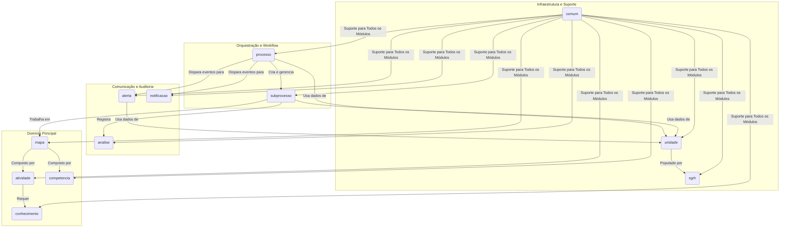

# Backend do Sistema de Gestão de Competências (SGC)

## Visão Geral
Este diretório contém o código-fonte do backend do SGC, uma aplicação Spring Boot (Java 21) responsável por gerenciar o mapeamento de competências, orquestrar os fluxos de trabalho e fornecer uma API REST. A arquitetura é modular, orientada a domínios e eventos, promovendo baixo acoplamento e alta coesão.

## Diagrama de Arquitetura Geral


## Arquitetura e Módulos Principais
O backend está organizado nos seguintes pacotes. Para mais detalhes sobre cada um, consulte o `README.md` dentro do respectivo diretório.

- **`processo`**: O orquestrador central dos fluxos de trabalho. Gerencia o ciclo de vida de processos de alto nível e publica eventos de domínio. ([Ver mais](./src/main/java/sgc/processo/README.md))
- **`subprocesso`**: O motor do workflow para cada unidade. Funciona como uma state machine, gerenciando as transições de estado e a trilha de auditoria (`Movimentacao`). ([Ver mais](./src/main/java/sgc/subprocesso/README.md))
- **`mapa`**: Gerencia o artefato "Mapa de Competências", incluindo operações complexas como cópia e análise de impacto. ([Ver mais](./src/main/java/sgc/mapa/README.md))
- **`atividade`**, **`competencia`**, **`conhecimento`**: Gerenciam as entidades de base que compõem um mapa. ([Ver `atividade`](./src/main/java/sgc/atividade/README.md), [Ver `competencia`](./src/main/java/sgc/competencia/README.md), [Ver `conhecimento`](./src/main/java/sgc/conhecimento/README.md))
- **`analise`**: Registra a trilha de auditoria das decisões (aceites, devoluções) tomadas durante o workflow. ([Ver mais](./src/main/java/sgc/analise/README.md))
- **`alerta`** e **`notificacao`**: Módulos reativos que lidam com a comunicação com o usuário (alertas no sistema e e-mails), escutando eventos de domínio. ([Ver `alerta`](./src/main/java/sgc/alerta/README.md), [Ver `notificacao`](./src/main/java/sgc/notificacao/README.md))
- **`unidade`**: Define o modelo de dados da estrutura organizacional. É a "fonte da verdade" dos dados organizacionais. ([Ver mais](./src/main/java/sgc/unidade/README.md))
- **`sgrh`**: Camada de integração com o sistema de RH. Atualmente usa dados simulados (mock). ([Ver mais](./src/main/java/sgc/sgrh/README.md))
- **`comum`**: Contém classes e configurações transversais, como tratamento de exceções, entidades base e configurações do Spring. ([Ver mais](./src/main/java/sgc/comum/README.md))

## Como Construir e Executar
Para construir o projeto e rodar os testes, utilize o Gradle Wrapper:
```bash
# A partir da raiz do repositório
./gradlew :backend:build
```

Para executar a aplicação:
```bash
./gradlew :backend:bootRun
```
A API estará disponível em `http://localhost:8080`.

## Padrões de Design
- **Injeção de Dependência** (Spring)
- **DTO (Data Transfer Object)** na camada de controle.
- **Arquitetura Orientada a Eventos** (`ApplicationEventPublisher`).
- **Serviços Coesos** com responsabilidades únicas.
- **Trilha de Auditoria Imutável** (`Movimentacao`, `Analise`).