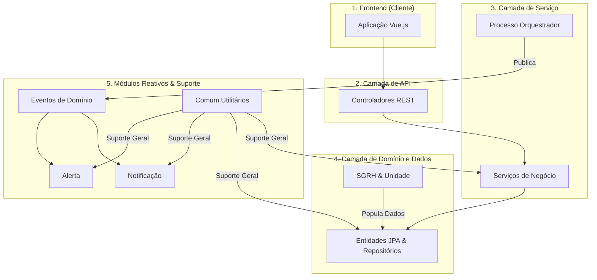

# Backend do Sistema de Gestão de Competências (SGC)

Última atualização: 2025-12-14

## Visão Geral

Este diretório contém o código-fonte do backend do SGC. Ele fornece uma API REST para consumo pelo frontend. A
arquitetura é organizada em pacotes representando domínios específicos. Parte da comunicação entre os módulos centrais é
realizada de forma reativa, através de eventos de domínio.

## Diagrama de Arquitetura

O diagrama abaixo ilustra a arquitetura em camadas, destacando as dependências principais entre os pacotes.



## Módulos Principais (`src/main/java/sgc/`)

### 1. `processo` (Orquestrador)

- **Responsabilidade:** Atua como o orquestrador central. Gerencia o ciclo de vida dos processos de alto nível (ex: "
  Mapeamento Anual de Competências") e dispara eventos de domínio (`ProcessoIniciadoEvento`) para notificar outros
  módulos, mantendo o sistema desacoplado.

### 2. `subprocesso` (Máquina de Estados e Controladores Especializados)

- **Responsabilidade:** Gerencia o fluxo de trabalho detalhado para cada unidade organizacional. Funciona como uma *
  *máquina de estados**, transitando as tarefas entre diferentes situações e mantendo um histórico imutável de todas as
  ações através da entidade `Movimentacao`. Para melhor organização, o controlador foi dividido em
  `SubprocessoCrudController` (operações CRUD), `SubprocessoCadastroController` (ações de workflow da etapa de
  cadastro), `SubprocessoMapaController` (operações relacionadas ao mapa) e `SubprocessoValidacaoController` (ações de
  workflow da etapa de validação). O `SubprocessoMapaWorkflowService` foi introduzido para gerenciar a lógica de
  salvamento do mapa no contexto do workflow.

### 3. `mapa` e `atividade` (Domínio Principal)

- **Responsabilidade:** Gerenciam os artefatos centrais do sistema.
- **`mapa`:** Orquestra a criação, cópia e análise de impacto dos Mapas de Competências. Contém a lógica para gerenciar
  competências através do `CompetenciaService`.
- **`atividade`:** Define as atividades associadas às competências. Este módulo também é responsável por gerenciar os *
  *conhecimentos** vinculados a cada atividade.

### 4. `analise` (Auditoria e Revisão)

- **Responsabilidade:** Registra o histórico de todas as análises de "cadastro" e "validação" realizadas sobre um
  subprocesso, fornecendo uma trilha de auditoria das revisões.

### 5. `notificacao` e `alerta` (Comunicação Reativa)

- **Responsabilidade:** Módulos reativos que "escutam" os eventos de domínio publicados pelo `processo`.
- **`alerta`:** Cria alertas visíveis dentro da interface do sistema.
- **`notificacao`:** Envia notificações externas (como e-mails) de forma assíncrona.

### 6. `sgrh` e `unidade` (Estrutura e Integração)

- **Responsabilidade:** Fornecem os dados sobre a estrutura organizacional e os usuários.
- **`unidade`:** Modela a hierarquia organizacional (secretarias, seções, etc.). É apenas um modelo de dados, sem lógica
  de negócio.
- **`sgrh`:** Define os modelos internos (`Usuario`, `Perfil`) e atua como uma fachada (`SgrhService`) para consultar
  dados de um sistema de RH externo (atualmente simulado).

### 7. `comum` e `util` (Componentes Transversais)

- **Responsabilidade:** Estes pacotes contêm código de suporte utilizado por toda a aplicação.
- **`comum`**: Centraliza o tratador global de exceções (`RestExceptionHandler`), classes de erro customizadas e a
  `EntidadeBase` para entidades JPA. Contém também configurações do Spring (`config`) e suporte para serialização JSON (
  `json`).
- **`util`**: Contém classes de utilidade diversas.

## Como Construir e Executar

Para construir o projeto e rodar os testes, utilize o Gradle Wrapper a partir da raiz do repositório:

```bash
./gradlew :backend:build
```

A API estará disponível em `http://localhost:10000`.

## Documentação da API (Swagger UI)

A documentação da API é gerada automaticamente com SpringDoc e está acessível em:
[http://localhost:10000/swagger-ui.html](http://localhost:10000/swagger-ui.html)

A especificação OpenAPI em formato JSON pode ser encontrada em:
[http://localhost:10000/api-docs](http://localhost:10000/api-docs)

## 🛡️ Verificações de Qualidade

O backend utiliza um conjunto de ferramentas de análise estática para garantir a qualidade do código. As verificações
são não-bloqueantes (warnings only).

### Ferramentas Configuradas

- **Checkstyle**: Verifica a aderência ao padrão de código (Google Checks).
- **PMD**: Analisa o código em busca de más práticas e código morto.
- **SpotBugs**: Detecta bugs potenciais através de análise de bytecode.
- **JaCoCo**: Mede a cobertura de testes unitários.

### Como Executar

Na raiz do projeto:

```bash
./gradlew :backend:qualityCheck
```

### Relatórios

Os relatórios HTML são gerados em `backend/build/reports/`:

- `checkstyle/main.html`
- `pmd/main.html`
- `spotbugs/main.html`
- `jacoco/test/html/index.html`

## Padrões de Design e Boas Práticas

- **Lombok:** Utilizado para reduzir código repetitivo.
- **DTOs (sufixos `Dto`, `Req` e `Resp`:** Usados em toda a camada de controle para desacoplar a API das entidades JPA.
- **Arquitetura Orientada a Eventos:** O `ApplicationEventPublisher` do Spring é usado para desacoplar os módulos
  `processo`, `alerta` e `notificacao`.
- **Serviços Coesos:** Lógica de negócio complexa é dividida em serviços com responsabilidades únicas (ex: `MapaService`
  vs. `ImpactoMapaService`).
- **Trilha de Auditoria:** A entidade `Movimentacao` garante um registro histórico completo das ações do workflow.

## Detalhamento técnico (gerado em 2025-12-14)

Resumo detalhado dos artefatos, comandos e observações técnicas gerado automaticamente.
