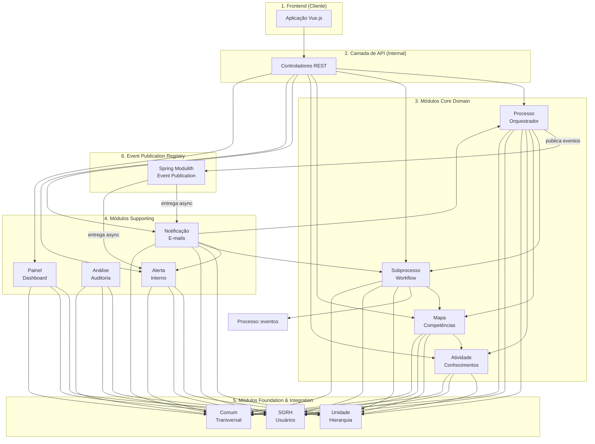

# Backend do Sistema de Gestão de Competências (SGC)


## Visão Geral

Este diretório contém o código-fonte do backend do SGC. Ele fornece uma API REST para consumo pelo frontend. A
arquitetura é organizada em **módulos Spring Modulith** representando domínios específicos, com comunicação
desacoplada através de **eventos de domínio assíncronos** persistidos e resilientes.

### Arquitetura Modular com Spring Modulith

O backend foi refatorado para adotar **Spring Modulith 2.0.1**, que fornece:

- **Enforcement Arquitetural Automático**: Violações de limites entre módulos são detectadas em tempo de compilação
- **Eventos Assíncronos Resilientes**: Event Publication Registry garante que eventos sejam processados mesmo em caso de falhas
- **Documentação Auto-Gerada**: Diagramas PlantUML e C4 são gerados automaticamente a partir do código
- **Testes Modulares Mais Rápidos**: Testes podem focar em módulos individuais com contexto Spring reduzido

Cada módulo segue a estrutura:
```
sgc/{modulo}/
├── {Modulo}Service.java    # API pública (facade)
├── package-info.java        # Metadados e dependências permitidas
├── api/                     # API pública exportada
│   ├── *.Dto.java          # DTOs expostos
│   └── eventos/            # Eventos publicados
└── internal/               # Implementação privada (NÃO acessível externamente)
    ├── *Controller.java
    ├── *Mapper.java
    ├── model/
    └── listeners/
```

## Diagrama de Arquitetura

O diagrama abaixo ilustra a arquitetura modular com Spring Modulith, destacando as dependências permitidas entre os módulos.



### Classificação dos Módulos (Spring Modulith)

Os módulos seguem a classificação do Domain-Driven Design adaptada para Spring Modulith:

| Tipo | Módulos | Descrição |
|------|---------|-----------|
| **Core Domain** | `processo`, `subprocesso`, `mapa`, `atividade` | Lógica de negócio central e domínio rico |
| **Supporting** | `notificacao`, `alerta`, `analise`, `painel` | Suporte ao domínio core, mas não essenciais |
| **Foundation** | `unidade`, `sgrh` | Estrutura organizacional e integração com sistemas externos |
| **Transversal** | `comum` | Componentes compartilhados (exceções, configuração, utilitários) |

## Módulos Principais (`src/main/java/sgc/`)

Todos os módulos seguem a estrutura Spring Modulith com pacotes `api/` (público) e `internal/` (privado).

### Módulos Core Domain

#### 1. `processo` (Orquestrador)

- **Responsabilidade:** Atua como o orquestrador central. Gerencia o ciclo de vida dos processos de alto nível (ex: "
  Mapeamento Anual de Competências") e dispara eventos de domínio para notificar outros
  módulos, mantendo o sistema desacoplado.
- **API Pública:**
  - `ProcessoService` - Facade para operações de CRUD e workflow
  - `api/ProcessoDto`, `api/ProcessoDetalheDto` - DTOs expostos
  - `api/eventos/*` - 22 eventos de domínio publicados (ex: `EventoProcessoIniciado`)
- **Dependências Permitidas:** `subprocesso`, `mapa`, `atividade`, `unidade`, `sgrh`, `comum`

#### 2. `subprocesso` (Máquina de Estados e Workflow)

- **Responsabilidade:** Gerencia o fluxo de trabalho detalhado para cada unidade organizacional. Funciona como uma **máquina de estados**, transitando as tarefas entre diferentes situações e mantendo um histórico imutável através da entidade `Movimentacao`. Para melhor organização, possui controladores especializados:
  `SubprocessoCrudController`, `SubprocessoCadastroController`, `SubprocessoMapaController` e `SubprocessoValidacaoController`.
- **API Pública:**
  - `SubprocessoService` - Facade para CRUD
  - `api/SubprocessoDto`, `api/SubprocessoDetalheDto` - DTOs expostos
- **Dependências Permitidas:** `processo::api.eventos`, `mapa`, `analise`, `unidade`, `sgrh`, `comum`
- **Nota:** Contém `MovimentacaoListener` (síncrono) para auditoria crítica de transições de estado

#### 3. `mapa` (Domínio Principal - Competências)

- **Responsabilidade:** Orquestra a criação, cópia e análise de impacto dos Mapas de Competências. Contém a lógica para gerenciar
  competências através do `CompetenciaService`.
- **API Pública:**
  - `MapaService` - Facade para CRUD e salvamento com validações
  - `api/MapaDto`, `api/MapaCompletoDto`, `api/ImpactoMapaDto` - DTOs expostos
  - Serviços especializados: `CopiaMapaService`, `ImpactoMapaService`, `MapaVisualizacaoService`, `CompetenciaService`
- **Dependências Permitidas:** `atividade`, `subprocesso`, `unidade`, `sgrh`, `comum`

#### 4. `atividade` (Domínio Principal - Atividades e Conhecimentos)

- **Responsabilidade:** Define as atividades associadas às competências. Este módulo também é responsável por gerenciar os **conhecimentos** vinculados a cada atividade.
- **API Pública:**
  - `AtividadeService` - Facade para operações de CRUD
  - `api/AtividadeDto`, `api/ConhecimentoDto` - DTOs expostos
- **Dependências Permitidas:** `comum`

### Módulos Supporting

#### 5. `analise` (Auditoria e Revisão)

- **Responsabilidade:** Registra o histórico de todas as análises de "cadastro" e "validação" realizadas sobre um
  subprocesso, fornecendo uma trilha de auditoria das revisões.
- **API Pública:**
  - `AnaliseService` - Facade para operações
  - `api/AnaliseDto` - DTO exposto
- **Dependências Permitidas:** `comum`

#### 6. `notificacao` (Comunicação Reativa - E-mails)

- **Responsabilidade:** Módulo reativo que "escuta" os eventos de domínio e envia notificações externas (como e-mails) de forma assíncrona com retry automático.
- **API Pública:**
  - `NotificacaoEmailService` - Interface para envio de e-mails
  - `api/EmailDto` - DTO para dados de e-mail
- **Implementação Interna:**
  - `internal/listeners/EventoProcessoListener` - Listener migrado para `@ApplicationModuleListener` (async)
  - `internal/services/NotificacaoModelosService` - Templates Thymeleaf
- **Dependências Permitidas:** `alerta`, `processo`, `subprocesso`, `sgrh`, `unidade`, `comum`
- **Eventos Consumidos:** `EventoProcessoIniciado`, `EventoProcessoFinalizado`

#### 7. `alerta` (Comunicação Reativa - Alertas Internos)

- **Responsabilidade:** Cria alertas visíveis dentro da interface do sistema, consumindo eventos de domínio.
- **API Pública:**
  - `AlertaService` - Facade para operações
  - `api/AlertaDto` - DTO exposto
- **Dependências Permitidas:** `sgrh`, `comum`

#### 8. `painel` (Dashboard e Estatísticas)

- **Responsabilidade:** Fornece visualizações agregadas e estatísticas do sistema (dashboard).
- **API Pública:** Nenhuma (apenas controllers REST)
- **Dependências Permitidas:** `comum`, `mapa`, `processo`, `subprocesso`, `atividade`, `unidade`, `sgrh`

### Módulos Foundation & Integration

#### 9. `sgrh` (Estrutura e Integração - Sistema de RH)

- **Responsabilidade:** Define os modelos internos (`Usuario`, `Perfil`) e atua como uma fachada (`SgrhService`) para consultar
  dados de um sistema de RH externo (atualmente simulado).
- **API Pública:**
  - `SgrhService` - Facade para consultas de usuários
  - `api/UsuarioDto`, `api/PerfilDto` - DTOs expostos
- **Dependências Permitidas:** `comum`, `unidade`

#### 10. `unidade` (Estrutura Organizacional)

- **Responsabilidade:** Modela a hierarquia organizacional (secretarias, seções, etc.). É apenas um modelo de dados, sem lógica
  de negócio complexa.
- **API Pública:**
  - `UnidadeService` - Facade para CRUD
  - `api/UnidadeDto` - DTO exposto
- **Dependências Permitidas:** `comum`

### Módulo Transversal

#### 11. `comum` (Componentes Compartilhados)

- **Responsabilidade:** Centraliza o tratador global de exceções (`RestExceptionHandler`), classes de erro customizadas, a
  `EntidadeBase` para entidades JPA, configurações do Spring (`config`) e suporte para serialização JSON (`json`).
- **Componentes Principais:**
  - `erros/RestExceptionHandler` - Tratamento global de exceções
  - `erros/*` - Hierarquia de exceções customizadas
  - `model/EntidadeBase` - Classe base para entidades JPA
  - `config/*` - Configurações Spring (Security, Web, Thymeleaf, Async)
  - `json/*` - Serialização e sanitização
- **Dependências:** Nenhuma (módulo base)

## Spring Modulith - Recursos e Benefícios

### Event Publication Registry

O backend utiliza o **Event Publication Registry** do Spring Modulith para garantir que eventos sejam processados de forma resiliente:

- **Persistência Automática**: Eventos são salvos na tabela `EVENT_PUBLICATION` antes do processamento
- **Retry Automático**: Eventos com falha são reprocessados automaticamente
- **Auditoria Completa**: Histórico de todos os eventos (status: published, processing, failed, completed)
- **Cleanup Automático**: Eventos completados são removidos após 7 dias

#### Consultas Úteis

```sql
-- Eventos pendentes
SELECT * FROM EVENT_PUBLICATION 
WHERE COMPLETION_DATE IS NULL 
ORDER BY PUBLICATION_DATE DESC;

-- Eventos com falha
SELECT * FROM EVENT_PUBLICATION 
WHERE STATUS = 'failed';

-- Estatísticas por tipo
SELECT EVENT_TYPE, STATUS, COUNT(*) 
FROM EVENT_PUBLICATION 
GROUP BY EVENT_TYPE, STATUS;
```

### Verificação de Estrutura Modular

O Spring Modulith verifica automaticamente se os módulos respeitam seus limites:

```bash
# Executar verificação
./gradlew :backend:test --tests ModulithStructureTest

# Gerar documentação automatizada (PlantUML, C4)
./gradlew :backend:test --tests ModulithStructureTest.gerarDocumentacaoDosModulos
```

Documentação gerada em: `backend/build/spring-modulith-docs/`

### Testes Modulares

Testes podem focar em módulos individuais com contexto Spring reduzido (~60% menor):

```java
@ApplicationModuleTest  // Carrega apenas o módulo e suas dependências
class MapaModuleTest {
    @Autowired private MapaService mapaService;
    
    @Test
    void deveCriarMapa() {
        // Teste rápido e isolado
    }
}
```

### Monitoramento com Actuator

```bash
# Informações sobre módulos e eventos
curl http://localhost:10000/actuator/modulith
```

## Como Construir e Executar

Para construir o projeto e rodar os testes, utilize o Gradle Wrapper a partir da raiz do repositório:

```bash
./gradlew :backend:build
```

A API estará disponível em `http://localhost:10000`.

## Documentação da API (Swagger UI)

A documentação da API é gerada automaticamente com SpringDoc e está acessível em:
[http://localhost:10000/swagger-ui.html](http://localhost:10000/swagger-ui.html)

A especificação OpenAPI em formato JSON pode ser encontrada em:
[http://localhost:10000/api-docs](http://localhost:10000/api-docs)

## 🧪 Testes

O backend possui uma suíte completa de testes (unitários e de integração) usando JUnit 5, Mockito e Spring Boot Test.

### Executar Testes

```bash
# Todos os testes
./gradlew :backend:test

# Apenas testes de integração
./gradlew :backend:test --tests "sgc.integracao.*"

# Com relatório de cobertura
./gradlew :backend:test :backend:jacocoTestReport
```

### Cobertura de Código (JaCoCo)

O projeto utiliza **JaCoCo** para medir a cobertura de testes. Os relatórios são gerados automaticamente após a execução dos testes.

#### Visualizar Relatório de Cobertura

Após executar os testes, abra o relatório HTML:

```bash
# Gerar relatório
./gradlew :backend:test :backend:jacocoTestReport

# Visualizar relatório HTML no navegador
open backend/build/reports/jacoco/test/html/index.html
```

#### Métricas de Cobertura (Baseline Atual)

- **Linhas**: 85.9% (3848/4480)
- **Branches**: 62.1% (845/1361)
- **Instruções**: 84.6% (15861/18759)
- **Métodos**: 83.5% (664/795)
- **Classes**: 91.3% (126/138)

#### Quality Gate

O projeto possui verificações automáticas de cobertura mínima:

- **Branches**: 60% mínimo
- **Linhas**: 80% mínimo

```bash
# Verificar quality gate
./gradlew :backend:jacocoTestCoverageVerification
```

**Observação**: O quality gate é executado automaticamente durante o `./gradlew :backend:check`.

### Estrutura de Testes

```
backend/src/test/java/sgc/
├── fixture/              # Builders reutilizáveis para entidades de teste
│   ├── ProcessoFixture.java
│   ├── SubprocessoFixture.java
│   ├── MapaFixture.java
│   ├── AtividadeFixture.java
│   ├── UnidadeFixture.java
│   └── UsuarioFixture.java
├── integracao/           # Testes de integração (CDU01-CDU21)
└── [módulos]/            # Testes unitários por módulo
```

## 🛡️ Verificações de Qualidade

O backend utiliza um conjunto de ferramentas de análise estática para garantir a qualidade do código. As verificações
são não-bloqueantes (warnings only).

### Ferramentas Configuradas

- **Checkstyle**: Verifica a aderência ao padrão de código (Google Checks).
- **PMD**: Analisa o código em busca de más práticas e código morto.
- **SpotBugs**: Detecta bugs potenciais através de análise de bytecode.
- **JaCoCo**: Mede a cobertura de testes unitários e de integração.

### Como Executar

Na raiz do projeto:

```bash
./gradlew :backend:qualityCheck
```

### Relatórios

Os relatórios HTML são gerados em `backend/build/reports/`:

- `checkstyle/main.html`
- `pmd/main.html`
- `spotbugs/main.html`
- `jacoco/test/html/index.html`

## Padrões de Design e Boas Práticas

### Padrões Spring Modulith

- **Estrutura api/internal:** Cada módulo expõe sua API pública no pacote `api/` e mantém implementação em `internal/`
- **package-info.java:** Metadados de módulos com `@ApplicationModule` definem dependências permitidas
- **Eventos de Domínio:** Comunicação assíncrona e desacoplada através de eventos em `api/eventos/`
- **@ApplicationModuleListener:** Listeners assíncronos com retry automático e persistência
- **Enforcement Automático:** Violações de limites de módulos falham em tempo de compilação

### Padrões Gerais

- **Lombok:** Utilizado para reduzir código repetitivo.
- **DTOs (sufixos `Dto`, `Req` e `Resp`):** Usados em toda a camada de controle para desacoplar a API das entidades JPA.
- **Arquitetura Orientada a Eventos:** O `ApplicationEventPublisher` do Spring é usado para desacoplar os módulos
  através de eventos de domínio publicados e consumidos de forma assíncrona.
- **Service Facades:** Cada módulo expõe uma facade única (ex: `MapaService`, `ProcessoService`) como ponto de entrada
- **Serviços Coesos:** Lógica de negócio complexa é dividida em serviços com responsabilidades únicas (ex: `MapaService`
  vs. `ImpactoMapaService`, `CopiaMapaService`).
- **Trilha de Auditoria:** A entidade `Movimentacao` garante um registro histórico completo das ações do workflow.
- **Transações Independentes:** Listeners assíncronos usam `@Transactional(propagation = REQUIRES_NEW)` para não comprometer a transação principal em caso de falha.

### Documentação de Módulos

Cada módulo possui:
- **README.md:** Visão geral, arquitetura, componentes e dependências
- **package-info.java:** Metadados Spring Modulith (display name, allowed dependencies, eventos publicados/consumidos)

