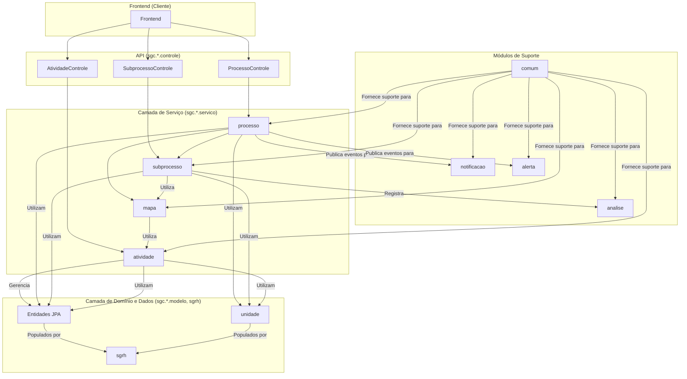

# Backend do Sistema de Gestão de Competências (SGC)

## Visão Geral
Este diretório contém o código-fonte do backend do SGC, uma aplicação Spring Boot (Java 21) que serve como a espinha dorsal para o gerenciamento de competências e seus fluxos de trabalho associados. Ele fornece uma API REST modular para ser consumida pelo frontend.

A arquitetura é organizada em pacotes que representam domínios de negócio específicos, promovendo alta coesão e baixo acoplamento. A comunicação entre os módulos centrais é realizada de forma reativa, através de eventos de domínio, o que garante a separação de responsabilidades.

## Diagrama de Arquitetura
O diagrama abaixo ilustra a arquitetura em camadas, destacando as dependências principais entre os pacotes.



## Módulos Principais (`src/main/java/sgc/`)

### 1. `processo` (Orquestrador)
- **Responsabilidade:** Atua como o orquestrador central. Gerencia o ciclo de vida dos processos de alto nível (ex: "Mapeamento Anual de Competências") e dispara eventos de domínio (`ProcessoIniciadoEvento`) para notificar outros módulos, mantendo o sistema desacoplado.

### 2. `subprocesso` (Máquina de Estados)
- **Responsabilidade:** Gerencia o fluxo de trabalho detalhado para cada unidade organizacional. Funciona como uma **máquina de estados**, transitando as tarefas entre diferentes situações (ex: de `PENDENTE_CADASTRO` para `MAPA_AJUSTADO`) e mantendo um histórico imutável de todas as ações através da entidade `Movimentacao`.

### 3. `mapa`, `competencia`, `atividade` (Domínio Principal)
- **Responsabilidade:** Gerenciam os artefatos centrais do sistema.
- **`mapa`:** Orquestra a criação, cópia e análise de impacto dos Mapas de Competências.
- **`competencia`:** Define as competências que compõem um mapa.
- **`atividade`:** Define as atividades associadas às competências. Este módulo também é responsável por gerenciar os **conhecimentos** vinculados a cada atividade.

### 4. `analise` (Auditoria e Revisão)
- **Responsabilidade:** Registra o histórico de todas as análises de "cadastro" e "validação" realizadas sobre um subprocesso, fornecendo uma trilha de auditoria das revisões.

### 5. `notificacao` e `alerta` (Comunicação Reativa)
- **Responsabilidade:** Módulos reativos que "escutam" os eventos de domínio publicados pelo `processo`.
- **`alerta`:** Cria alertas visíveis dentro da interface do sistema.
- **`notificacao`:** Envia notificações externas (como e-mails) de forma assíncrona.

### 6. `sgrh` e `unidade` (Estrutura e Integração)
- **Responsabilidade:** Fornecem os dados sobre a estrutura organizacional e os usuários.
- **`unidade`:** Modela a hierarquia organizacional (secretarias, seções, etc.). É apenas um modelo de dados, sem lógica de negócio.
- **`sgrh`:** Define os modelos internos (`Usuario`, `Perfil`) e atua como uma fachada (`SgrhService`) para consultar dados de um sistema de RH externo (atualmente simulado).

### 7. `comum` (Componentes Transversais)
- **Responsabilidade:** Contém código de suporte utilizado por toda a aplicação, como o tratador global de exceções (`RestExceptionHandler`), classes de erro, e a `EntidadeBase` para entidades JPA.

## Como Construir e Executar
Para construir o projeto e rodar os testes, utilize o Gradle Wrapper a partir da raiz do repositório:
```bash
./gradlew :backend:build
```

Para executar a aplicação:
```bash
./gradlew :backend:bootRun
```
A API estará disponível em `http://localhost:8080`.

## Documentação da API (Swagger UI)
A documentação da API é gerada automaticamente com SpringDoc e está acessível em:
[http://localhost:8080/swagger-ui.html](http://localhost:8080/swagger-ui.html)

A especificação OpenAPI em formato JSON pode ser encontrada em:
[http://localhost:8080/api-docs](http://localhost:8080/api-docs)

## Padrões de Design e Boas Práticas
- **Injeção de Dependência:** Utilizada extensivamente pelo Spring Framework.
- **DTO (Data Transfer Object):** Usado em toda a camada de controle para desacoplar a API das entidades JPA.
- **Arquitetura Orientada a Eventos:** O `ApplicationEventPublisher` do Spring é usado para desacoplar os módulos `processo`, `alerta` e `notificacao`.
- **Serviços Coesos:** Lógica de negócio complexa é dividida em serviços com responsabilidades únicas (ex: `MapaService` vs. `ImpactoMapaService`).
- **Trilha de Auditoria:** A entidade `Movimentacao` garante um registro histórico completo das ações do workflow.