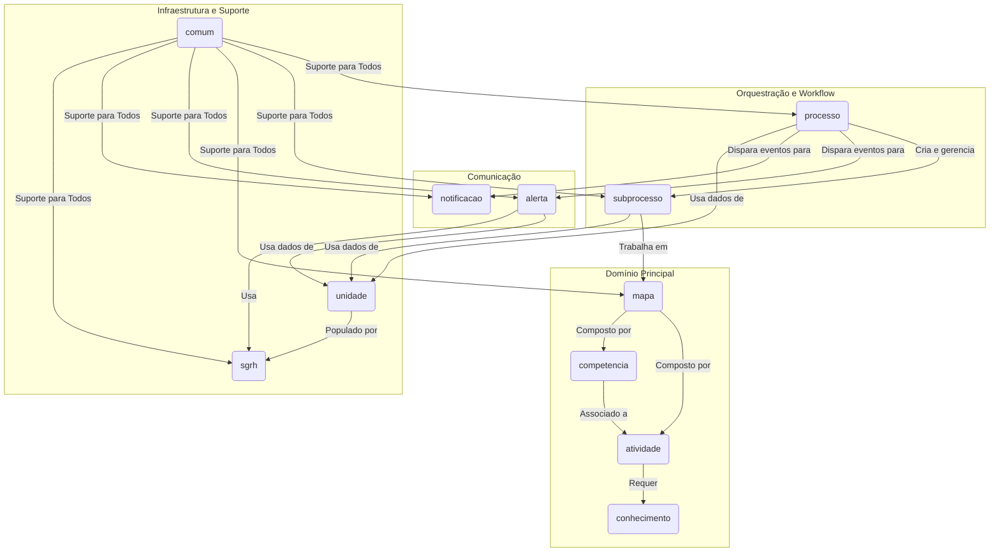

# Backend do Sistema de Gestão de Competências (SGC)

## Visão Geral
Este diretório contém todo o código-fonte do backend do SGC, uma aplicação Spring Boot desenvolvida em Java 21. A aplicação é responsável por gerenciar o mapeamento de competências, orquestrar os fluxos de trabalho associados e fornecer uma API REST para o frontend.

A arquitetura é modular e orientada a domínios, com cada pacote principal representando uma área de negócio específica. A comunicação entre os módulos é, em grande parte, orientada a eventos, promovendo baixo acoplamento e alta coesão.

## Diagrama de Arquitetura Geral


## Arquitetura e Módulos Principais

O backend está organizado nos seguintes pacotes principais, localizados em `src/main/java/sgc/`:

### 1. `comum`
- **Responsabilidade:** Contém classes e configurações transversais utilizadas por toda a aplicação.
- **Componentes Notáveis:**
  - `EntidadeBase`: Superclasse para entidades JPA com ID padronizado.
  - `RestExceptionHandler`: Tratamento global de exceções para a API REST.
  - `config/`: Configurações do Spring (CORS, datasources, etc.).
  - `erros/`: Hierarquia de exceções customizadas.

### 2. `unidade`
- **Responsabilidade:** Define o modelo de dados da estrutura organizacional.
- **Componentes Notáveis:**
  - `Unidade.java`: Entidade que representa uma unidade organizacional (secretaria, seção, etc.).
  - **Nota:** Este pacote não possui lógica de negócio; ele é a "fonte da verdade" dos dados organizacionais, que são gerenciados por outros serviços.

### 3. `sgrh`
- **Responsabilidade:** Camada de integração com o sistema de RH (SGRH).
- **Componentes Notáveis:**
  - `SgrhService.java`: Serviço que consulta dados de usuários e unidades.
  - **Status Atual:** Utiliza dados **simulados (mock)** e está pronto para ser conectado a um banco de dados Oracle real.

### 4. `processo`
- **Responsabilidade:** O orquestrador central dos fluxos de trabalho.
- **Componentes Notáveis:**
  - `ProcessoService.java`: Gerencia o ciclo de vida de processos de alto nível (ex: "Mapeamento Anual").
  - `eventos/`: Publica eventos de domínio (ex: `ProcessoIniciadoEvento`) para desacoplar a comunicação com outros módulos.

### 5. `subprocesso`
- **Responsabilidade:** O motor do workflow para cada unidade individual.
- **Componentes Notáveis:**
  - `SubprocessoService.java`: Funciona como uma **state machine**, gerenciando as transições de estado de cada tarefa (ex: de `PENDENTE_CADASTRO` para `CADASTRO_DISPONIBILIZADO`).
  - `Movimentacao.java`: Entidade que cria uma trilha de auditoria imutável para cada ação no subprocesso.

### 6. `mapa`
- **Responsabilidade:** Gerencia o artefato "Mapa de Competências".
- **Componentes Notáveis:**
  - `MapaService.java`: Orquestra operações complexas e transacionais de salvamento do mapa.
  - `ImpactoMapaService.java`: Analisa as diferenças entre versões de um mapa.
  - `CopiaMapaService.java`: Clona mapas existentes.

### 7. `atividade`, `conhecimento`, `competencia`
- **Responsabilidade:** Gerenciam as entidades de base que compõem um mapa.
- **Componentes Notáveis:**
  - `Atividade.java`: Uma tarefa ou atribuição.
  - `Conhecimento.java`: Uma habilidade necessária para uma atividade.
  - `Competencia.java`: Um agrupamento de conhecimentos e atividades.

### 8. `alerta` e `notificacao`
- **Responsabilidade:** Módulos reativos que lidam com a comunicação com o usuário.
- **Componentes Notáveis:**
  - `EventoProcessoListener`: "Escuta" os eventos publicados pelo `ProcessoService`.
  - `AlertaService.java`: Cria alertas dentro do sistema.
  - `NotificacaoServicoImpl.java`: Envia e-mails de forma assíncrona, com retentativas.

## Como Construir e Executar
Para construir o projeto e rodar os testes, utilize o Gradle Wrapper:
```bash
# A partir da raiz do repositório
./gradlew :backend:build
```

Para executar a aplicação:
```bash
./gradlew :backend:bootRun
```
A API estará disponível em `http://localhost:8080`.

## Padrões de Design e Boas Práticas
- **Injeção de Dependência:** Utilizada extensivamente pelo Spring Framework.
- **DTO (Data Transfer Object):** Usado em toda a camada de controle para desacoplar a API das entidades JPA.
- **Arquitetura Orientada a Eventos:** O `ApplicationEventPublisher` do Spring é usado para desacoplar os módulos `processo`, `alerta` e `notificacao`.
- **Serviços Coesos:** Lógica de negócio complexa é dividida em serviços com responsabilidades únicas (ex: `MapaService` vs. `ImpactoMapaService`).
- **Trilha de Auditoria:** A entidade `Movimentacao` garante um registro histórico completo das ações do workflow.