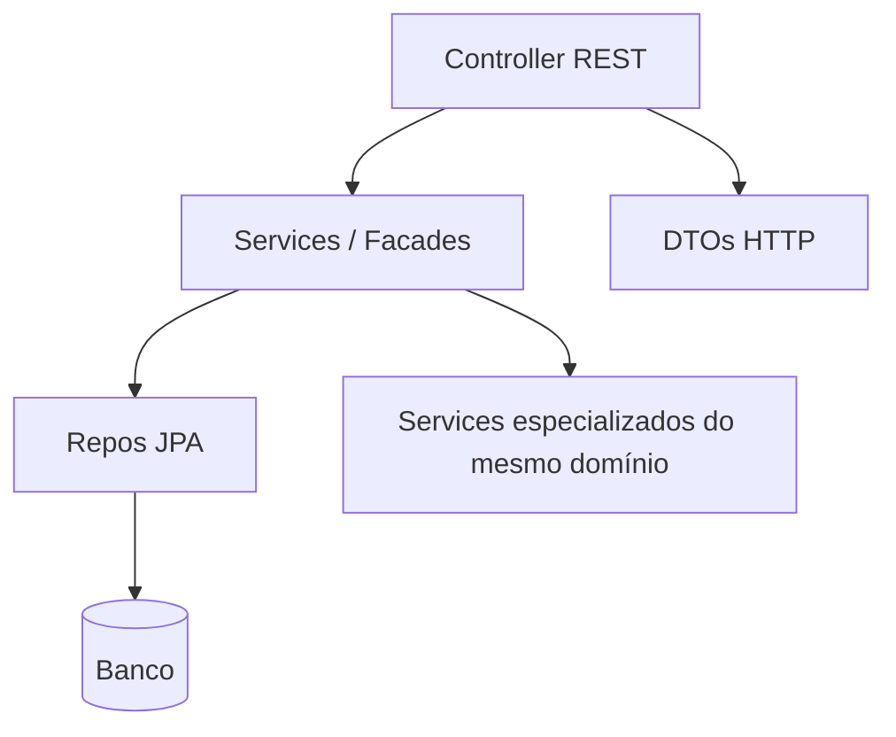

# Backend do SGC

## Papel do módulo

`backend/` concentra a API REST do SGC, a implementação das regras de negócio, a segurança, a persistência e a observabilidade da aplicação. O módulo é um **monólito modular**: os domínios convivem no mesmo deploy, mas mantêm fronteiras explícitas por pacote, DTO e testes arquiteturais.

## Stack técnica

- **Java 25**
- **Spring Boot 4**
- **Spring Security, Validation, Web MVC, Actuator**
- **JPA/Hibernate**
- **Gradle Kotlin DSL**
- **H2** para testes/e2e e **Oracle** para hom/prod
- **Caffeine**, **Micrometer**, **Thymeleaf**, **OpenPDF**, **OWASP Java HTML Sanitizer**

## Estrutura de domínios

Código principal em `src/main/java/sgc`:

| Pacote | Responsabilidade |
|---|---|
| `processo` | CRUD de processos, painel, inicialização/finalização e ações em bloco |
| `subprocesso` | workflow por unidade, contexto para tela, histórico, permissões e validações |
| `mapa` | mapas, atividades, conhecimentos, impactos e manutenção do conteúdo técnico |
| `organizacao` | unidades, usuários, hierarquia, contexto autenticado e atribuições temporárias |
| `seguranca` | login, JWT, permission evaluator, sanitização e config de segurança |
| `alerta` | alertas exibidos no frontend, notificações e worker de e-mail |
| `relatorio` | relatórios PDF/exportações de andamento e mapas |
| `configuracaos` | parâmetros/configurações editáveis |
| `feedback` | recebimento e gestão de feedbacks administrativos |
| `comum` | config, erros, monitoramento, tipos base e utilidades compartilhadas |
| `e2e` | suporte exclusivo para automação de testes ponta a ponta |

## Organização interna dos pacotes

A maior parte dos domínios segue a mesma composição:

- `...Controller`: fronteira HTTP
- `dto/`: contratos de request/response
- `model/`: entidades, enums e repositórios
- `service/`: orquestração e regras de negócio
- `package-info.java`: marcações de pacote e null-safety

Exemplo conceitual:


```mermaid
graph TD
    Controller[Controller REST] --> Service[Services / Facades]
    Service --> Repo[Repos JPA]
    Service --> Outros[Services especializados do mesmo domínio]
    Repo --> Banco[(Banco)]
    Controller --> Dto[DTOs HTTP]
```

## Domínios que estruturam o sistema

### `processo`

Controla o ciclo macro do sistema:

- criação, atualização e exclusão administrativa;
- início e finalização do processo;
- consulta de participantes, subprocessos elegíveis e contexto completo;
- painel e ações em bloco.

### `subprocesso`

É o núcleo do workflow operacional. O pacote concentra:

- status por unidade;
- contexto de visualização e edição;
- permissões estruturadas para a UI;
- validação de cadastro e de mapa;
- movimentações, histórico e notificações;
- reabertura, homologação, aceite, devolução e operações em bloco.

### `mapa`

Representa o conteúdo técnico mapeado:

- mapas e sugestões;
- atividades e conhecimentos;
- impactos e consistência do conteúdo;
- reconciliação do estado do subprocesso quando o mapa muda.

### `organizacao`

Modela o contexto institucional:

- usuários e perfis;
- unidades e árvore hierárquica;
- atribuições temporárias;
- contexto do usuário autenticado consumido pelas demais camadas.

### `seguranca`

Implementa autenticação e autorização. O ponto central é `SgcPermissionEvaluator`, responsável por consolidar:

- **leitura pela hierarquia**;
- **escrita pela localização atual do subprocesso**;
- diferenças entre ações administrativas e ações de workflow.

## Regras arquiteturais garantidas em teste

`src/test/java/sgc/arquitetura/ArchConsistencyTest.java` reforça, entre outras, as seguintes regras:

- controllers não acessam `Repo` diretamente;
- `sgc.comum` não deve carregar lógica de negócio;
- services não devem acessar repositórios de outros módulos indiscriminadamente;
- controllers expõem DTOs, não entidades JPA;
- controllers não recebem entidades JPA em `@RequestBody`;
- pacotes com services/controllers devem permanecer `@NullMarked`.

## Segurança e modelo de autorização

A aplicação usa `@PreAuthorize` nos controllers e o avaliador central de permissão para o contexto fino.

```mermaid
flowchart LR
    Requisicao[Requisição HTTP] --> Controller
    Controller --> PreAuthorize[@PreAuthorize]
    PreAuthorize --> Evaluator[SgcPermissionEvaluator]
    Evaluator --> Hierarquia[HierarquiaService]
    Evaluator --> Localizacao[LocalizacaoSubprocessoService]
    Evaluator --> Resultado[Permite / nega]
```

Resumo funcional:

- **ADMIN** possui alcance global de leitura e as principais ações administrativas;
- **GESTOR** vê sua unidade e subordinadas, aceitando/devolvendo fases compatíveis;
- **CHEFE** atua sobre cadastro/validação quando o subprocesso está em sua unidade ativa;
- **SERVIDOR** atua no que o domínio de diagnóstico exigir, sem receber privilégios de gestão.

Veja também: [regras de acesso](../etc/reqs/acesso.md).

## Perfis de execução

O `bootRun` carrega `.env.<perfil>` e `.env.<perfil>.local` automaticamente.

| Perfil | Uso | Banco |
|---|---|---|
| `local` | desenvolvimento backend | H2 |
| `e2e` | automação com fixtures e Swagger ligado | H2 + `seed.sql` |
| `hom` | homologação | Oracle |
| `prod` | produção | Oracle |

Execução a partir da raiz:

```bash
./gradlew :backend:bootRun -PENV=e2e
./gradlew :backend:bootRun -PENV=hom
```

## Configuração e observabilidade

Configuração central: `src/main/resources/application.yml`

Aspectos relevantes:

- `open-in-view=false`
- schema default `sgc`
- batch/fetch configurados no Hibernate
- Actuator por perfil
- `springdoc` ativo em `e2e` e `hom`
- monitoramento de lentidão via `sgc.monitoramento.*`
- logs em arquivo/rotação em `hom` e `prod`

Endpoints e recursos operacionais:

- `/actuator/health`
- `/actuator/info`
- `/actuator/metrics`
- `/actuator/prometheus`
- `/actuator/logfile`

## Build

```bash
./gradlew :backend:build
```

No build integrado da raiz, o frontend é empacotado e copiado para `src/main/resources/static` antes do artefato final.

## Estratégia de testes do backend

Os testes ficam em `src/test/java/sgc` e combinam vários níveis.

### 1. Testes de arquitetura

- diretório `arquitetura/`
- ArchUnit para dependências, DTOs, null-safety e fronteiras de camadas

### 2. Testes de controller

- uso frequente de `@WebMvcTest`
- validação de contrato HTTP, segurança, serialização e mensagens de erro

### 3. Testes de integração

- pacote `integracao/`
- base comum em `BaseIntegrationTest`
- cenários CDU (`CDU01IntegrationTest` a `CDU36IntegrationTest`)
- testes de regressão, segurança e budgets de query

### 4. Testes de repositório/modelo/serviço

- por domínio (`mapa`, `organizacao`, `subprocesso`, `alerta`, `feedback`...)
- garantem consultas, entidades e regras específicas

Comandos mais usados:

```bash
./gradlew :backend:test
./gradlew :backend:unitTest
./gradlew :backend:integrationTest
./gradlew :backend:qualityCheck
./gradlew :backend:qualityCheckFast
```

## Referências internas

- [README raiz](../README.md)
- [Pacote comum](src/main/java/sgc/comum/README.md)
- [Módulo de subprocesso](src/main/java/sgc/subprocesso/README.md)
- [Suporte E2E no backend](src/main/java/sgc/e2e/README.md)
