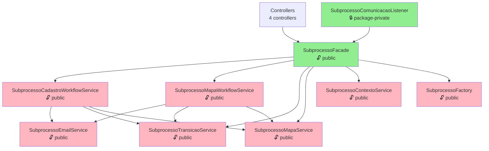
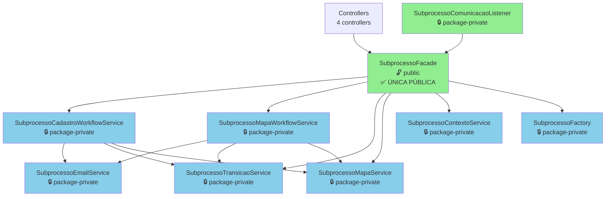
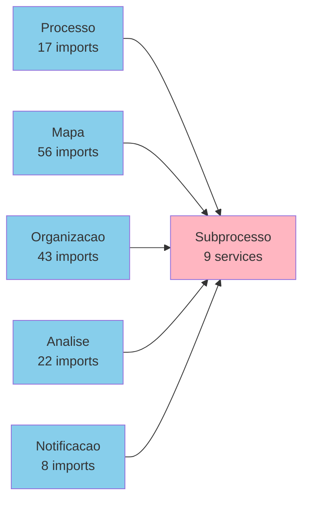

# Diagramas de Services do Módulo Subprocesso

**Data:** 2026-01-15  
**Relacionado:** proposta-arquitetura.md, ADR-006

---

## 📊 Diagrama de Dependências - Estado Atual

### Visão Geral dos Services



**Legenda:**
- 🔓 `public` = Deve ser alterado para package-private (vermelho/rosa)
- 🔒 `package-private` = Correto (verde)
- ✅ Apenas Facade deveria ser público

---

## 🎯 Diagrama de Dependências - Estado Alvo (Fase 2)

### Após Package-Private Services



**Resultado:**
- ✅ 1 service público (Facade)
- ✅ 8 services package-private
- ✅ Encapsulamento garantido

---

## 📋 Tabela de Consolidação de Services

### Estado Atual → Estado Alvo

| # | Service Atual | Visibilidade Atual | Fase 2<br/>(Package-Private) | Fase 5<br/>(Consolidação) | LoC | Destino Final |
|---|--------------|-------------------|--------------------------|------------------------|-----|---------------|
| 1 | **SubprocessoFacade** | 🔓 public | 🔓 public ✅ | 🔓 public ✅ | ~360 | **Mantido** (orquestração) |
| 2 | SubprocessoMapaWorkflowService | 🔓 public | 🔒 package-private | 🔄 Consolidado | ~520 | → SubprocessoWorkflowService |
| 3 | SubprocessoCadastroWorkflowService | 🔓 public | 🔒 package-private | 🔄 Consolidado | ~350 | → SubprocessoWorkflowService |
| 4 | SubprocessoTransicaoService | 🔓 public | 🔒 package-private | 🔄 Consolidado | ~165 | → SubprocessoWorkflowService |
| 5 | SubprocessoMapaService | 🔓 public | 🔒 package-private | ❌ Eliminado | ~180 | → MapaFacade (outro módulo) |
| 6 | SubprocessoFactory | 🔓 public | 🔒 package-private | ✅ Mantido | ~160 | **Mantido** (criação) |
| 7 | SubprocessoEmailService | 🔓 public | 🔒 package-private | 🔄 Renomeado | ~158 | → SubprocessoNotificacaoService |
| 8 | SubprocessoContextoService | 🔓 public | 🔒 package-private | ❌ Eliminado | ~65 | → SubprocessoFacade (lógica movida) |
| 9 | SubprocessoComunicacaoListener | 🔒 package-private | 🔒 package-private ✅ | ✅ Mantido | ~37 | **Mantido** (listener) |

**Resumo da Evolução:**

| Fase | Services Públicos | Services Package-Private | Total Services | Redução |
|------|------------------|-------------------------|----------------|---------|
| **Estado Atual** | 8 | 1 | 9 | - |
| **Fase 2** (Package-Private) | 1 | 8 | 9 | 0% (preparação) |
| **Fase 5** (Consolidação) | 1 | 5 | 6-7 | ~30% |

---

## 🔄 Plano de Consolidação (Fase 5 - Futuro)

### Service 1: SubprocessoWorkflowService (Unificado)

**Absorve:**
- SubprocessoCadastroWorkflowService (~350 LoC)
- SubprocessoMapaWorkflowService (~520 LoC)
- SubprocessoTransicaoService (~165 LoC)

**Responsabilidades:**
```java
@Service
class SubprocessoWorkflowService {
    // Workflow de Cadastro
    void iniciarCadastro(Long codigo);
    void disponibilizarCadastro(Long codigo);
    void validarCadastro(Long codigo);
    void homologarCadastro(Long codigo);
    
    // Workflow de Mapa
    void disponibilizarMapa(Long codigo);
    void validarMapa(Long codigo, boolean comSugestoes);
    void homologarMapa(Long codigo);
    
    // Transições
    void executarTransicao(Long codigo, SituacaoSubprocesso destino);
}
```

**Estimativa:** ~800-900 LoC (consolidado e refatorado)

### Service 2: SubprocessoNotificacaoService (Renomeado)

**Era:** SubprocessoEmailService  
**Responsabilidades:** Envio de notificações (email, eventos)

```java
@Service
class SubprocessoNotificacaoService {
    void notificarCadastroDisponibilizado(Long codigo);
    void notificarMapaDisponibilizado(Long codigo);
    void notificarValidacaoHomologacao(Long codigo);
}
```

**Estimativa:** ~180 LoC (expandido com eventos)

### Services Mantidos

1. **SubprocessoFacade** - Orquestração (público)
2. **SubprocessoFactory** - Criação de subprocessos
3. **SubprocessoComunicacaoListener** - Eventos (já package-private)

### Services Eliminados

1. **SubprocessoContextoService** → Lógica movida para Facade
2. **SubprocessoMapaService** → Lógica movida para MapaFacade (outro módulo)

---

## 🏗️ Estrutura de Sub-pacotes (Fase 4 - Futuro)

```
sgc/subprocesso/service/
├── SubprocessoFacade.java                    (🔓 public)
│
├── workflow/                                 (🔒 package-private)
│   ├── SubprocessoWorkflowService.java
│   └── package-info.java
│
├── crud/                                     (🔒 package-private)
│   ├── SubprocessoCrudService.java
│   ├── SubprocessoValidacaoService.java
│   └── package-info.java
│
├── notificacao/                              (🔒 package-private)
│   ├── SubprocessoNotificacaoService.java
│   └── package-info.java
│
├── factory/                                  (🔒 package-private)
│   ├── SubprocessoFactory.java
│   └── package-info.java
│
└── package-info.java
```

**Benefícios:**
- ✅ Navegação clara por responsabilidade
- ✅ Coesão dentro de cada sub-pacote
- ✅ Facilita identificação de services relacionados

---

## 📊 Análise de Dependências Entre Módulos

### Imports de Subprocesso em Outros Módulos



**Total:** 59 arquivos importam de subprocesso

**Observação:** Alta dependência é esperada - Subprocesso é o agregado raiz.

**Mitigação (Fase 3):** Implementar eventos de domínio para reduzir acoplamento direto.

---

## 🎯 Métricas de Progresso

### Por Fase

| Métrica | Atual | Fase 2 | Fase 3 | Fase 4 | Fase 5 |
|---------|-------|--------|--------|--------|--------|
| **Services Públicos** | 8 | 1 ✅ | 1 | 1 | 1 |
| **Services Total** | 9 | 9 | 9 | 9 | 6-7 |
| **Eventos Implementados** | 6 | 6 | 14-16 ✅ | 14-16 | 14-16 |
| **Sub-pacotes** | 0 | 0 | 0 | 4 ✅ | 4 |
| **LoC em Services** | ~2100 | ~2100 | ~2200 | ~2200 | ~1800 ✅ |

---

## 📝 Referências

- **Documento Principal:** `/proposta-arquitetura.md`
- **ADR:** `/docs/adr/ADR-006-domain-aggregates-organization.md`
- **Tracking:** `/tracking-arquitetura.md`
- **Código:** `/backend/src/main/java/sgc/subprocesso/service/`

---

**Última Atualização:** 2026-01-15  
**Próxima Revisão:** Após Fase 2 (Package-Private Services)
