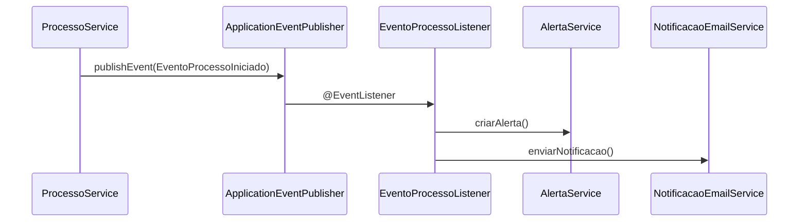
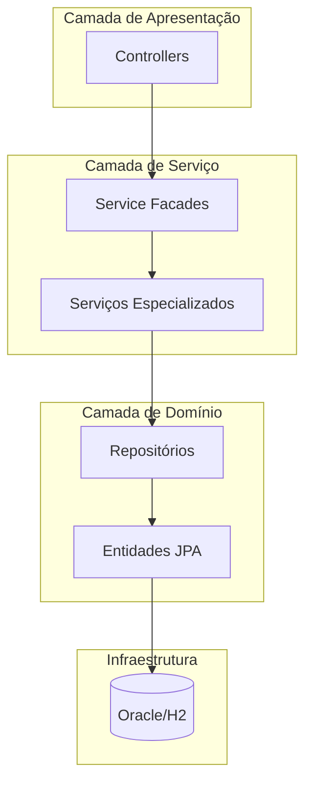
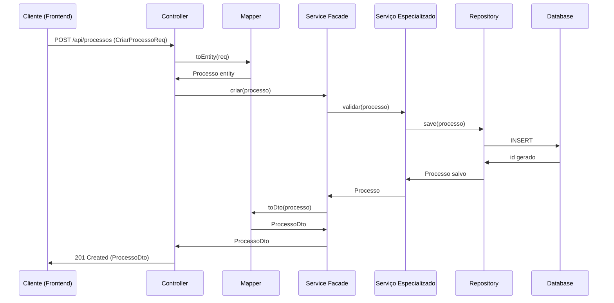
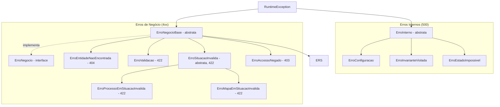
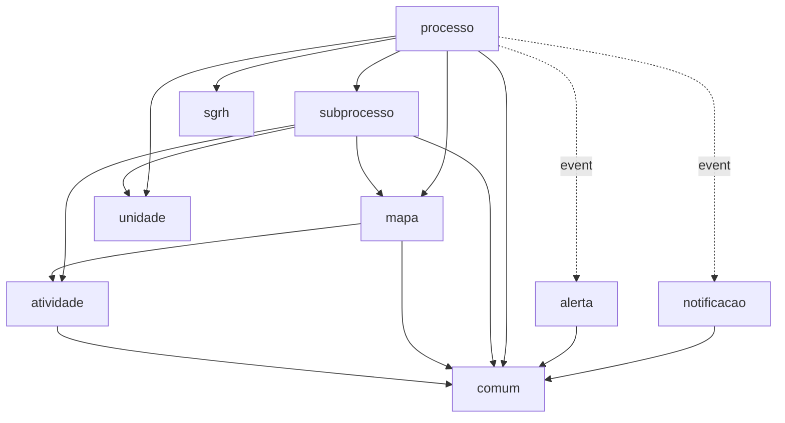

# Padrões de Arquitetura e Desenvolvimento Backend

Este documento consolida os padrões arquiteturais, convenções de nomenclatura e melhores práticas identificadas no
backend do Sistema de Gestão de Competências (SGC). O objetivo é servir como guia de referência para manter a
consistência e qualidade do código.

## 1. Visão Geral da Arquitetura

O SGC utiliza uma arquitetura **Modular Monolith** baseada em Spring Boot. O sistema é dividido em pacotes de domínio (
`processo`, `mapa`, `atividade`, etc.) que encapsulam suas regras de negócio e persistem dados.

A comunicação entre módulos ocorre de duas formas:

1. **Síncrona:** Chamadas diretas de método entre Serviços (Fachadas).
2. **Assíncrona/Reativa:** Publicação e escuta de Eventos de Domínio (Spring Events) para desacoplamento (ex:
   Processo -> Notificação).

### Diagrama de Arquitetura Geral

```mermaid
graph TD
    subgraph "Camada de API"
        API[Controladores REST]
    end

    subgraph "Camada de Serviço"
        Servico[Serviços de Negócio (Fachadas)]
    end

    subgraph "Camada de Domínio e Dados"
        Dominio[Entidades JPA & Repositórios]
    end

    subgraph "Módulos Reativos"
        Eventos[Eventos de Domínio]
        Notificacao[Notificação]
        Alerta[Alerta]
    end

    API --> Servico
    Servico --> Dominio
    Servico -- Publica --> Eventos
    Eventos --> Notificacao
    Eventos --> Alerta
```

## 2. Padrões de Nomenclatura

O idioma oficial do projeto é o **Português Brasileiro**.

- **Classes:** PascalCase (ex: `UsuarioFacade`, `MapaController`).
- **Métodos e Variáveis:** camelCase (ex: `buscarPorId`, `dataCriacao`).
- **Pacotes:** minúsculo, sem separadores, representando o domínio (ex: `sgc.processo`, `sgc.mapa`).
- **Exceções:** Prefixo `Erro` (ex: `ErroEntidadeNaoEncontrada`).
- **Sufixos Padronizados:**
  - Controladores: `Controller` (ex: `ProcessoController`).
  - Serviços: `Service` (ex: `MapaService`).
  - Repositórios: `Repo` (ex: `SubprocessoRepo`).
  - Testes: `Test` (ex: `MapaServiceTest`).
  - DTOs: `Dto`, `Req` (Request), `Resp` (Response).

## 3. Padrões de Projeto (Design Patterns)

### 3.1. Service Facade (Fachada de Serviço)

**Descrição:** Cada módulo possui um serviço principal que atua como ponto de entrada único para operações de negócio. Este serviço
orquestra serviços especializados internos e delega tarefas.

**Responsabilidades da Fachada:**

- Expor interface pública para Controllers e outros módulos
- Orquestrar chamadas a serviços especializados
- Gerenciar transações de alto nível
- Validar precondições de negócio

**Exemplo no módulo `mapa`:**

O `MapaService` é a fachada pública. Ele utiliza internamente:

- `CopiaMapaService`: Lógica de cópia de mapas
- `ImpactoMapaService`: Análise de impacto de alterações
- `MapaVisualizacaoService`: Formatação de dados para visualização
- `MapaVinculoService`: Gerenciamento de vínculos
- `MapaIntegridadeService`: Validação de integridade

```mermaid
graph TD
    Client[Cliente (Controller ou Outro Módulo)]
    Facade[MapaService (Fachada)]
    Sub1[CopiaMapaService]
    Sub2[ImpactoMapaService]
    Sub3[MapaVisualizacaoService]
    Sub4[MapaVinculoService]
    Sub5[MapaIntegridadeService]
    Sub6[CompetenciaService]

    Client --> Facade
    Facade --> Sub1
    Facade --> Sub2
    Facade --> Sub3
    Facade --> Sub4
    Facade --> Sub5
    Facade --> Sub6
```

**Benefícios:**

- Reduz acoplamento entre controllers e lógica complexa
- Facilita testes unitários (mock da fachada)
- Ponto único para logging e auditoria
- Facilita manutenção e refatoração

### 3.2. Repository Pattern (Repositórios JPA)

**Descrição:** Abstração da camada de persistência usando Spring Data JPA.

**Convenções:**

- Nomenclatura: `{Entidade}Repo` (ex: `ProcessoRepo`, `SubprocessoRepo`)
- Sempre extends `JpaRepository<Entidade, Long>`
- Queries customizadas usando `@Query` ou métodos derivados
- Localização: `{modulo}/model/{Entidade}Repo.java`

**Exemplo:**

```java
public interface ProcessoRepo extends JpaRepository<Processo, Long> {
    List<Processo> findBySituacao(SituacaoProcesso situacao);
    
    @Query("SELECT p FROM Processo p WHERE p.dataLimite < :data")
    List<Processo> findProcessosAtrasados(LocalDateTime data);
}
```

### 3.3. Arquitetura Orientada a Eventos (Event-Driven)

**Descrição:** Para evitar acoplamento rígido em fluxos secundários (como enviar e-mail ou criar alerta), o sistema utiliza o
`ApplicationEventPublisher` do Spring.

**Eventos de Domínio Identificados (23 eventos):**

**Eventos de Processo:**

- `EventoProcessoCriado`
- `EventoProcessoIniciado`
- `EventoProcessoFinalizado`

**Eventos de Subprocesso - Cadastro:**

- `EventoSubprocessoCadastroDisponibilizado`
- `EventoSubprocessoCadastroAceito`
- `EventoSubprocessoCadastroDevolvido`
- `EventoSubprocessoCadastroHomologado`

**Eventos de Subprocesso - Mapa:**

- `EventoSubprocessoMapaIniciado`
- `EventoSubprocessoMapaDisponibilizado`
- `EventoSubprocessoMapaComSugestoes`
- `EventoSubprocessoMapaAjustadoSubmetido`
- `EventoSubprocessoMapaValidado`
- `EventoSubprocessoMapaAceito`
- `EventoSubprocessoMapaDevolvido`
- `EventoSubprocessoMapaHomologado`

**Eventos de Subprocesso - Revisão:**

- `EventoRevisaoSubprocessoDisponibilizada`
- `EventoSubprocessoRevisaoDisponibilizada`
- `EventoSubprocessoRevisaoAceita`
- `EventoSubprocessoRevisaoDevolvida`
- `EventoSubprocessoRevisaoHomologada`

**Fluxo de Eventos:**



**Implementação:**

1. Serviço publica evento:

```java
@Service
public class ProcessoService {
    @Autowired
    private ApplicationEventPublisher eventPublisher;
    
    public void iniciar(Long codigo) {
        // ... lógica de negócio
        eventPublisher.publishEvent(new EventoProcessoIniciado(codigo));
    }
}
```

2. Listener reage ao evento:

```java
@Component
public class EventoProcessoListener {
    @EventListener
    @Transactional
    public void onProcessoIniciado(EventoProcessoIniciado evento) {
        alertaService.criar(...);
        notificacaoEmailService.enviar(...);
    }
}
```

**Benefícios:**

- Desacoplamento entre módulos
- Facilita adição de novos comportamentos reativos
- Separação de responsabilidades (negócio vs notificação)
- Testabilidade independente

### 3.4. Data Transfer Object (DTO) Pattern

> [!IMPORTANT]
> Consulte o [Guia Completo de DTOs](../../regras/guia-dtos.md) para detalhes sobre nomenclatura e boas práticas.

**Descrição:** Objetos que transportam dados entre as camadas, especialmente entre Controller e Service.

**Convenções de Nomenclatura:**

- `{Entidade}Dto`: DTO genérico (ex: `ProcessoDto`)
- `{Acao}Req`: Request de entrada (ex: `CriarProcessoReq`, `AtualizarMapaReq`)
- `{Entidade}Resp`: Response específica (ex: `ProcessoDetalheResp`)

### 3.5. Mapper Pattern (MapStruct)

**Descrição:** Conversão automática entre Entidades JPA e DTOs usando MapStruct.

**Convenções:**

- Nomenclatura: `{Entidade}Mapper` (ex: `ProcessoMapper`, `SubprocessoMapper`)
- Anotação: `@Mapper(componentModel = "spring")`
- Localização: `{modulo}/mapper/` ou `{modulo}/dto/`
- Pode injetar Repositórios para resolver relacionamentos

**Exemplo Simples:**

```java
@Component
@Mapper(componentModel = "spring")
public abstract class AtividadeMapper {
    @Mapping(source = "mapa.codigo", target = "mapaCodigo")
    public abstract AtividadeDto toDto(Atividade atividade);
    
    @Mapping(target = "mapa", ignore = true)
    public abstract Atividade toEntity(AtividadeDto dto);
}
```

**Exemplo Complexo (com Repositórios):**

```java
@Component
@Mapper(componentModel = "spring")
public abstract class SubprocessoMapper {
    @Autowired
    protected ProcessoRepo processoRepo;
    @Autowired
    protected UnidadeRepo unidadeRepo;
    
    @Mapping(source = "processo.codigo", target = "codProcesso")
    @Mapping(source = "unidade.codigo", target = "codUnidade")
    public abstract SubprocessoDto toDTO(Subprocesso subprocesso);
    
    @Mapping(source = "codProcesso", target = "processo")
    public abstract Subprocesso toEntity(SubprocessoDto dto);
    
    // Método auxiliar para resolver relacionamento
    public Processo mapProcesso(Long codigo) {
        return processoRepo.findById(codigo)
            .orElseThrow(() -> new ErroEntidadeNaoEncontrada("Processo", codigo));
    }
}
```

**Benefícios:**

- Performance superior a reflexão manual
- Segurança de tipos em tempo de compilação
- Menos código boilerplate
- Mapeamentos complexos facilitados

## 4. Arquitetura em Camadas

### 4.1. Estrutura de Camadas



**Camada de Apresentação (Controllers):**

- Recebe requisições HTTP
- Valida entrada básica
- Converte DTOs
- Delega para Service Facade
- Retorna ResponseEntity com DTOs

**Camada de Serviço:**

- Service Facade: Ponto de entrada único
- Serviços Especializados: Lógica de negócio específica
- Gerenciam transações
- Publicam eventos de domínio

**Camada de Domínio:**

- Entidades JPA: Modelo de dados
- Repositórios: Acesso a dados
- Regras de negócio no modelo (quando aplicável)

### 4.2. Fluxo de Dados Completo



## 5. Padrões de API REST

### 5.1. Verbos HTTP e Operações

O sistema adota uma convenção específica para operações de escrita, priorizando o uso de POST para ações de negócio
explícitas.

**Convenção Adotada:**

- **GET:** Consultas e listagens (idempotente, sem side-effects)
- **POST:** Criação de recursos
- **POST (com sufixo):** Atualizações, exclusões e ações de workflow

**Exemplos de Endpoints:**

| Operação  | Método | Endpoint                        | Descrição                    |
|-----------|--------|---------------------------------|------------------------------|
| Listar    | GET    | `/api/processos`                | Lista todos os processos     |
| Buscar    | GET    | `/api/processos/{id}`           | Busca um processo específico |
| Criar     | POST   | `/api/processos`                | Cria novo processo           |
| Atualizar | POST   | `/api/processos/{id}/atualizar` | Atualiza processo existente  |
| Excluir   | POST   | `/api/processos/{id}/excluir`   | Remove processo              |
| Iniciar   | POST   | `/api/processos/{id}/iniciar`   | Ação de workflow             |
| Finalizar | POST   | `/api/processos/{id}/finalizar` | Ação de workflow             |

**Justificativa da Convenção:**

- Ações de workflow não são CRUD puro (iniciar, finalizar, devolver)
- Clareza semântica: a URL indica explicitamente a ação
- Facilita auditoria e logging
- Consistência em toda a API

### 5.2. Estrutura de Controllers

**Padrão de Controller:**

```java
@RestController
@RequestMapping("/api/processos")
@RequiredArgsConstructor
public class ProcessoController {
    private final ProcessoService processoService;
    
    @GetMapping
    public List<ProcessoDto> listar() {
        return processoService.listar();
    }
    
    @GetMapping("/{codigo}")
    public ProcessoDto buscar(@PathVariable Long codigo) {
        return processoService.buscarPorCodigo(codigo);
    }
    
    @PostMapping
    public ResponseEntity<ProcessoDto> criar(@RequestBody CriarProcessoReq req) {
        ProcessoDto dto = processoService.criar(req);
        return ResponseEntity.status(HttpStatus.CREATED).body(dto);
    }
    
    @PostMapping("/{codigo}/iniciar")
    public void iniciar(@PathVariable Long codigo) {
        processoService.iniciar(codigo);
    }
}
```

**Convenções:**

- Controller interage APENAS com Service Facade
- Não contém lógica de negócio
- Usa `@PathVariable` para IDs
- Usa `@RequestBody` para payloads
- Retorna DTOs, nunca entidades JPA

**Controllers Especializados:**

O módulo `subprocesso` demonstra uma especialização interessante, dividindo o controller em:

- `SubprocessoCrudController`: Operações CRUD básicas
- `SubprocessoCadastroController`: Ações da etapa de cadastro
- `SubprocessoMapaController`: Operações relacionadas ao mapa
- `SubprocessoValidacaoController`: Ações da etapa de validação

Isso melhora organização e coesão quando há muitas operações.

### 5.3. Tratamento de Erros

> [!IMPORTANT]
> Consulte o [Guia Completo de Exceções](../../regras/guia-excecoes.md) para orientações detalhadas sobre escolha de exceções.

**Hierarquia de Exceções:**



### 5.4. Validação de Entrada

> [!IMPORTANT]
> Consulte o [Guia Completo de Validação](../../regras/guia-validacao.md) para orientações detalhadas.

**Validação em Camadas:**

1. **Controller:** `@Valid` no `@RequestBody` dispara Bean Validation
2. **DTO:** Anotações `@NotBlank`, `@NotNull`, `@Size` com mensagens em português
3. **Service:** Apenas regras de negócio (estado, permissões)
4. **Repository:** Constraints de banco de dados

## 6. Padrões de Persistência (JPA/Hibernate)

### 6.1. Entidade Base

**Todas as entidades herdam de `EntidadeBase`:**

```java
@MappedSuperclass
@Getter
@Setter
@NoArgsConstructor
@AllArgsConstructor
public abstract class EntidadeBase implements Serializable {
    @Id
    @GeneratedValue(strategy = GenerationType.IDENTITY)
    @Column(name = "codigo")
    private Long codigo;
}
```

**Convenções:**

- Campo PK: `codigo` (não `id`)
- Strategy: `IDENTITY` (auto-increment)
- Tipo: `Long` (permite valores grandes)

### 6.2. Estrutura de Entidade Padrão

```java
@Entity
@Table(name = "PROCESSO", schema = "sgc")
@Getter
@Setter
@NoArgsConstructor
@AllArgsConstructor
@AttributeOverrides({
    @AttributeOverride(name = "codigo", column = @Column(name = "codigo"))
})
public class Processo extends EntidadeBase {
    @Column(name = "descricao")
    private String descricao;
    
    @Enumerated(EnumType.STRING)
    @Column(name = "situacao", length = 20)
    private SituacaoProcesso situacao;
    
    @ManyToOne
    @JoinColumn(name = "unidade_codigo")
    private Unidade unidade;
}
```

**Convenções:**

- Tabelas: UPPER_CASE com schema `sgc`
- Colunas: snake_case
- Enums: `EnumType.STRING` (legibilidade no banco)
- Lombok: `@Getter`, `@Setter`, `@NoArgsConstructor`, `@AllArgsConstructor`
- Relacionamentos: Lazy loading por padrão

### 6.3. Relacionamentos JPA

**OneToMany / ManyToOne:**

```java
// Lado One (Processo)
@OneToMany(mappedBy = "processo", cascade = CascadeType.ALL)
private List<Subprocesso> subprocessos = new ArrayList<>();

// Lado Many (Subprocesso)
@ManyToOne
@JoinColumn(name = "processo_codigo")
private Processo processo;
```

**ManyToMany:**

```java
@ManyToMany
@JoinTable(
    name = "unidade_processo",
    schema = "sgc",
    joinColumns = @JoinColumn(name = "processo_codigo"),
    inverseJoinColumns = @JoinColumn(name = "unidade_codigo")
)
private Set<Unidade> unidades = new HashSet<>();
```

**Boas Práticas:**

- Use `Set` para evitar duplicatas em `@ManyToMany`
- Inicialize coleções para evitar `NullPointerException`
- `mappedBy` no lado inverso do relacionamento
- `cascade` apenas quando apropriado

### 6.4. Repositórios

**Estrutura Padrão:**

```java
public interface ProcessoRepo extends JpaRepository<Processo, Long> {
    // Métodos derivados (query method)
    List<Processo> findBySituacao(SituacaoProcesso situacao);
    Optional<Processo> findByDescricao(String descricao);
    
    // Query customizada
    @Query("SELECT p FROM Processo p WHERE p.dataLimite < :data")
    List<Processo> findProcessosAtrasados(@Param("data") LocalDateTime data);
    
    // Query nativa (quando necessário)
    @Query(value = "SELECT * FROM sgc.PROCESSO WHERE ...", nativeQuery = true)
    List<Processo> findComQueryNativa();
}
```

## 7. Organização de Módulos

### 7.1. Estrutura Interna de um Módulo

Cada módulo segue a estrutura:

```
sgc/{modulo}/
├── {Modulo}Controller.java       # Controller principal (ou controllers especializados)
├── {Modulo}Service.java          # Service Facade
├── README.md                      # Documentação do módulo
├── dto/                           # Data Transfer Objects
│   ├── {Acao}Req.java
│   ├── {Entidade}Dto.java
│   └── {Entidade}Mapper.java     # Mappers (pode estar em /mapper também)
├── mapper/                        # Mappers MapStruct (opcional)
│   └── {Entidade}Mapper.java
├── model/                         # Entidades e Repositórios
│   ├── {Entidade}.java
│   ├── {Entidade}Repo.java
│   └── {Enum}.java
├── service/                       # Serviços especializados (opcional)
│   ├── {Especializado}Service.java
│   └── ...
├── erros/                         # Exceções específicas do módulo (opcional)
│   └── Erro{Situacao}.java
└── eventos/                       # Eventos de domínio (opcional)
    └── Evento{Acao}.java
```

### 7.2. Módulos do Sistema (15 módulos)

**Módulos de Domínio Principal:**

1. **processo**: Orquestrador de alto nível
2. **subprocesso**: Máquina de estados e workflow
3. **mapa**: Gestão de mapas de competências
4. **atividade**: CRUD de atividades e conhecimentos

**Módulos de Suporte:**
6. **analise**: Trilha de auditoria
7. **notificacao**: E-mails assíncronos
8. **alerta**: Alertas na interface
9. **painel**: Dashboards e visões agregadas

**Módulos de Integração e Estrutura:**
10. **sgrh**: Integração com sistema de RH
11. **unidade**: Estrutura organizacional

**Módulos de Infraestrutura:**
12. **comum**: Componentes compartilhados (erros, base entities, config)
13. **config**: Configurações específicas (OpenAPI)
14. **e2e**: Suporte para testes end-to-end

### 7.3. Dependências Entre Módulos



**Legenda:**

- Seta sólida: Dependência direta (chamada de método)
- Seta pontilhada: Comunicação via eventos

**Princípio:** Evitar dependências cíclicas; usar eventos para desacoplar

## 8. Padrões de Testes

> [!IMPORTANT]
> Consulte o [Guia Completo de Testes JUnit](../../regras/guia-testes-junit.md) para padrões detalhados de nomenclatura e implementação.

**Localização:** `backend/src/test/java/sgc/{modulo}/`

**Nomenclatura:** `{Classe}Test.java`

**Convenções:**

- Use `@SpringBootTest` para testes de integração
- Use `@MockBean` para mockar dependências
- Use `@Transactional` para rollback automático
- Banco H2 em memória para testes
- Nomenclatura de métodos: `deve{Acao}Quando{Condicao}`

## 9. Tecnologias e Ferramentas

### 9.1. Stack Tecnológico

| Categoria                 | Tecnologia        | Versão | Propósito                        |
|---------------------------|-------------------|--------|----------------------------------|
| Linguagem                 | Java              | 25     | Linguagem de programação         |
| Framework                 | Spring Boot       | 4.x    | Framework web e DI               |
| ORM                       | Hibernate         | 7.x    | Mapeamento objeto-relacional     |
| Validação                 | Bean Validation   | 3.x    | Validação de entrada             |
| Mapeamento                | MapStruct         | Latest | Entity-DTO conversion            |
| Redução de Boilerplate    | Lombok            | Latest | Annotations para code generation |
| Banco de Dados (Prod)     | Oracle            | Latest | Banco relacional                 |
| Banco de Dados (Dev/Test) | H2                | Latest | Banco em memória                 |
| Documentação API          | SpringDoc OpenAPI | Latest | Swagger UI                       |
| Testes                    | JUnit 5           | Latest | Framework de testes              |
| Mocks                     | Mockito           | Latest | Mocking em testes                |
| Build                     | Gradle            | 8.x    | Automação de build               |

### 9.2. Anotações Importantes

**Lombok:**

- `@Getter` / `@Setter`: Gera getters e setters
- `@NoArgsConstructor` / `@AllArgsConstructor`: Construtores
- `@RequiredArgsConstructor`: Construtor com campos final
- `@Slf4j`: Logger SLF4J
- `@Builder`: Pattern Builder

**Spring:**

- `@RestController`: Controller REST
- `@Service`: Serviço de negócio
- `@Repository`: Repositório (herança de JpaRepository já marca)
- `@Transactional`: Gerenciamento de transação
- `@EventListener`: Listener de eventos
- `@ControllerAdvice`: Tratamento global de exceções

**JPA:**

- `@Entity`: Marca entidade JPA
- `@Table`: Configura tabela
- `@Id` / `@GeneratedValue`: Chave primária
- `@Column`: Configura coluna
- `@OneToMany` / `@ManyToOne` / `@ManyToMany`: Relacionamentos
- `@Enumerated`: Mapeia enums

**MapStruct:**

- `@Mapper(componentModel = "spring")`: Marca mapper
- `@Mapping`: Configura mapeamento customizado

## 10. Segurança e Sanitização

### 10.1. Sanitização de HTML

O sistema possui proteção contra XSS através de sanitização de HTML usando OWASP Java HTML Sanitizer.

**Anotação Customizada:**

```java
@SanitizeHtml
private String descricao;
```

**Deserializador Jackson:**

```java
public class HtmlSanitizingDeserializer extends JsonDeserializer<String> {
    private static final PolicyFactory HTML_POLICY = 
        new HtmlPolicyBuilder().toFactory();
    
    @Override
    public String deserialize(JsonParser p, DeserializationContext ctxt) {
        String value = p.getText();
        return HTML_POLICY.sanitize(value);
    }
}
```

### 10.2. Autenticação e Autorização

**JWT (JSON Web Tokens):**

- Token enviado no header: `Authorization: Bearer {token}`
- Validado em cada requisição via Spring Security
- Perfis de usuário: ADMIN, GESTOR, SERVIDOR

## 11. Boas Práticas Identificadas

### 11.1. Logging

**Convenção:**

```java
@Slf4j
@Service
public class ProcessoService {
    public void iniciar(Long codigo) {
        log.info("Iniciando processo {}", codigo);
        // lógica
        log.debug("Detalhes: {}", detalhes);
    }
}
```

**Níveis:**

- `ERROR`: Erros graves
- `WARN`: Situações anormais mas tratáveis
- `INFO`: Fluxo principal da aplicação
- `DEBUG`: Detalhes para debugging
- `TRACE`: Informações muito detalhadas

### 11.2. Transações

**Regra Geral:**

- `@Transactional` na camada de Service
- Controllers não gerenciam transações
- Repositórios herdam transacional do JpaRepository

**Exemplo:**

```java
@Service
@Transactional  // Todas as operações são transacionais
public class ProcessoService {
    
    @Transactional(readOnly = true)  // Otimização para consultas
    public List<Processo> listar() {
        return processoRepo.findAll();
    }
    
    public Processo criar(CriarProcessoReq req) {
        // Modificação - usa transação read-write
    }
}
```

### 11.3. Imutabilidade

**Records para DTOs (Java 14+):**

```java
public record ProcessoDto(
    Long codigo,
    String descricao,
    LocalDateTime dataCriacao
) {}
```

**Benefícios:**

- Imutável por padrão
- Menos código boilerplate
- Segurança de threads
- Performance

### 11.4. Tratamento de Nulos

**Uso de Optional:**

```java
public Optional<Processo> buscarPorDescricao(String descricao) {
    return processoRepo.findByDescricao(descricao);
}

// Chamada
processoService.buscarPorDescricao("Mapeamento")
    .ifPresent(p -> log.info("Encontrado: {}", p));
```

### 11.5. Enumerações

**Padrão:**

```java
public enum SituacaoProcesso {
    CRIADO,
    EM_ANDAMENTO,
    FINALIZADO;
    
    public boolean podeIniciar() {
        return this == CRIADO;
    }
}
```

**Sempre usar `EnumType.STRING` no JPA** para legibilidade no banco.

## 12. Referências e Documentação Adicional

- **OpenAPI/Swagger:** <http://localhost:10000/swagger-ui.html>
- **Especificação API:** <http://localhost:10000/api-docs>
- **README Módulos:** Cada módulo possui `README.md` detalhado em `backend/src/main/java/sgc/{modulo}/`
- **README Principal:** `/backend/README.md`
- **Spring Boot Docs:** <https://spring.io/projects/spring-boot>
- **MapStruct Docs:** <https://mapstruct.org/>
- **Lombok Docs:** <https://projectlombok.org/>