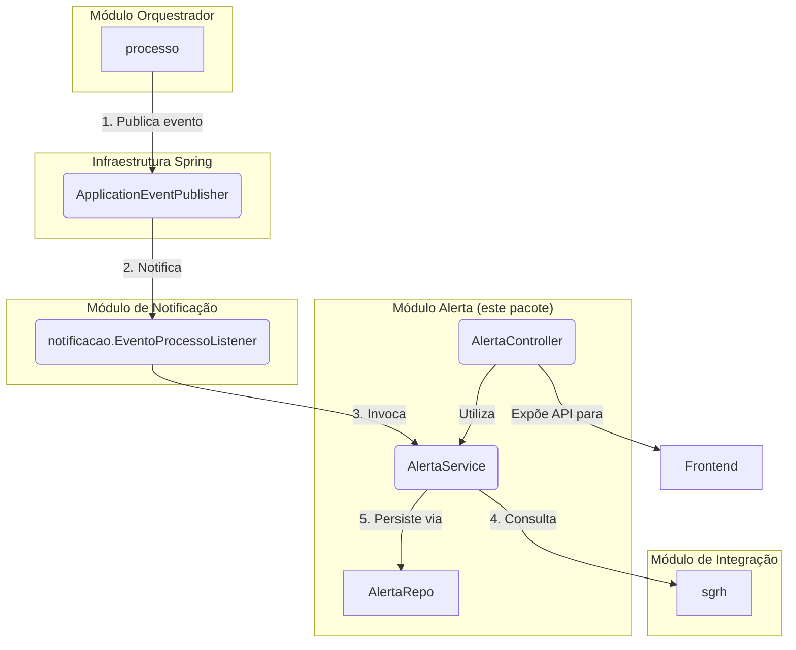

# Módulo de Alerta


## Visão Geral

Este pacote é responsável por criar e gerenciar **alertas internos** do sistema, que são notificações exibidas na
interface do usuário. Ele funciona de maneira reativa, "escutando" eventos de domínio publicados por outros módulos (
como o `processo`) e gerando os alertas correspondentes.

O objetivo é notificar os usuários sobre eventos que exigem sua atenção, como o início de um novo processo ou a
devolução de um mapa para ajuste.

## Estrutura Spring Modulith

Este módulo segue a convenção Spring Modulith:

### API Pública
- **`AlertaService`** (pacote raiz) - Facade principal para operações de alertas
- **`AlertaDto`** (em `api/`) - DTO exposto para transferência de dados

### Implementação Interna
- `AlertaController` - REST endpoints
- `AlertaMapper` - Mapeamento entre entidade e DTO
- Model: Entidades JPA e Repositories (`Alerta`, `AlertaUsuario`, `TipoAlerta`)
- Erros: Exceções customizadas

**⚠️ Importante:** Outros módulos **NÃO** devem acessar classes em `internal/`.

## Dependências

### Módulos que este módulo depende
- `sgrh` - Para obter informações de usuários
- `comum` - Para componentes compartilhados

## Eventos

### Publicados
Nenhum evento é publicado por este módulo no momento.

### Consumidos
- `EventoProcessoIniciado` - Cria alertas ao iniciar processo
- `EventoSubprocessoCriado` - Cria alertas para novos subprocessos

## Arquitetura e Funcionamento

A principal característica deste módulo é seu **baixo acoplamento**. Ele não é invocado diretamente. Em vez disso, o
`EventoProcessoListener` (localizado no pacote `notificacao`) ouve os eventos de domínio e invoca o `AlertaService` para
criar os alertas correspondentes.



### Fluxo de Trabalho

1. **Publicação do Evento:** Um módulo de negócio, como o `processo`, publica um evento (ex: `ProcessoIniciadoEvento`).
2. **Escuta do Evento:** O `EventoProcessoListener` (do pacote `notificacao`) captura o evento.
3. **Criação do Alerta:** O listener invoca o `AlertaService` (deste pacote), que contém a lógica para:
    * Construir a mensagem de alerta apropriada.
    * Consultar o `SgrhService` para identificar os usuários destinatários (ex: chefe da unidade).
    * Persistir as entidades `Alerta` e `AlertaUsuario` no banco de dados.
4. **Interação do Usuário:** O `AlertaController` expõe uma API REST para que o frontend possa listar e marcar os
   alertas do usuário logado como lidos.

## Componentes Principais

### Controladores e Serviços

- **`AlertaService`** (API pública): Contém a lógica de negócio para criar, formatar e persistir os alertas, além de gerenciar sua
  leitura. É invocado pelo `EventoProcessoListener` central.
- **`AlertaController`** (internal): Expõe endpoints REST (`GET /api/alertas`, `POST /api/alertas/{codigo}/marcar-como-lido`) para
  o frontend.

### Modelo de Dados (`internal/model`)

- **`Alerta`**: Entidade JPA que representa o alerta em si (título, mensagem, data).
- **`AlertaUsuario`**: Entidade que associa um alerta a um usuário específico, controlando se já foi lido ou não.
- **`AlertaRepo` / `AlertaUsuarioRepo`**: Repositórios Spring Data.
- **`TipoAlerta`**: Enum que define os tipos de alerta (ex: `INFORMATIVO`, `ACAO_NECESSARIA`).

### DTOs (`api`)

- **`AlertaDto`**: Objeto de transferência de dados utilizado para enviar informações de alertas para o frontend.
- **`AlertaMapper`** (internal): Interface MapStruct para conversão entre entidade `Alerta`/`AlertaUsuario` e `AlertaDto`.


## Como Testar

Para executar apenas os testes deste módulo:
```bash
./gradlew :backend:test --tests "sgc.alerta.*"
```
