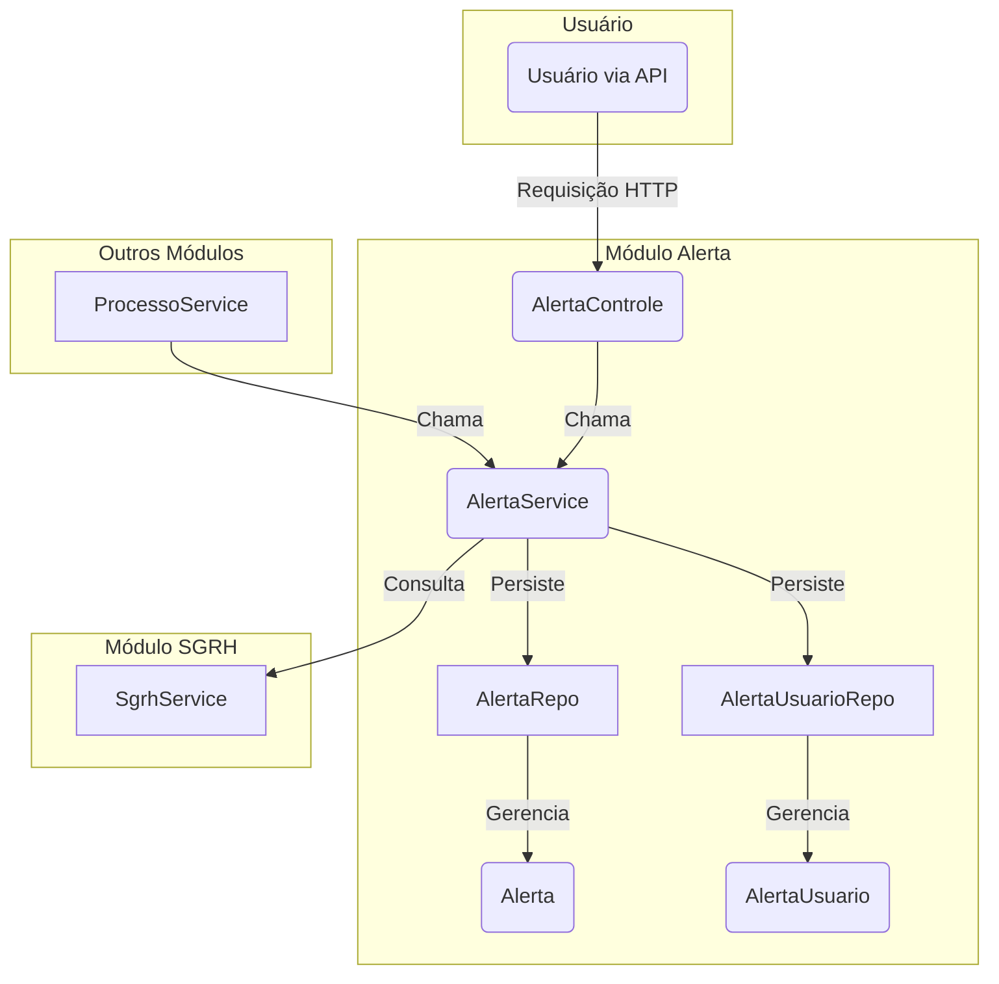

# Módulo de Alertas - SGC

## Visão Geral
Este pacote é responsável pela gestão e criação de alertas dentro do sistema SGC. Os alertas são notificações direcionadas a usuários específicos, geralmente relacionadas a eventos importantes em processos e subprocessos, como o início de um processo, a disponibilização de um cadastro para análise ou a devolução de um documento.

O sistema de alertas é projetado para garantir que os usuários relevantes sejam notificados sobre ações que exigem sua atenção, adaptando as mensagens com base no tipo de unidade organizacional (Operacional, Intermediária, etc.) e buscando os destinatários corretos (titulares e substitutos) através da integração com o módulo SGRH.

## Arquivos Principais

### 1. `AlertaService.java`
**Localização:** `backend/src/main/java/sgc/alerta/AlertaService.java`
- **Descrição:** Classe de serviço que centraliza toda a lógica de negócio para a criação e gerenciamento de alertas.
- **Responsabilidades:**
  - Criar alertas genéricos para unidades de destino.
  - Orquestrar a criação de alertas específicos para eventos como o início de um processo, a disponibilização de um cadastro e a devolução de um cadastro.
  - Determinar os destinatários de um alerta (responsável da unidade e seus substitutos) consultando o `SgrhService`.
  - Customizar as mensagens de alerta com base no tipo de unidade (Operacional, Intermediária, Interoperacional).
  - Persistir as entidades `Alerta` e `AlertaUsuario` no banco de dados.
  - Marcar alertas como lidos.

### 2. `Alerta.java`
**Localização:** `backend/src/main/java/sgc/alerta/modelo/Alerta.java`
- **Descrição:** Entidade JPA que representa um alerta no sistema. Mapeia a tabela `ALERTA`.
- **Campos Importantes:**
  - `processo`: O processo ao qual o alerta está associado.
  - `dataHora`: O momento em que o alerta foi criado.
  - `unidadeOrigem`: A unidade que originou o evento do alerta.
  - `unidadeDestino`: A unidade para a qual o alerta é direcionado.
  - `descricao`: O texto do alerta a ser exibido ao usuário.

### 3. `AlertaUsuario.java`
**Localização:** `backend/src/main/java/sgc/alerta/modelo/AlertaUsuario.java`
- **Descrição:** Entidade de associação que vincula um `Alerta` a um `Usuario` específico. Um mesmo alerta pode ser direcionado a múltiplos usuários (ex: titular e substituto).
- **Estrutura:**
  - Utiliza uma chave composta (`@EmbeddedId`) contendo o ID do alerta e o título do usuário.
  - `dataHoraLeitura`: Armazena o timestamp de quando o usuário marcou o alerta como lido.

### 4. `AlertaControle.java`
**Localização:** `backend/src/main/java/sgc/alerta/AlertaControle.java`
- **Descrição:** Controller REST que expõe os endpoints relacionados a alertas.
- **Endpoints:**
  - `POST /api/alertas/{id}/marcar-como-lido`: Permite que o usuário autenticado marque um alerta específico como lido.

## Diagrama de Componentes


## Fluxo de Criação de Alerta

1.  **Invocação do Serviço**: Um serviço de nível superior (ex: `ProcessoService`) chama um método público em `AlertaService` (ex: `criarAlertasProcessoIniciado`).
2.  **Lógica de Negócio**: `AlertaService` processa a requisição, determina a mensagem apropriada, a unidade de destino e outras propriedades do alerta.
3.  **Criação da Entidade**: Uma nova instância de `Alerta` é criada e persistida.
4.  **Identificação dos Destinatários**: O serviço consulta o `SgrhService` para encontrar o titular e o substituto da unidade de destino.
5.  **Criação da Associação**: Para cada destinatário encontrado, uma instância de `AlertaUsuario` é criada, vinculando o alerta ao usuário.
6.  **Persistência**: As entidades `Alerta` e `AlertaUsuario` são salvas no banco de dados.

## Como Usar

Para interagir com o sistema de alertas, injete `AlertaService` em seu componente e utilize seus métodos públicos.

**Exemplo:**
```java
@Service
public class ExemploService {

    @Autowired
    private AlertaService alertaService;

    public void notificarCadastroDevolvido(Processo processo, Long unidadeDestino, String motivo) {
        // Cria um alerta para notificar sobre a devolução de um cadastro
        alertaService.criarAlertaCadastroDevolvido(processo, unidadeDestino, motivo);
    }
}
```