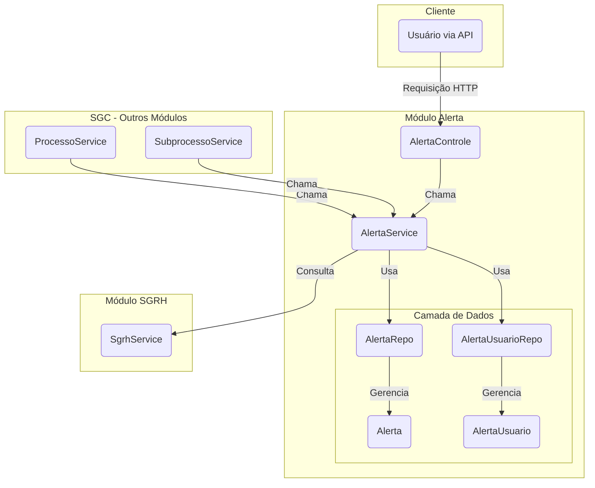

# Módulo de Alertas - SGC

## Visão Geral
Este pacote é responsável pela gestão e criação de alertas dentro do sistema SGC. Os alertas são notificações direcionadas a usuários específicos, geralmente relacionadas a eventos importantes em processos e subprocessos, como o início de um processo, a disponibilização de um cadastro para análise ou a devolução de um documento.

O sistema de alertas é projetado para garantir que os usuários relevantes sejam notificados sobre ações que exigem sua atenção, adaptando as mensagens com base no tipo de unidade organizacional e buscando os destinatários corretos (titulares e substitutos) através da integração com o módulo SGRH.

## Arquitetura e Componentes
O módulo está estruturado da seguinte forma:

- **`AlertaControle.java`**: Controller REST que expõe endpoints para interação com os alertas, como marcá-los como lidos.
- **`AlertaService.java`**: Orquestrador principal do módulo. Contém a lógica de negócio para criar e gerenciar alertas, determinar os destinatários e formatar as mensagens.
- **`dto/`**: Contém os Data Transfer Objects (DTOs) utilizados na camada de controle para serializar dados de e para a API REST.
- **`modelo/`**: Contém as entidades JPA e os repositórios.
  - **`Alerta.java`**: Entidade que representa um alerta.
  - **`AlertaUsuario.java`**: Entidade de associação que vincula um `Alerta` a um `Usuario` e rastreia o status de leitura.
  - **`TipoAlerta.java`**: Enum que define os tipos de alerta possíveis (ex: `PROCESSO_INICIADO`, `CADASTRO_DEVOLVIDO`).
  - **`AlertaRepo.java`**: Repositório Spring Data JPA para a entidade `Alerta`.
  - **`AlertaUsuarioRepo.java`**: Repositório Spring Data JPA para a entidade `AlertaUsuario`.

## Diagrama de Componentes


## Fluxo de Criação de Alerta

1.  **Invocação**: Um serviço de negócio (ex: `ProcessoService`) invoca um método em `AlertaService` (ex: `criarAlertasProcessoIniciado`).
2.  **Lógica de Negócio**: `AlertaService` cria a instância da entidade `Alerta` com a mensagem apropriada.
3.  **Identificação dos Destinatários**: O serviço consulta o `SgrhService` para obter o titular e o substituto da unidade de destino.
4.  **Criação da Associação**: Para cada destinatário, uma instância de `AlertaUsuario` é criada, vinculando o `Alerta` ao `Usuario`.
5.  **Persistência**: As entidades `Alerta` e `AlertaUsuario` são salvas no banco de dados através de seus respectivos repositórios.

## Como Usar

Para disparar um alerta, injete `AlertaService` em seu componente e utilize seus métodos públicos.

**Exemplo:**
```java
@Service
public class ExemploService {

    @Autowired
    private AlertaService alertaService;

    public void notificarCadastroDevolvido(Processo processo, Unidade unidadeDestino, String motivo) {
        // Cria um alerta para notificar sobre a devolução de um cadastro
        alertaService.criarAlertaCadastroDevolvido(processo, unidadeDestino.getId(), motivo);
    }
}
```