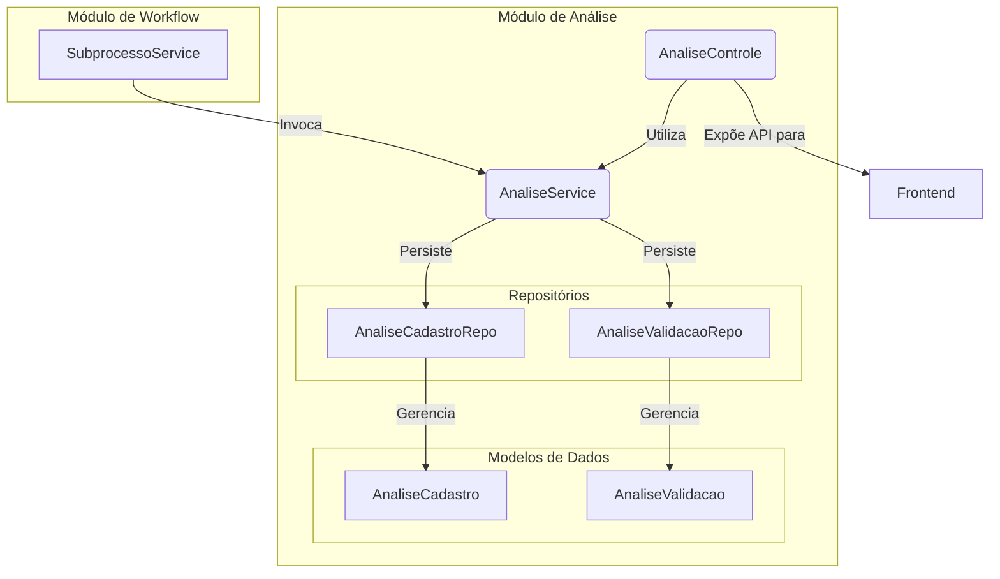

# Módulo de Análise

## Visão Geral
Este pacote é responsável por registrar o **histórico de decisões** tomadas durante o ciclo de vida de um `Subprocesso`. Ele funciona como uma trilha de auditoria, armazenando as justificativas, observações e ações (aceite, devolução) que ocorrem durante as etapas de revisão de um mapa de competências.

Para garantir a clareza do domínio, o módulo separa as análises em dois contextos distintos, cada um com sua própria entidade e API:

1.  **Análise de Cadastro:** Registra as ações de aceite ou devolução do cadastro inicial de atividades.
2.  **Análise de Validação:** Registra as ações de aceite ou devolução durante a etapa de validação do mapa.

## Arquitetura e Componentes
O `AnaliseService` é invocado pelo `SubprocessoService` sempre que uma transição de estado que requer uma justificativa ocorre (ex: `devolverCadastro`). A API exposta pelo `AnaliseControle` permite ao frontend registrar novas análises e consultar o histórico de um subprocesso.

## Componentes Principais
- **`AnaliseService`**: Centraliza a lógica de negócio para criar os registros de análise de cadastro e validação. É chamado por serviços de nível superior para garantir que as ações de workflow sejam devidamente auditadas.
- **`AnaliseControle`**: Expõe endpoints REST para o frontend, permitindo a criação e consulta do histórico de análises de um subprocesso.
  - `GET /api/subprocessos/{id}/analises-cadastro`
  - `POST /api/subprocessos/{id}/analises-cadastro`
  - `GET /api/subprocessos/{id}/analises-validacao`
  - `POST /api/subprocessos/{id}/analises-validacao`
- **`AnaliseCadastro` / `AnaliseValidacao`**: Entidades JPA que modelam os dois tipos de registro de análise. Cada uma está vinculada a um `Subprocesso` e armazena a ação realizada, as observações e o autor.
- **`AnaliseCadastroRepo` / `AnaliseValidacaoRepo`**: Repositórios Spring Data para a persistência de cada tipo de análise.

## Propósito e Uso
A principal função deste módulo é fornecer **rastreabilidade**. Ao separar as análises em entidades distintas, o sistema garante que o histórico de decisões em cada etapa do workflow seja explícito e fácil de consultar, evitando o uso de campos de "tipo" genéricos e fortalecendo a integridade do modelo de dados.