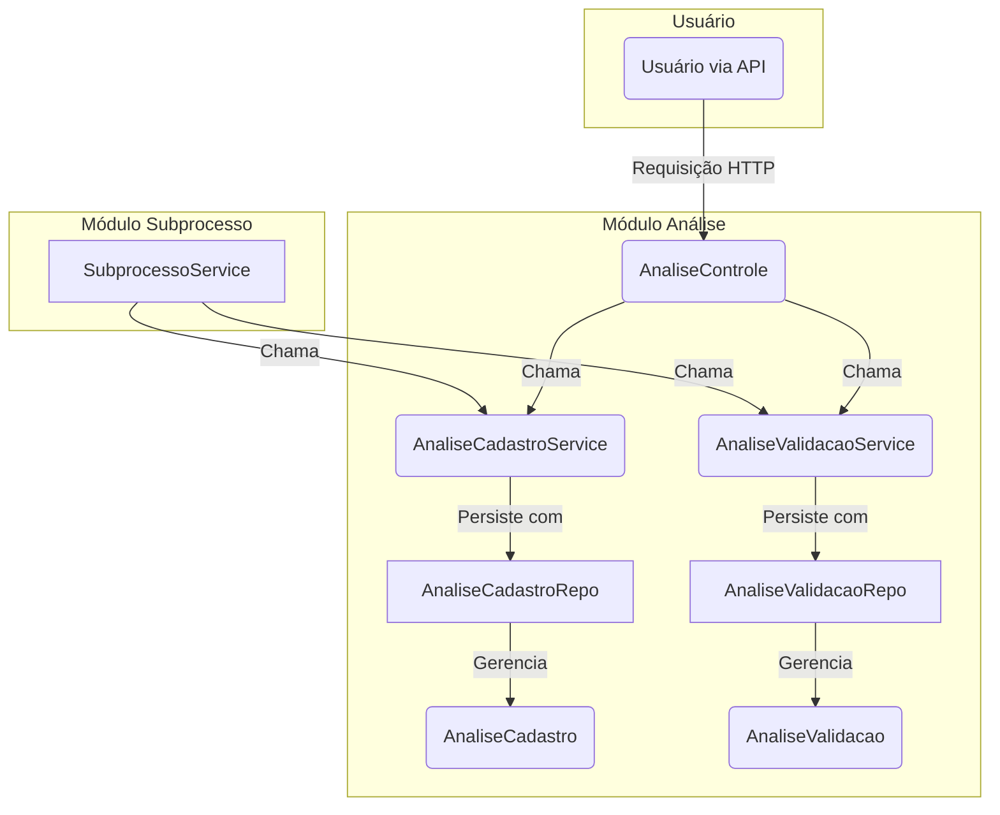

# Módulo de Análise - SGC

## Visão Geral
Este pacote é responsável por gerenciar os registros de **Análise** que ocorrem durante o ciclo de vida de um `Subprocesso`. Ele captura as observações, justificativas e decisões tomadas durante as etapas de revisão e validação dos cadastros de atividades e mapas de competências.

As análises funcionam como uma trilha de auditoria, documentando o histórico de interações em um subprocesso. Existem dois tipos principais de análise gerenciados neste módulo:

1.  **Análise de Cadastro**: Registros criados quando um cadastro de atividades é aceito ou devolvido.
2.  **Análise de Validação**: Registros criados durante o fluxo de validação de um mapa de competências.

## Arquivos Principais

### 1. `AnaliseControle.java`
**Localização:** `backend/src/main/java/sgc/analise/AnaliseControle.java`
- **Descrição:** Controlador REST que expõe endpoints para criar e listar os diferentes tipos de análise, sempre no contexto de um `Subprocesso`.
- **Endpoints Principais:**
  - `GET /api/subprocessos/{id}/analises-cadastro`: Lista o histórico de análises de cadastro de um subprocesso.
  - `POST /api/subprocessos/{id}/analises-cadastro`: Cria um novo registro de análise de cadastro.
  - `GET /api/subprocessos/{id}/analises-validacao`: Lista o histórico de análises de validação de um subprocesso.
  - `POST /api/subprocessos/{id}/analises-validacao`: Cria um novo registro de análise de validação.

### 2. Serviços de Análise
- **`AnaliseCadastroService.java`**: Classe de serviço que contém a lógica de negócio para operações com `AnaliseCadastro` (criar, listar, remover).
- **`AnaliseValidacaoService.java`**: Classe de serviço que contém a lógica de negócio para operações com `AnaliseValidacao` (criar, listar, remover).

### 3. Entidades de Análise (`modelo/`)
**Localização:** `backend/src/main/java/sgc/analise/modelo/`
- **`AnaliseCadastro.java`**: Entidade JPA que representa um registro de análise sobre o cadastro de atividades e conhecimentos. Está vinculada a um `Subprocesso`.
- **`AnaliseValidacao.java`**: Entidade JPA para um registro de análise sobre a validação de um mapa de competências. Também vinculada a um `Subprocesso`.

### 4. Repositórios (`modelo/`)
- **`AnaliseCadastroRepo.java`**: Interface Spring Data JPA para acesso aos dados da entidade `AnaliseCadastro`.
- **`AnaliseValidacaoRepo.java`**: Interface Spring Data JPA para acesso aos dados da entidade `AnaliseValidacao`.

## Diagrama de Componentes


## Como Usar

A criação de registros de análise é tipicamente orquestrada por serviços de nível superior (como `SubprocessoService`) quando uma ação de fluxo de trabalho é executada (ex: "devolver cadastro", "aceitar validação"). Os endpoints no `AnaliseControle` também permitem o registro de observações de forma ad-hoc.

**Exemplo de uso por outro serviço:**
```java
// Em um serviço que gerencia o fluxo de trabalho

@Autowired
private AnaliseCadastroService analiseCadastroService;

public void devolverCadastro(Long subprocessoId, String justificativa) {
    // ... lógica de negócio para alterar o estado do subprocesso ...

    // Cria um registro da análise que motivou a devolução
    analiseCadastroService.criarAnalise(subprocessoId, justificativa);

    // ... notificar usuário, etc. ...
}
```

## Notas Importantes
- **Trilha de Auditoria**: As entidades de análise são um componente fundamental da trilha de auditoria do sistema, pois armazenam as justificativas para as decisões tomadas ao longo do fluxo de trabalho.
- **Vínculo com Subprocesso**: Todas as análises estão intrinsecamente ligadas a um `Subprocesso`, que fornece o contexto para a avaliação.