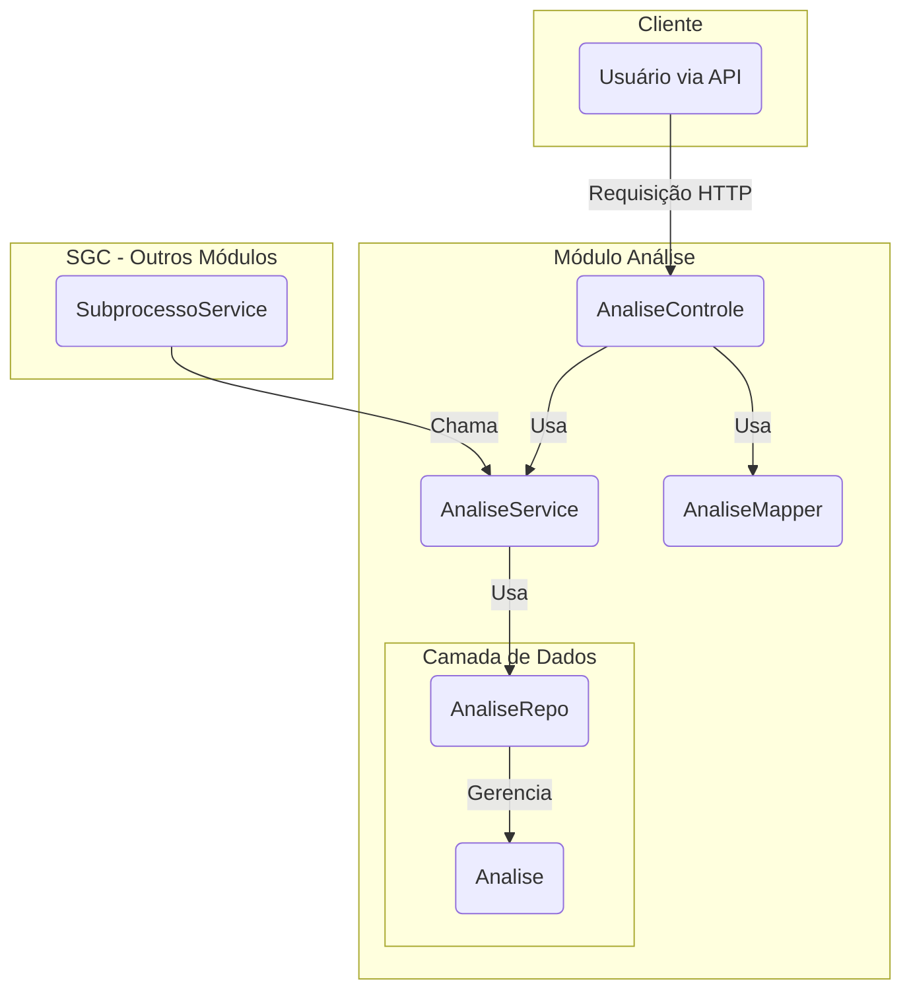

# Módulo de Análise - SGC

## Visão Geral
Este pacote gerencia o registro de análises (observações, justificativas e decisões) que ocorrem durante o ciclo de vida de um `Subprocesso`. Ele funciona como uma trilha de auditoria para as etapas de revisão do cadastro de atividades e validação do mapa de competências.

Embora a camada de persistência utilize uma única entidade `Analise` genérica, a lógica de negócio e a API são especializadas para tratar dois contextos distintos:
1.  **Análise de Cadastro**: Registros sobre o aceite ou devolução do cadastro de atividades.
2.  **Análise de Validação**: Registros sobre o aceite ou devolução do mapa de competências durante a etapa de validação.

## Arquitetura e Componentes

- **`AnaliseControle.java`**: Controller REST que expõe endpoints para criar e consultar as análises, com rotas distintas para cada contexto (`/analises-cadastro` e `/analises-validacao`).
- **`AnaliseService.java`**: Contém a lógica de negócio para criar e listar os registros de análise, interagindo com o repositório.
- **`dto/`**: Contém os DTOs e o mapper.
  - **`AnaliseCadastroDto.java`**: DTO para criar um novo registro de análise de cadastro.
  - **`AnaliseHistoricoDto.java`**: DTO para exibir o histórico de análises de cadastro.
  - **`AnaliseValidacaoHistoricoDto.java`**: DTO para exibir o histórico de análises de validação.
  - **`AnaliseMapper.java`**: MapStruct para converter entre as entidades `Analise` e os DTOs.
- **`modelo/`**: Contém a entidade JPA, enums e o repositório.
  - **`Analise.java`**: Entidade JPA que representa um registro de análise.
  - **`AnaliseRepo.java`**: Repositório Spring Data JPA para a entidade `Analise`.
  - **`TipoAnalise.java`**: Enum (`CADASTRO`, `VALIDACAO`) usado para diferenciar o contexto da análise.
  - **`TipoAcaoAnalise.java`**: Enum (`ACEITE`, `DEVOLUCAO`, `REVISAO_PEDIDO_AJUSTE`) que define a ação realizada.

## Diagrama de Componentes

## Fluxo de Trabalho

1.  **Requisição**: Um usuário, via API, envia uma requisição para o `AnaliseControle` (ex: `POST /api/subprocessos/{id}/analises-cadastro`) ou um serviço interno como `SubprocessoService` invoca `AnaliseService` diretamente.
2.  **Mapeamento**: No caso da API, o `AnaliseMapper` converte o DTO da requisição para a entidade `Analise`.
3.  **Lógica de Negócio**: `AnaliseService` processa a requisição, define o `TipoAnalise` e o `TipoAcaoAnalise` corretos e associa a análise ao `Subprocesso` correspondente.
4.  **Persistência**: O `AnaliseRepo` salva a entidade `Analise` no banco de dados.
5.  **Resposta**: No caso da API, o resultado é mapeado de volta para um DTO de histórico e retornado ao cliente.

## Notas Importantes
- **Trilha de Auditoria**: Este módulo é crucial para a trilha de auditoria do sistema, pois armazena as justificativas para as decisões tomadas ao longo do fluxo de trabalho.
- **Vínculo com Subprocesso**: Todas as análises estão intrinsecamente ligadas a um `Subprocesso`.