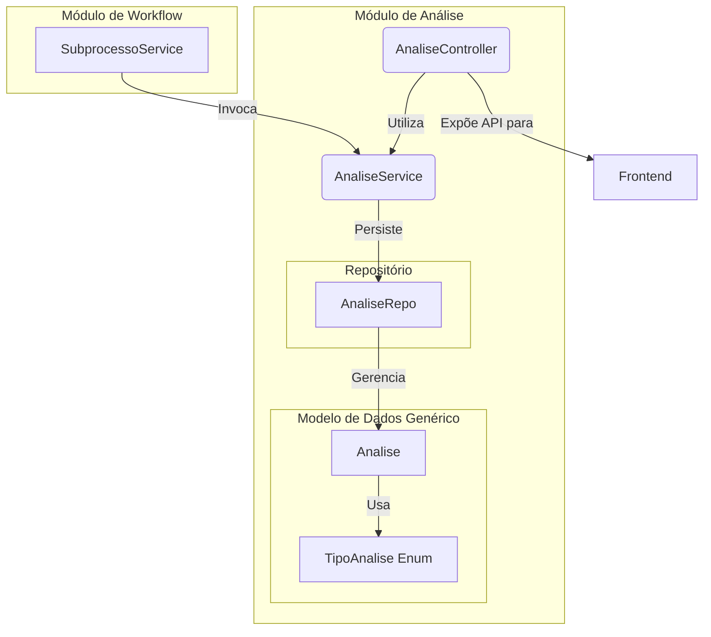

# Módulo de Análise


## Visão Geral

Este pacote é responsável por registrar o **histórico de decisões** tomadas durante o ciclo de vida de um `Subprocesso`.
Ele funciona como uma trilha de auditoria, armazenando as justificativas, observações e ações (aceite, devolução) que
ocorrem durante as etapas de revisão de um mapa de competências.

A implementação utiliza um **modelo de dados genérico**, onde uma única entidade `Analise` é usada para registrar todos
os tipos de análise. Um enum, `TipoAnalise`, é usado para diferenciar os contextos (ex: `CADASTRO` vs. `VALIDACAO`).

## Estrutura Spring Modulith

Este módulo segue a convenção Spring Modulith:

### API Pública
- **`AnaliseService`** (pacote raiz) - Facade principal para operações de análise
- **DTOs em `api/`**:
  - `CriarAnaliseRequest` - DTO para criação de análise
  - `CriarAnaliseApiRequest` - DTO para criação via API
  - `AnaliseHistoricoDto` - DTO para histórico de análises
  - `AnaliseValidacaoHistoricoDto` - DTO para validação de histórico

### Implementação Interna
- `AnaliseController` - REST endpoints
- `AnaliseMapper` - Mapeamento entre entidade e DTO
- Model: Entidades JPA e Repositories (`Analise`, `TipoAnalise`, `TipoAcaoAnalise`)

**⚠️ Importante:** Outros módulos **NÃO** devem acessar classes em `internal/`.

## Dependências

### Módulos que este módulo depende
- `processo` - Para acesso a informações de processos
- `subprocesso` - Para acesso a informações de subprocessos
- `comum` - Para componentes compartilhados

## Eventos

### Publicados
Nenhum evento é publicado por este módulo no momento.

### Consumidos
Nenhum evento é consumido por este módulo no momento.

## Arquitetura e Componentes

O `AnaliseService` é invocado pelo `SubprocessoService` (ou diretamente pelo `AnaliseController` para operações
específicas) sempre que uma transição de estado que requer uma justificativa ocorre (ex: `devolverCadastro`). A API
exposta pelo `AnaliseController` permite ao frontend registrar novas análises e consultar o histórico de um subprocesso,
usando endpoints distintos para cada tipo de análise.



## Componentes Principais

### Controladores e Serviços

- **`AnaliseService`** (API pública): Centraliza a lógica de negócio para criar os registros de análise. É chamado por serviços de
  nível superior para garantir que as ações de workflow sejam devidamente auditadas.
- **`AnaliseController`** (internal): Expõe endpoints REST para o frontend criar e consultar o histórico de cada tipo de análise.
    - `GET /api/subprocessos/{codigo}/analises-cadastro`
    - `POST /api/subprocessos/{codigo}/analises-cadastro`
    - `GET /api/subprocessos/{codigo}/analises-validacao`
    - `POST /api/subprocessos/{codigo}/analises-validacao`

### Modelo de Dados (`internal/model`)

- **`Analise`**: Entidade JPA genérica que modela um registro de análise. Está vinculada a um `Subprocesso` e armazena a
  ação realizada, as observações, o autor e o `TipoAnalise`.
- **`AnaliseRepo`**: Repositório Spring Data.
- **`TipoAnalise`**: Enum que diferencia os contextos de análise (`CADASTRO`, `VALIDACAO`).
- **`TipoAcaoAnalise`**: Enum que define as ações possíveis em uma análise (ex: `DEVOLUCAO`, `ACEITE`).

### DTOs (`api`)

- **`CriarAnaliseRequest`**: DTO utilizado para transportar os dados necessários para a criação de uma nova análise.
- **`AnaliseMapper`** (internal): Interface MapStruct para conversão de entidades (embora o controller atualmente retorne entidades
  diretamente em alguns casos, a infraestrutura de mapeamento existe para uso futuro).

## Propósito e Uso

A principal função deste módulo é fornecer **rastreabilidade**. A abordagem de modelo genérico com um campo de "tipo"
foi utilizada para registrar o histórico de decisões em diferentes etapas do workflow sem duplicar estruturas de dados.


## Como Testar

Para executar apenas os testes deste módulo:
```bash
./gradlew :backend:test --tests "sgc.analise.*"
```
