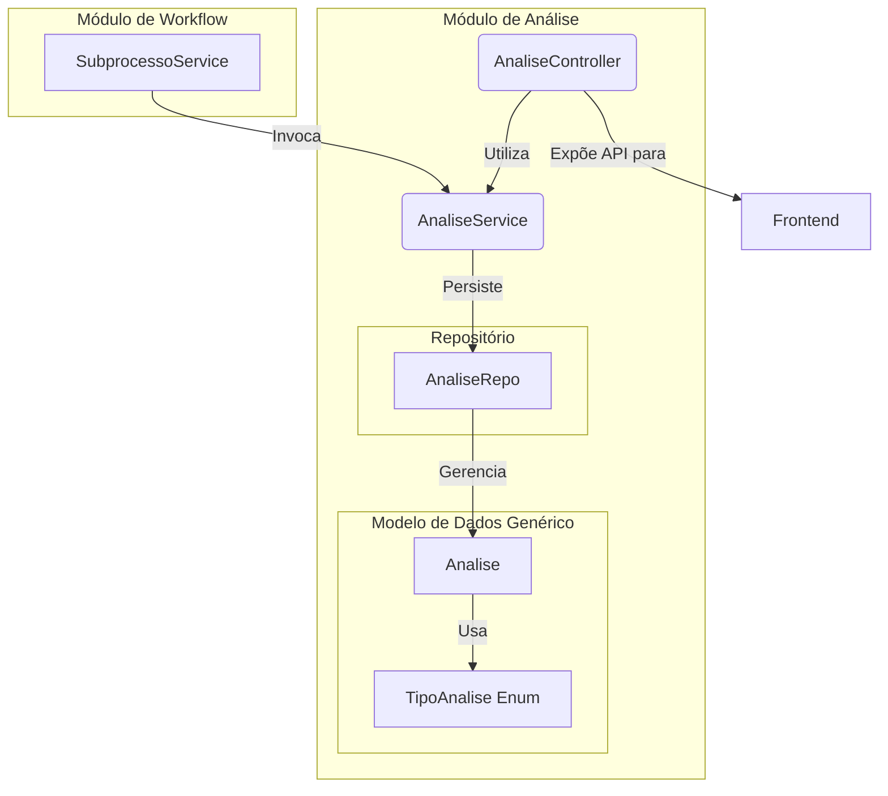

# Módulo de Análise

## Visão Geral
Este pacote é responsável por registrar o **histórico de decisões** tomadas durante o ciclo de vida de um `Subprocesso`. Ele funciona como uma trilha de auditoria, armazenando as justificativas, observações e ações (aceite, devolução) que ocorrem durante as etapas de revisão de um mapa de competências.

A implementação utiliza um **modelo de dados genérico**, onde uma única entidade `Analise` é usada para registrar todos os tipos de análise. Um enum, `TipoAnalise`, é usado para diferenciar os contextos (ex: `CADASTRO` vs. `VALIDACAO`).

## Arquitetura e Componentes
O `AnaliseService` é invocado pelo `SubprocessoService` sempre que uma transição de estado que requer uma justificativa ocorre (ex: `devolverCadastro`). A API exposta pelo `AnaliseController` permite ao frontend registrar novas análises e consultar o histórico de um subprocesso, usando endpoints distintos para cada tipo de análise.

## Componentes Principais
- **`AnaliseService`**: Centraliza a lógica de negócio para criar os registros de análise, independentemente do tipo. É chamado por serviços de nível superior para garantir que as ações de workflow sejam devidamente auditadas.
- **`AnaliseController`**: Expõe endpoints REST distintos para o frontend criar e consultar o histórico de cada tipo de
  análise de um subprocesso.
  - `GET /api/subprocessos/{codigo}/analises-cadastro`
  - `POST /api/subprocessos/{codigo}/analises-cadastro`
  - `GET /api/subprocessos/{codigo}/analises-validacao`
  - `POST /api/subprocessos/{codigo}/analises-validacao`
- **`Analise`**: Entidade JPA genérica que modela um registro de análise. Está vinculada a um `Subprocesso` e armazena a ação realizada, as observações, o autor e o `TipoAnalise`.
- **`AnaliseRepo`**: Repositório Spring Data para a persistência da entidade `Analise`.
- **`TipoAnalise`**: Enum que diferencia os contextos de análise (`CADASTRO`, `VALIDACAO`).

## Propósito e Uso
A principal função deste módulo é fornecer **rastreabilidade**. A abordagem de modelo genérico com um campo de "tipo" foi utilizada para registrar o histórico de decisões em diferentes etapas do workflow. A API segmentada em endpoints separados para cada tipo de análise ajuda a manter a clareza para o cliente frontend, apesar do modelo de dados unificado.