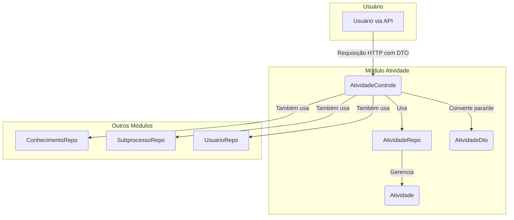

# Módulo de Atividade - SGC

## Visão Geral
Este pacote é responsável por gerenciar as **Atividades** do sistema. Uma `Atividade` representa uma tarefa ou ação específica que é cadastrada no contexto de um `Mapa` de competências.

O módulo fornece a estrutura de dados (`Atividade.java`), o repositório para acesso ao banco de dados (`AtividadeRepo.java`) e o controlador REST (`AtividadeControle.java`) para expor as operações CRUD (Criar, Ler, Atualizar, Excluir) via API.

## Arquivos Principais

### 1. `Atividade.java`
**Localização:** `backend/src/main/java/sgc/atividade/modelo/Atividade.java`
- **Descrição:** Entidade JPA que representa uma atividade. Mapeia a tabela `ATIVIDADE` no banco de dados.
- **Campos Importantes:**
  - `descricao`: O texto que descreve a atividade.
  - `mapa`: A associação com a entidade `Mapa` à qual a atividade pertence.

### 2. `AtividadeControle.java`
**Localização:** `backend/src/main/java/sgc/atividade/AtividadeControle.java`
- **Descrição:** Controlador REST que expõe endpoints para gerenciar a entidade `Atividade`. Este controlador contém a lógica de negócio para validação e orquestração das operações, interagindo diretamente com os repositórios.
- **Endpoints Principais:**
  - `GET /api/atividades`: Lista todas as atividades cadastradas.
  - `GET /api/atividades/{id}`: Obtém os detalhes de uma atividade específica por seu ID.
  - `POST /api/atividades`: Cria uma nova atividade, validando o estado do subprocesso e as permissões do usuário.
  - `PUT /api/atividades/{id}`: Atualiza uma atividade existente.
  - `DELETE /api/atividades/{id}`: Exclui uma atividade e seus conhecimentos associados (deleção em cascata na camada de aplicação).

### 3. `AtividadeRepo.java`
**Localização:** `backend/src/main/java/sgc/atividade/modelo/AtividadeRepo.java`
- **Descrição:** Interface Spring Data JPA que fornece os métodos padrão para acesso e manipulação dos dados da entidade `Atividade`.

### 4. DTOs e Mappers (`dto/`)
**Localização:** `backend/src/main/java/sgc/atividade/dto/`
- **Descrição:** O pacote `dto` contém os Data Transfer Objects (DTOs) utilizados para a comunicação via API, como `AtividadeDto`. Isso desacopla a representação da API da estrutura interna da entidade `Atividade`.

## Diagrama de Componentes


## Como Usar
Para gerenciar atividades, interaja com os endpoints expostos pelo `AtividadeControle` utilizando um cliente HTTP.

**Exemplo: Criar uma nova atividade**
```http
POST /api/atividades
Content-Type: application/json

{
  "descricao": "Elaborar o relatório de progresso do projeto.",
  "mapaId": 123
}
```

## Notas Importantes
- **Relacionamento com Mapa**: Cada `Atividade` está diretamente associada a um `Mapa`, indicando que as atividades são definidas dentro do contexto de um mapa de competências específico.
- **Uso de DTOs**: A comunicação com o frontend é feita através de DTOs, uma prática que aumenta a segurança e a flexibilidade da API, evitando a exposição direta das entidades JPA.