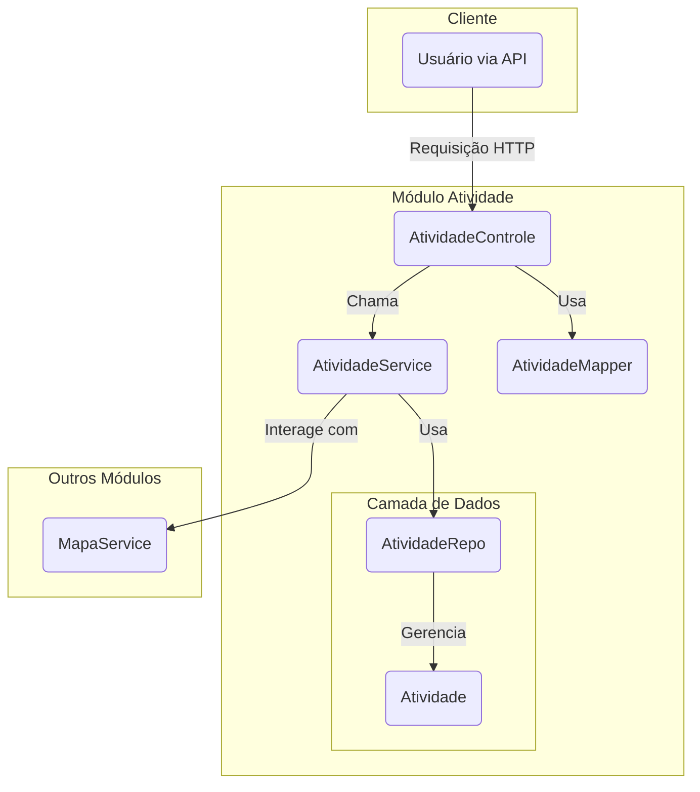

# Módulo de Atividade - SGC

## Visão Geral
Este pacote gerencia a entidade `Atividade`, que representa uma tarefa ou atribuição específica dentro de um `Mapa` de competências. O módulo fornece a lógica de negócio, os endpoints da API e a persistência de dados para todas as operações relacionadas a atividades.

## Arquitetura e Componentes

- **`AtividadeControle.java`**: Controller REST que expõe os endpoints para as operações CRUD (Criar, Ler, Atualizar, Excluir) da entidade `Atividade`.
- **`AtividadeService.java`**: Contém a lógica de negócio para o gerenciamento de atividades. É responsável por validar os dados, interagir com o repositório e orquestrar as operações.
- **`dto/`**:
  - **`AtividadeDto.java`**: DTO padrão para representar a entidade `Atividade` na API.
  - **`AtividadeMapper.java`**: Interface MapStruct para a conversão entre a entidade `Atividade` e seus DTOs.
- **`modelo/`**:
  - **`Atividade.java`**: Entidade JPA que mapeia a tabela `ATIVIDADE`. Contém a descrição da atividade e a associação com o `Mapa` a que pertence.
  - **`AtividadeRepo.java`**: Repositório Spring Data JPA para acesso aos dados da entidade `Atividade`.

## Diagrama de Componentes


## Como Usar
Para gerenciar atividades, interaja com os endpoints expostos pelo `AtividadeControle`. A lógica de negócio mais complexa, como validações ou interações com outros módulos, é encapsulada no `AtividadeService`.

**Exemplo: Criar uma nova atividade**
```http
POST /api/atividades
Content-Type: application/json

{
  "mapaId": 1,
  "descricao": "Elaborar o relatório trimestral de desempenho."
}
```

## Notas Importantes
- **Relacionamento com Mapa**: Toda `Atividade` deve estar associada a um `Mapa`, fornecendo o contexto para o mapeamento de competências.
- **Uso de DTOs**: A comunicação com a API é feita através de DTOs para desacoplar a representação externa da entidade de persistência, aumentando a segurança e a flexibilidade.