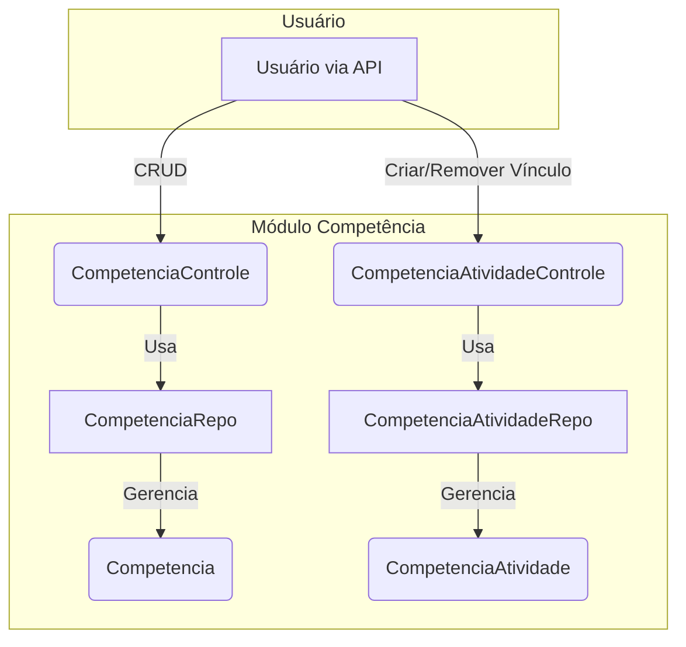

# Módulo de Competências - SGC

## Visão Geral
Este pacote é responsável por gerenciar as **Competências** e sua associação com **Atividades**. Ele permite não apenas o gerenciamento CRUD (Criar, Ler, Atualizar, Excluir) de competências, mas também o gerenciamento dos vínculos que conectam uma competência a uma ou mais atividades.

O módulo está estruturado com controladores distintos para cada responsabilidade, entidades no pacote `modelo` e DTOs para a comunicação via API.

## Arquivos Principais

### Gestão de Competências

#### 1. `Competencia.java`
**Localização:** `backend/src/main/java/sgc/competencia/modelo/Competencia.java`
- **Descrição:** Entidade JPA que representa uma competência. Mapeia a tabela `COMPETENCIA`.
- **Campos Importantes:**
  - `descricao`: O texto que descreve a competência.
  - `mapa`: Associação com a entidade `Mapa` à qual a competência pertence.

#### 2. `CompetenciaControle.java`
**Localização:** `backend/src/main/java/sgc/competencia/CompetenciaControle.java`
- **Descrição:** Controlador REST que expõe endpoints para as operações CRUD da entidade `Competencia`.
- **Endpoints Principais:**
  - `GET /api/competencias`: Lista todas as competências.
  - `POST /api/competencias`: Cria uma nova competência.
  - `PUT /api/competencias/{id}`: Atualiza uma competência existente.
  - `DELETE /api/competencias/{id}`: Exclui uma competência.

#### 3. `CompetenciaRepo.java`
**Localização:** `backend/src/main/java/sgc/competencia/modelo/CompetenciaRepo.java`
- **Descrição:** Interface Spring Data JPA para acesso aos dados da entidade `Competencia`.

### Gestão do Vínculo Competência-Atividade

#### 4. `CompetenciaAtividade.java`
**Localização:** `backend/src/main/java/sgc/competencia/modelo/CompetenciaAtividade.java`
- **Descrição:** Entidade que representa a tabela de associação entre `Competencia` and `Atividade`. Utiliza uma chave primária composta (`@EmbeddedId`) para o mapeamento.
- **Relacionamentos:**
  - `ManyToOne` com `Competencia`.
  - `ManyToOne` com `Atividade`.

#### 5. `CompetenciaAtividadeControle.java`
**Localização:** `backend/src/main/java/sgc/competencia/CompetenciaAtividadeControle.java`
- **Descrição:** Controlador REST dedicado a gerenciar o vínculo entre `Competencia` e `Atividade`.
- **Endpoints Principais:**
  - `POST /api/competencia-atividades`: Cria um novo vínculo entre uma competência e uma atividade.
  - `DELETE /api/competencia-atividades`: Remove um vínculo existente.

#### 6. `CompetenciaAtividadeRepo.java`
**Localização:** `backend/src/main/java/sgc/competencia/modelo/CompetenciaAtividadeRepo.java`
- **Descrição:** Interface Spring Data JPA para acesso aos dados da entidade de associação `CompetenciaAtividade`.

### DTOs e Mappers (`dto/`)
**Localização:** `backend/src/main/java/sgc/competencia/dto/`
- **Descrição:** O pacote `dto` contém os Data Transfer Objects (DTOs) para a comunicação via API, como `CompetenciaDto`. Isso desacopla a representação da API da estrutura interna das entidades.

## Diagrama de Componentes


## Como Usar

### Gerenciando Competências
Interaja com os endpoints do `CompetenciaControle` através de um cliente HTTP.

**Exemplo: Criar uma nova competência**
```http
POST /api/competencias
Content-Type: application/json

{
  "descricao": "Capacidade de Análise Crítica",
  "mapaId": 42
}
```

### Vinculando Competência e Atividade
Interaja com os endpoints do `CompetenciaAtividadeControle`.

**Exemplo: Vincular uma competência a uma atividade**
```http
POST /api/competencia-atividades
Content-Type: application/json

{
  "competenciaId": 10,
  "atividadeId": 25
}
```

## Notas Importantes
- **Chave Primária Composta**: A entidade `CompetenciaAtividade` usa uma classe aninhada `Id` como chave primária composta (`@EmbeddedId`), uma abordagem padrão para gerenciar tabelas de associação muitos-para-muitos em JPA.
- **Desacoplamento**: A separação dos controladores (`CompetenciaControle` e `CompetenciaAtividadeControle`) mantém as responsabilidades bem definidas: um para o recurso principal (`Competencia`) e outro para o seu relacionamento com `Atividade`.