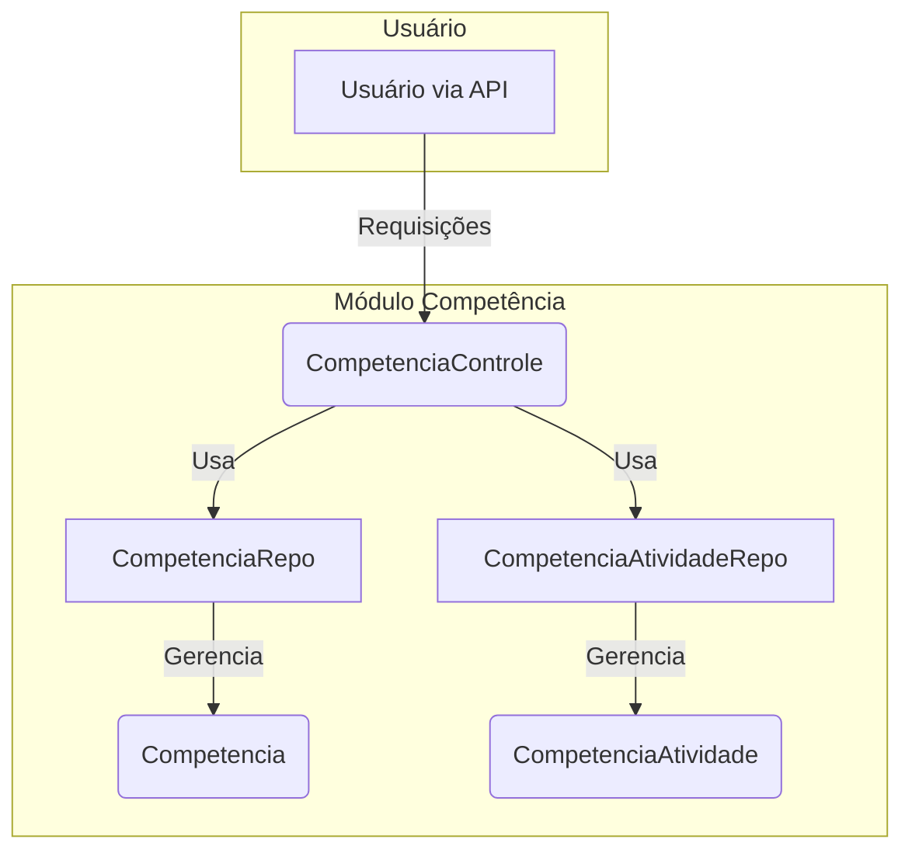

# Módulo de Competências - SGC

## Visão Geral
Este pacote é responsável por gerenciar as **Competências** e sua associação com **Atividades**. Ele fornece uma API REST para o gerenciamento CRUD (Criar, Ler, Atualizar, Excluir) de competências e para gerenciar os vínculos que conectam uma competência a uma ou mais atividades.

A lógica de negócio e a exposição dos endpoints estão centralizadas em um único controlador, `CompetenciaControle`, que orquestra as interações com as entidades e repositórios.

## Arquivos Principais

### 1. `CompetenciaControle.java`
**Localização:** `backend/src/main/java/sgc/competencia/CompetenciaControle.java`
- **Descrição:** Controlador REST que centraliza todas as operações relacionadas a competências e seus vínculos com atividades.
- **Endpoints de Competência:**
  - `GET /api/competencias`: Lista todas as competências.
  - `POST /api/competencias`: Cria uma nova competência.
  - `PUT /api/competencias/{id}`: Atualiza uma competência existente.
  - `DELETE /api/competencias/{id}`: Exclui uma competência.
- **Endpoints de Vínculo Competência-Atividade (Aninhados):**
  - `GET /api/competencias/{idCompetencia}/atividades`: Lista as atividades vinculadas a uma competência.
  - `POST /api/competencias/{idCompetencia}/atividades`: Cria um novo vínculo entre a competência e uma atividade.
  - `DELETE /api/competencias/{idCompetencia}/atividades/{idAtividade}`: Remove um vínculo existente.

### 2. Entidades (`modelo/`)
- **`Competencia.java`**: Entidade JPA que representa uma competência. Mapeia a tabela `COMPETENCIA`.
- **`CompetenciaAtividade.java`**: Entidade que representa a tabela de associação entre `Competencia` e `Atividade`. Utiliza uma chave primária composta (`@EmbeddedId`).

### 3. Repositórios (`modelo/`)
- **`CompetenciaRepo.java`**: Interface Spring Data JPA para acesso aos dados da entidade `Competencia`.
- **`CompetenciaAtividadeRepo.java`**: Interface Spring Data JPA para acesso aos dados da entidade de associação `CompetenciaAtividade`.

### 4. DTOs e Mappers (`dto/`)
**Localização:** `backend/src/main/java/sgc/competencia/dto/`
- **Descrição:** Contém os Data Transfer Objects (DTOs) para a comunicação via API, como `CompetenciaDto`, desacoplando a representação da API da estrutura interna das entidades.

## Diagrama de Componentes


## Como Usar

### Gerenciando Competências
Interaja com os endpoints base do `CompetenciaControle`.

**Exemplo: Criar uma nova competência**
```http
POST /api/competencias
Content-Type: application/json

{
  "descricao": "Capacidade de Análise Crítica",
  "mapaCodigo": 42
}
```

### Vinculando Competência e Atividade
Interaja com os endpoints aninhados.

**Exemplo: Vincular uma competência a uma atividade**
```http
POST /api/competencias/10/atividades
Content-Type: application/json

{
  "idAtividade": 25
}
```

## Notas Importantes
- **Chave Primária Composta**: A entidade `CompetenciaAtividade` usa uma classe aninhada `Id` como chave primária composta (`@EmbeddedId`), uma abordagem padrão para gerenciar tabelas de associação muitos-para-muitos em JPA.
- **Controlador Consolidado**: A gestão de competências e de seus relacionamentos está consolidada no `CompetenciaControle` para simplificar a API e manter a coesão.