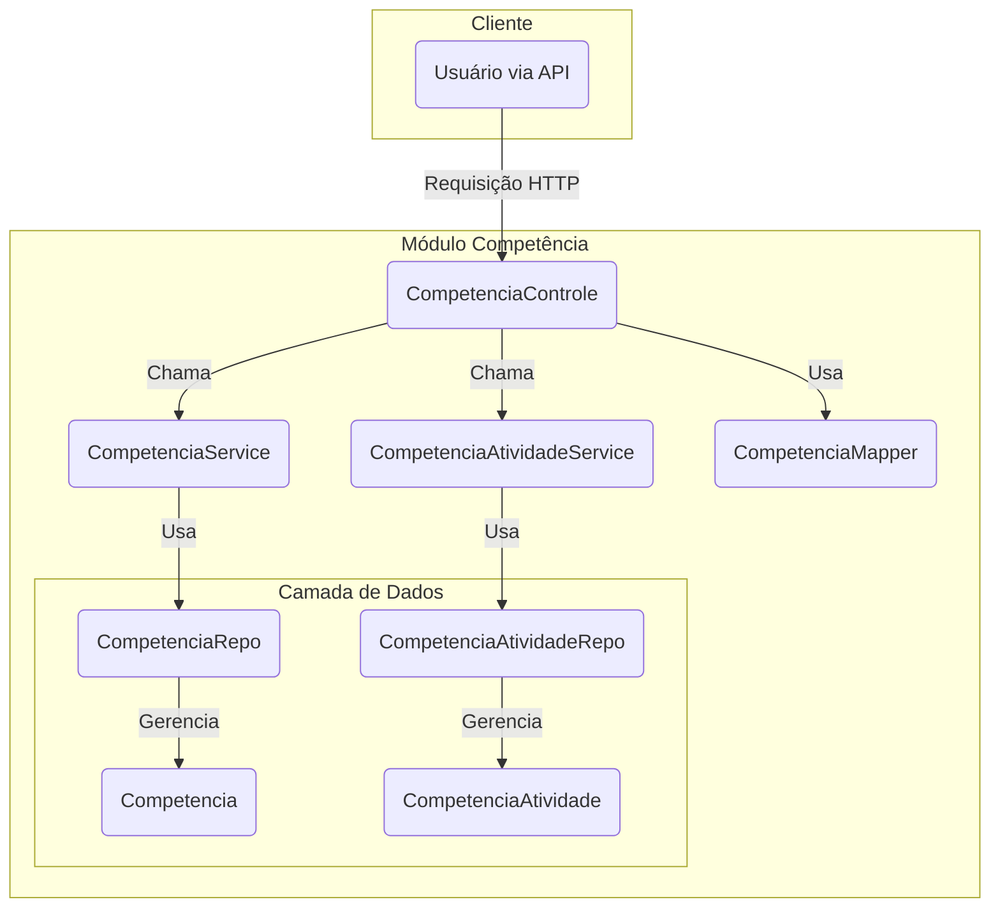

# Módulo de Competência - SGC

## Visão Geral
Este pacote gerencia as **Competências** e sua associação com **Atividades**. Ele centraliza a lógica de negócio, os endpoints da API e a persistência de dados para as competências e seus relacionamentos.

## Arquitetura e Componentes

- **`CompetenciaControle.java`**: Controller REST que expõe endpoints para as operações CRUD de competências e para o gerenciamento dos vínculos com atividades.
- **`CompetenciaService.java`**: Contém a lógica de negócio para o gerenciamento de competências (criar, ler, atualizar, excluir).
- **`CompetenciaAtividadeService.java`**: Serviço dedicado a gerenciar o vínculo entre `Competencia` e `Atividade`.
- **`dto/`**:
  - **`CompetenciaDto.java`**: DTO para representar a entidade `Competencia` na API.
  - **`CompetenciaMapper.java`**: Interface MapStruct para a conversão entre a entidade `Competencia` e seus DTOs.
- **`modelo/`**:
  - **`Competencia.java`**: Entidade JPA que representa uma competência.
  - **`CompetenciaAtividade.java`**: Entidade de associação que representa o vínculo entre `Competencia` e `Atividade`.
  - **`CompetenciaRepo.java`**: Repositório para a entidade `Competencia`.
  - **`CompetenciaAtividadeRepo.java`**: Repositório para a entidade de associação `CompetenciaAtividade`.

## Diagrama de Componentes


## Como Usar

### Gerenciando Competências
Interaja com os endpoints do `CompetenciaControle` para criar, ler, atualizar e excluir competências.

**Exemplo: Criar uma nova competência**
```http
POST /api/competencias
Content-Type: application/json

{
  "mapaId": 1,
  "descricao": "Pensamento Crítico"
}
```

### Vinculando Competência e Atividade
A API para vincular e desvincular competências de atividades também é exposta através do `CompetenciaControle`.

**Exemplo: Vincular competência a uma atividade**
```http
POST /api/competencias/{id}/atividades
Content-Type: application/json

{
  "atividadeId": 15
}
```

## Notas Importantes
- **Separação de Serviços**: A lógica de negócio é dividida entre `CompetenciaService` (para o ciclo de vida da competência em si) and `CompetenciaAtividadeService` (para gerenciar o relacionamento), promovendo a coesão.
- **DTOs e Mappers**: O uso de DTOs e MapStruct desacopla a API da persistência, seguindo as melhores práticas de design de API.