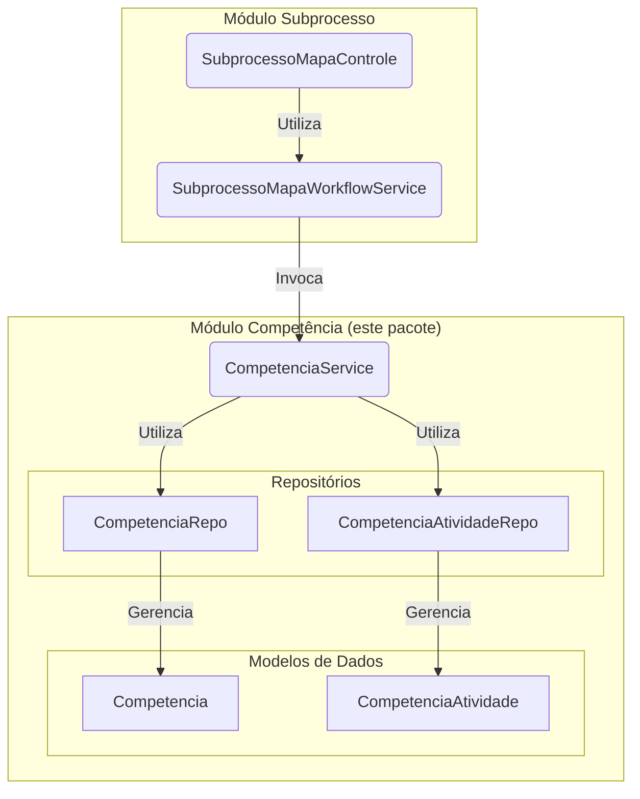

# Módulo de Competência

## Visão Geral
Este pacote gerencia a entidade `Competencia` e sua associação com `Atividades`. Uma competência representa um conjunto de habilidades ou conhecimentos. Este módulo fornece a lógica de negócio para o gerenciamento completo de competências, incluindo a criação, atualização, exclusão e a gestão dos vínculos com as atividades.

**Nota Arquitetural Importante:** Este pacote **não possui uma camada de controle (`*Controle`)**. A API REST para o gerenciamento de `Competências` foi centralizada no `SubprocessoMapaControle`, que por sua vez invoca o `CompetenciaService`.

## Arquitetura e Componentes
O `CompetenciaService` encapsula toda a lógica de negócio. Ele é um serviço de domínio puro, invocado por outros serviços de nível superior (como `SubprocessoMapaWorkflowService`) para manipular os dados de competências.

## Componentes Principais
- **`CompetenciaService`**: Contém a lógica de negócio para todas as operações de CRUD de `Competencia` e para gerenciar seus vínculos com `Atividade`.
- **`Competencia`**: Entidade JPA que representa uma competência.
- **`CompetenciaAtividade`**: Entidade de associação que representa a relação N-para-N entre `Competencia` e `Atividade`.
- **`CompetenciaRepo` / `CompetenciaAtividadeRepo`**: Repositórios Spring Data para a persistência das entidades.

## Propósito e Uso
O módulo permite que a aplicação defina competências de forma granular e as componha associando-as a múltiplas atividades. A decisão de centralizar a exposição da API no `SubprocessoMapaControle` reflete o fato de que, no contexto do negócio, a gestão de competências ocorre sempre dentro de um `Subprocesso` ativo.
