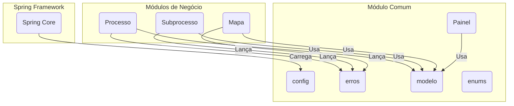

# Módulo Comum - SGC

## Visão Geral
O pacote `comum` é um pilar da aplicação, contendo classes, configurações e utilitários transversais que são utilizados por outros módulos. Ele serve como uma base compartilhada, definindo entidades, configurações globais, tratamento de erros e outros componentes para garantir a consistência e evitar a duplicação de código.

## Arquitetura e Componentes

- **`PainelControle.java` / `PainelService.java`**: Fornecem dados agregados para um painel (dashboard) da aplicação, oferecendo uma visão geral do estado dos processos.
- **`config/`**: Contém classes de configuração do Spring.
  - **`ConfigAsync.java`**: Configura o pool de threads para operações assíncronas (ex: envio de notificações).
  - **`ConfigWeb.java`**: Define configurações globais da aplicação web, como CORS.
- **`erros/`**: Define a hierarquia de exceções customizadas e o handler global.
  - **`RestExceptionHandler.java`**: `@ControllerAdvice` que captura exceções e as traduz em respostas HTTP padronizadas no formato `ErroApi`.
  - **Exceções Notáveis**: `ErroDominioNaoEncontrado` (404), `ErroDominioAccessoNegado` (403), `ErroServicoExterno` (502).
- **`enums/`**: Contém enums globais como `SituacaoProcesso` e `SituacaoSubprocesso`.
- **`modelo/`**: Contém entidades de base compartilhadas.
  - **`EntidadeBase.java`**: Superclasse (`@MappedSuperclass`) que fornece um campo de ID padronizado (`codigo`).
  - **`Administrador.java`**: Entidade que representa um administrador do sistema.
  - **`Parametro.java`**: Entidade para armazenar parâmetros de configuração do sistema no banco de dados.

## Diagrama de Componentes


## Tratamento de Erros
O tratamento de erros é centralizado no `RestExceptionHandler`, que captura exceções específicas lançadas pelos serviços e as converte em um objeto `ErroApi` padronizado, que é então serializado para JSON e retornado ao cliente com o status HTTP apropriado.

**Exemplo de uso:**
```java
@Service
public class ExemploService {

    @Autowired
    private ExemploRepository exemploRepository;

    public Exemplo findById(Long id) {
        return exemploRepository.findById(id)
            .orElseThrow(() -> new ErroDominioNaoEncontrado("Recurso com ID " + id + " não encontrado."));
    }
}
```

## Notas Importantes
- **Centralização**: Manter componentes compartilhados neste pacote é crucial para a manutenibilidade e consistência da aplicação.
- **Configuração**: As classes em `config/` são carregadas automaticamente pelo Spring na inicialização.
- **Exceções**: As exceções customizadas em `erros/` devem ser usadas em toda a aplicação para garantir que os erros sejam tratados de forma uniforme.