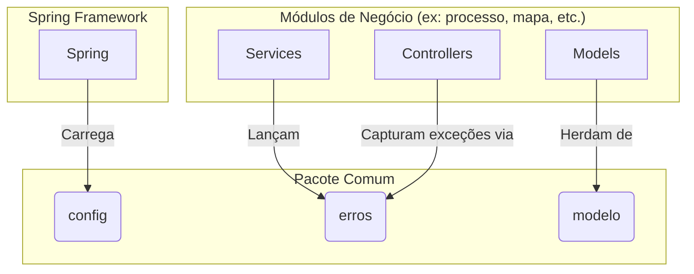

# Pacote Comum

## Visão Geral
O pacote `comum` é a fundação da aplicação SGC. Ele contém código transversal, essencial para o funcionamento de todos os outros módulos. Seu objetivo é centralizar componentes compartilhados para evitar a duplicação de código e garantir consistência em toda a base de código.

Este pacote **não contém lógica de negócio**. Seus componentes são utilitários, configurações e abstrações.

## Arquitetura e Subpacotes
O `comum` fornece a infraestrutura básica sobre a qual os módulos de negócio são construídos.



### 1. `config`
- **Responsabilidade:** Contém classes de configuração do Spring Framework.
- **Componentes Notáveis:**
  - `WebConfig`: Configurações globais da aplicação web, como CORS.
  - `ThymeleafConfig`: Configura o motor de templates para e-mails.
  - `OpenApiConfig`: Configurações relacionadas à geração da documentação OpenAPI (Swagger).

### 2. `erros`
- **Responsabilidade:** Define a hierarquia de exceções customizadas e o tratador global de erros.
- **Componentes Notáveis:**
  - `RestExceptionHandler`: Um `@ControllerAdvice` que intercepta exceções lançadas pela aplicação e as converte em respostas JSON padronizadas para a API.
  - `ErroDominioNaoEncontrado`: Exceção padrão para ser lançada quando uma entidade não é encontrada (resulta em HTTP 404).
  - `ErroAcessoNegado`: Exceção para violações de segurança (resulta em HTTP 403).
  - `ApiError`: Classe que modela a resposta de erro JSON padrão.

### 3. `modelo`
- **Responsabilidade:** Contém modelos de dados compartilhados.
- **Componentes Notáveis:**
  - `EntidadeBase`: Uma superclasse (`@MappedSuperclass`) que fornece um campo de ID (`codigo`) padronizado para a maioria das entidades JPA do sistema.

## Propósito e Uso
As classes deste pacote são, em sua maioria, usadas de forma implícita pelo framework ou de forma explícita pelos outros módulos.

- **Configurações (`config`)**: Carregadas automaticamente pelo Spring na inicialização.
- **Exceções (`erros`)**: Lançadas pelos serviços para sinalizar um erro de negócio ou técnico. O `RestExceptionHandler` cuida do resto.
- **Modelo (`modelo`)**: A `EntidadeBase` é estendida por outras entidades para padronizar a chave primária.

**Exemplo de uso de uma exceção:**
```java
// Em um serviço de outro módulo
public Recurso buscar(Long id) {
    return repository.findById(id)
        .orElseThrow(() -> new ErroDominioNaoEncontrado("Recurso", id));
}
```