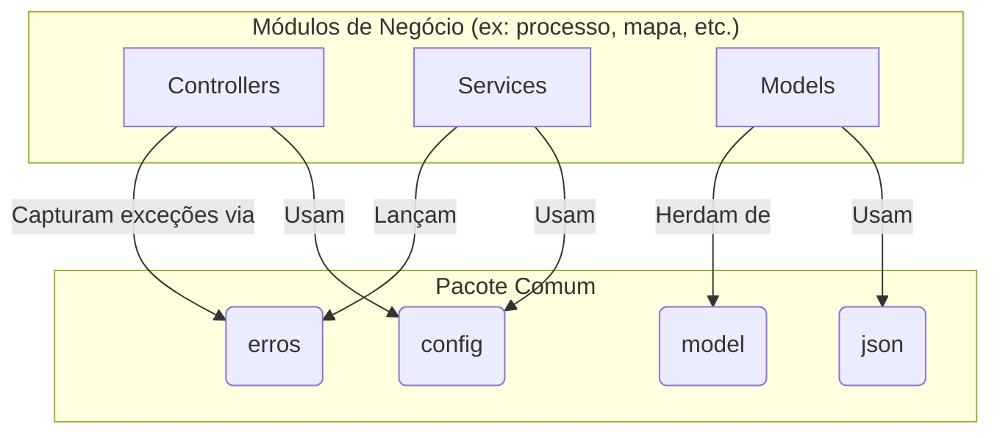

# Pacote Comum

## Visão Geral
O pacote `comum` é uma das fundações da aplicação SGC. Ele contém código transversal, essencial para o funcionamento de outros módulos. Seu objetivo é centralizar componentes compartilhados para evitar a duplicação de código e garantir consistência.

Este pacote abriga exclusivamente código de suporte sem lógica de negócio.

## Arquitetura e Subpacotes

O `comum` fornece infraestrutura básica, como o tratamento de erros, modelos de dados compartilhados, configurações do
Spring e suporte para serialização JSON.



### 1. `erros`
- **Responsabilidade:** Define a hierarquia de exceções customizadas e o tratador global de erros.
- **Componentes Notáveis:**
  - `RestExceptionHandler`: Um `@ControllerAdvice` que intercepta exceções lançadas pela aplicação e as converte em respostas JSON padronizadas para a API.
  - `ErroEntidadeNaoEncontrada`: Exceção padrão lançada quando uma entidade não é encontrada (resulta em HTTP 404).
  - `ErroValidacao`: Exceção para erros de validação de negócio (resulta em HTTP 400).
  - `ErroNegocio`: Exceção base para erros de negócio genéricos.
  - `ApiError`: Classe que modela a resposta de erro JSON padrão.

### 2. `model`
- **Responsabilidade:** Contém modelos de dados compartilhados.
- **Componentes Notáveis:**
  - `EntidadeBase`: Uma superclasse (`@MappedSuperclass`) que fornece um campo de ID (`codigo`) padronizado para a maioria das entidades JPA do sistema.

### 3. `config`

- **Responsabilidade:** Centraliza as classes de configuração do Spring.
- **Componentes Notáveis:**
    - Configurações de segurança, serialização, banco de dados e outras configurações transversais da aplicação.

### 4. `json`

- **Responsabilidade:** Fornece configurações e utilitários para serialização/deserialização JSON.
- **Componentes Notáveis:**
    - Configurações customizadas do Jackson para tratamento de tipos específicos.

## Propósito e Uso
- **Exceções (`erros`)**: Lançadas pelos serviços para sinalizar um erro de negócio ou técnico. O `RestExceptionHandler` cuida do resto.
- **Modelo (`model`)**: A `EntidadeBase` é estendida por outras entidades para padronizar a chave primária.
- **Configuração (`config`)**: Classes de configuração do Spring são carregadas automaticamente durante a inicialização
  da aplicação.

**Exemplo de uso de uma exceção:**
```java
// Em um serviço de outro módulo
public Recurso buscar(Long codigo) {
    return repository.findById(codigo)
        .orElseThrow(() -> new ErroEntidadeNaoEncontrada("Recurso", codigo));
}
```
