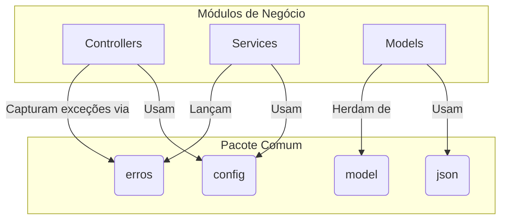

# Pacote Comum


## Visão Geral

O pacote `comum` é uma das fundações da aplicação SGC. Ele contém código transversal, essencial para o funcionamento de
outros módulos. Seu objetivo é centralizar componentes compartilhados para evitar a duplicação de código e garantir
consistência.

Este pacote abriga exclusivamente código de suporte sem lógica de negócio específica de domínio.

## Arquitetura e Subpacotes

O `comum` fornece infraestrutura básica, como o tratamento de erros, modelos de dados compartilhados, configurações do
Spring e suporte para serialização JSON.



### 1. `exceções`

- **Responsabilidade:** Define a hierarquia de exceções customizadas e o tratador global de erros.
- **Componentes Notáveis:**
    - **`RestExceptionHandler`**: Um `@ControllerAdvice` que intercepta exceções lançadas pela aplicação e as converte
      em respostas JSON padronizadas (`ErroApi`).
    - **`ErroApi`**: Classe que modela a resposta de erro JSON padrão (status, mensagem, timestamp).
    - **`ErroSubApi`**: Classe para detalhes de erros (ex: campos inválidos na validação).
    - **Exceções de Negócio:**
        - `ErroEntidadeNaoEncontrada`: HTTP 404.
        - `ErroValidacao`: HTTP 400.
        - `ErroSituacaoInvalida`: HTTP 409 (Conflito de estado).
        - `ErroAccessoNegado`: HTTP 403.

### 2. `model`

- **Responsabilidade:** Contém modelos de dados compartilhados.
- **Componentes Notáveis:**
    - **`EntidadeBase`**: Superclasse (`@MappedSuperclass`) que fornece o campo `codigo` (ID) para as entidades JPA.
    - **`Parametro`**: Entidade para configuração dinâmica de parâmetros do sistema.

### 3. `config`

- **Responsabilidade:** Centraliza as classes de configuração do Spring.
- **Componentes Notáveis:**
    - `ConfigSeguranca`: Configurações do Spring Security.
    - `ConfigWeb`: Configurações de CORS e MVC.
    - `ConfigThymeleaf`: Configuração do template engine para e-mails.

### 4. `json`

- **Responsabilidade:** Utilitários para serialização e sanitização JSON.
- **Componentes Notáveis:**
    - `SanitizeHtml`: Anotação customizada para sanitização de HTML.
    - `HtmlSanitizingDeserializer`: Deserializador Jackson que remove tags HTML perigosas de strings de entrada.

## Propósito e Uso

- **Padronização de Erros**: Ao lançar exceções do pacote `erros`, garantimos que o cliente da API receba sempre uma
  resposta JSON consistente e traduzida.
- **Reutilização**: Classes como `EntidadeBase` e anotações como `@SanitizeHtml` reduzem código boilerplate nos módulos
  de negócio.

**Exemplo de uso:**

```java
// Em um serviço de domínio
public Recurso buscar(Long codigo) {
    return repository.findById(codigo)
        .orElseThrow(() -> new ErroEntidadeNaoEncontrada("Recurso", codigo));
}
```


## Como Testar

Para executar apenas os testes deste módulo (a partir do diretório `backend`):
```bash
./gradlew test --tests "sgc.comum.*"
```
