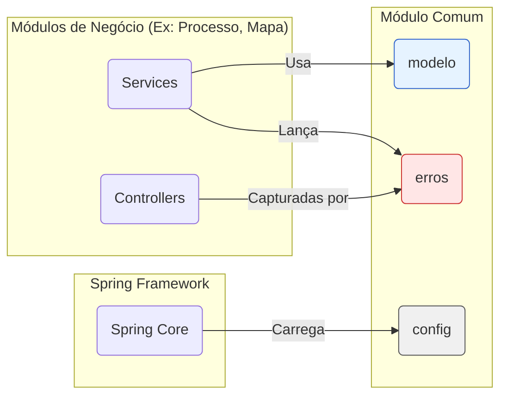

# Módulo Comum - SGC

## Visão Geral
O pacote `comum` é um pilar fundamental da aplicação, contendo classes, configurações e utilitários transversais que são utilizados por diversos outros módulos. Ele serve como uma base compartilhada, definindo entidades centrais, configurações globais, tratamento de erros e outros componentes de utilidade geral para garantir a consistência e evitar a duplicação de código.

## Arquivos e Diretórios Principais

### 1. Entidades Comuns (`modelo/`)
**Localização:** `backend/src/main/java/sgc/comum/modelo/`
- **`EntidadeBase.java`**: Uma superclasse (`@MappedSuperclass`) que fornece um campo de ID (`codigo`) autoincrementado para a maioria das entidades do sistema, padronizando a definição de chaves primárias.
- **`Administrador.java`**: Entidade que representa um administrador do sistema, com permissões elevadas.
- **`Parametro.java`**: Entidade para armazenar parâmetros de configuração do sistema no banco de dados, permitindo ajustes dinâmicos sem a necessidade de reimplantar a aplicação.

## Diagrama de Arquitetura


### 2. Sub-pacotes

#### `config/`
**Localização:** `backend/src/main/java/sgc/comum/config/`
- **Descrição:** Contém classes de configuração do Spring Framework.
- **Arquivos Notáveis:**
  - `AsyncConfig.java`: Configura o pool de threads para operações assíncronas (ex: envio de notificações).
  - `SgrhDataSourceConfig.java`: Configura uma fonte de dados secundária para integração com o sistema SGRH.
  - `WebConfig.java`: Define configurações globais da aplicação web, como CORS (Cross-Origin Resource Sharing).

#### `erros/`
**Localização:** `backend/src/main/java/sgc/comum/erros/`
- **Descrição:** Define uma hierarquia de exceções customizadas e não checadas (`RuntimeException`) para padronizar o tratamento de erros. Inclui também o `RestExceptionHandler` (`@ControllerAdvice`) que captura essas exceções e as traduz em respostas HTTP padronizadas.
- **Exceções Notáveis:**
  - `ErroEntidadeNaoEncontrada`: Lançada quando uma busca por uma entidade no banco de dados não retorna resultados (resulta em HTTP 404).
  - `ErroAcessoNegado`: Lançada quando um usuário tenta executar uma ação para a qual não tem permissão (resulta em HTTP 403).
  - `ErroServicoExterno`: Para erros de comunicação com serviços externos (resulta em HTTP 502).

### 3. Funcionalidade de Painel
- **`PainelControle.java` e `PainelService.java`**: Componentes que servem para alimentar um painel de controle (dashboard) com dados agregados e estatísticas do sistema, oferecendo uma visão geral do estado dos processos e outras métricas importantes.

## Como Usar
As classes deste pacote são, em sua maioria, utilizadas implicitamente por outras partes do sistema.
- **Entidades**: São estendidas (`EntidadeBase`) ou referenciadas (`Usuario`) por outras entidades nos demais módulos.
- **Configurações**: São carregadas automaticamente pelo Spring no momento da inicialização.
- **Exceções**: São lançadas por serviços em outros pacotes para sinalizar erros de forma consistente e centralizada.

**Exemplo de uso de uma exceção customizada:**
```java
@Service
public class MeuServico {

    @Autowired
    private RecursoRepository recursoRepository;

    public Recurso buscarRecurso(Long id) {
        return recursoRepository.findById(id)
            .orElseThrow(() -> new ErroEntidadeNaoEncontrada("Recurso com ID " + id + " não encontrado."));
    }
}
```

## Notas Importantes
- **Centralização**: Manter componentes compartilhados neste pacote é crucial para evitar a duplicação de código e promover a consistência em toda a aplicação.
- **Configuração de Múltiplos DataSources**: A presença de `SgrhDataSourceConfig` demonstra que a aplicação se conecta a mais de um banco de dados, uma configuração avançada gerenciada pelo Spring.
- **Tratamento de Erros Padronizado**: O uso do `RestExceptionHandler` para capturar as exceções customizadas do pacote `erros` permite um tratamento de erros global e consistente, retornando respostas JSON bem formatadas para os clientes da API.