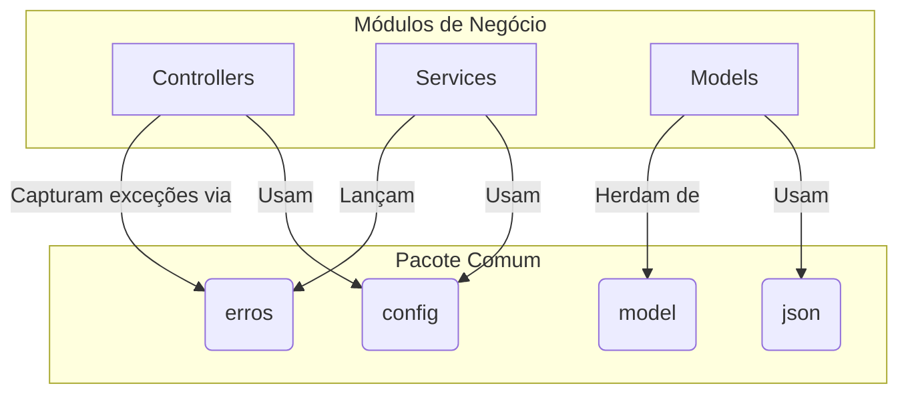

# Módulo Comum


## Visão Geral

O módulo `comum` é uma das fundações da aplicação SGC. Ele contém código transversal, essencial para o funcionamento de
outros módulos. Seu objetivo é centralizar componentes compartilhados para evitar a duplicação de código e garantir
consistência.

Este módulo abriga exclusivamente código de suporte sem lógica de negócio específica de domínio.

## Estrutura Spring Modulith

Este módulo é **transversal** e não segue a estrutura api/internal, pois todos os seus componentes são públicos por natureza.

### Componentes Públicos
- **`erros/`** - Hierarquia de exceções e tratador global
  - `RestExceptionHandler` - `@ControllerAdvice` para tratamento global
  - `ErroApi`, `ErroSubApi` - Classes de resposta de erro
  - Exceções de negócio: `ErroEntidadeNaoEncontrada`, `ErroValidacao`, `ErroSituacaoInvalida`, etc.
- **`model/`** - Modelos compartilhados
  - `EntidadeBase` - Superclasse JPA com campo `codigo`
  - `Parametro` - Entidade para configuração dinâmica
- **`config/`** - Configurações Spring
  - `ConfigSeguranca` - Spring Security
  - `ConfigWeb` - CORS e MVC
  - `ConfigThymeleaf` - Template engine
  - `ConfigAsync` - Processamento assíncrono (Spring Modulith)
- **`json/`** - Serialização e sanitização
  - `SanitizeHtml` - Anotação para sanitização
  - `HtmlSanitizingDeserializer` - Deserializador Jackson

**⚠️ Importante:** Este módulo **NÃO possui** pacote `internal/` pois todos os componentes são compartilhados.

## Dependências

### Módulos que este módulo depende
- Nenhum (módulo base, sem dependências de outros módulos)

### Módulos que dependem deste módulo
- **Todos os módulos** - `comum` é a base para todos os outros módulos

## Arquitetura e Subpacotes

O `comum` fornece infraestrutura básica, como o tratamento de erros, modelos de dados compartilhados, configurações do
Spring e suporte para serialização JSON.



### 1. `erros`

- **Responsabilidade:** Define a hierarquia de exceções customizadas e o tratador global de erros.
- **Componentes Notáveis:**
    - **`RestExceptionHandler`**: Um `@ControllerAdvice` que intercepta exceções lançadas pela aplicação e as converte
      em respostas JSON padronizadas (`ErroApi`).
    - **`ErroApi`**: Classe que modela a resposta de erro JSON padrão (status, mensagem, timestamp).
    - **`ErroSubApi`**: Classe para detalhes de erros (ex: campos inválidos na validação).
    - **Exceções de Negócio:**
        - `ErroEntidadeNaoEncontrada`: HTTP 404 - Entidade não encontrada
        - `ErroValidacao`: HTTP 400 - Validação de dados falhou
        - `ErroSituacaoInvalida`: HTTP 409 - Conflito de estado/situação
        - `ErroRequisicaoSemCorpo`: HTTP 400 - Requisição sem body
        - `ErroAccessoNegado`: HTTP 403 - Acesso negado

### 2. `model`

- **Responsabilidade:** Contém modelos de dados compartilhados.
- **Componentes Notáveis:**
    - **`EntidadeBase`**: Superclasse (`@MappedSuperclass`) que fornece o campo `codigo` (ID) para as entidades JPA. Todas as entidades do sistema devem herdar desta classe.
    - **`Parametro`**: Entidade para configuração dinâmica de parâmetros do sistema.

### 3. `config`

- **Responsabilidade:** Centraliza as classes de configuração do Spring.
- **Componentes Notáveis:**
    - `ConfigSeguranca`: Configurações do Spring Security (autenticação, autorização)
    - `ConfigWeb`: Configurações de CORS e MVC
    - `ConfigThymeleaf`: Configuração do template engine para e-mails
    - `ConfigAsync`: Configuração de processamento assíncrono para **Spring Modulith** (thread pools, executors)

### 4. `json`

- **Responsabilidade:** Utilitários para serialização e sanitização JSON.
- **Componentes Notáveis:**
    - `SanitizeHtml`: Anotação customizada para sanitização de HTML
    - `HtmlSanitizingDeserializer`: Deserializador Jackson que remove tags HTML perigosas de strings de entrada, prevenindo XSS

## Propósito e Uso

- **Padronização de Erros**: Ao lançar exceções do pacote `erros`, garantimos que o cliente da API receba sempre uma
  resposta JSON consistente e traduzida.
- **Reutilização**: Classes como `EntidadeBase` e anotações como `@SanitizeHtml` reduzem código boilerplate nos módulos
  de negócio.
- **Configuração Centralizada**: Todas as configurações Spring ficam em um único lugar, facilitando manutenção.

**Exemplo de uso:**

```java
// Em um serviço de domínio
public Recurso buscar(Long codigo) {
    return repository.findById(codigo)
        .orElseThrow(() -> new ErroEntidadeNaoEncontrada("Recurso", codigo));
}
```

## Integração com Spring Modulith

O módulo `comum` é especial no contexto Spring Modulith:

### Características Especiais

1. **Sem Restrições de Acesso**: Por ser transversal, não usa pacotes `api/` e `internal/`
2. **Sem package-info.java**: Não precisa de anotação `@ApplicationModule` pois é usado por todos
3. **Sempre Permitido**: Todos os módulos declaram dependência em `comum` via `allowedDependencies`

### Configuração para Spring Modulith

O módulo `comum` contém a configuração essencial para o funcionamento do Spring Modulith:

**`config/ConfigAsync.java`** - Configuração do pool de threads para eventos assíncronos:
```java
@Configuration
@EnableAsync
public class ConfigAsync {
    @Bean
    public Executor taskExecutor() {
        ThreadPoolTaskExecutor executor = new ThreadPoolTaskExecutor();
        executor.setCorePoolSize(5);
        executor.setMaxPoolSize(10);
        executor.setQueueCapacity(100);
        executor.setThreadNamePrefix("sgc-async-");
        executor.initialize();
        return executor;
    }
}
```

Esta configuração é crítica para o processamento assíncrono de eventos via `@ApplicationModuleListener`.


## Como Testar

Para executar apenas os testes deste módulo:
```bash
./gradlew :backend:test --tests "sgc.comum.*"
```
