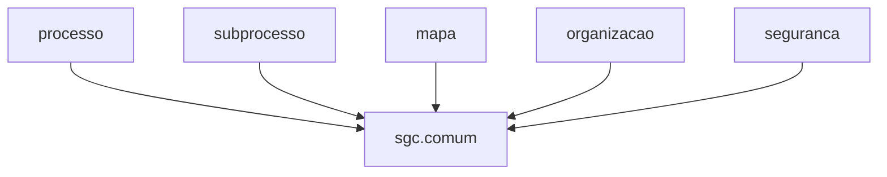

# Pacote `comum`

## Papel arquitetural

`sgc.comum` é a base compartilhada do backend. Ele não representa um domínio funcional do produto; representa a
infraestrutura comum usada pelos demais módulos.

A regra principal é simples: **o pacote deve oferecer suporte técnico e semântico reutilizável, sem absorver regras de
negócio específicas**.

## O que vive aqui

### `config`

Configurações transversais da aplicação, como:

- inicialização geral do Spring;
- cache;
- OpenAPI;
- integração com templates;
- demais ajustes de infraestrutura compartilhada.

### `erros`

Padronização da resposta de erro da API:

- `RestExceptionHandler`
- `ErroApi`
- `ErroSubApi`
- exceções de negócio e de validação (`ErroNegocio`, `ErroValidacao`, `ErroAcessoNegado`,
  `ErroEntidadeNaoEncontrada`...)

Essa camada garante que a API responda de forma consistente independentemente do domínio que originou a falha.

### `model`

Tipos base compartilhados, com destaque para:

- `EntidadeBase`, de onde as entidades herdam o campo `codigo`;
- contratos/modelos reutilizados por mais de um domínio.

### `util`

Ferramentas transversais, incluindo:

- monitoramento (`MonitoramentoAspect`, `FiltroMonitoramentoHttp`, propriedades de monitoramento);
- utilitários de formatação e apoio técnico.

## Relação com os demais módulos

```mermaid
graph TD
    Comum[sgc.comum]
    Processo[processo]
    Subprocesso[subprocesso]
    Mapa[mapa]
    Organizacao[organizacao]
    Seguranca[seguranca]

    Processo --> Comum
    Subprocesso --> Comum
    Mapa --> Comum
    Organizacao --> Comum
    Seguranca --> Comum
```

## Restrições arquiteturais

O projeto possui teste arquitetural explícito para impedir que `sgc.comum` vire um novo domínio de negócio.

Em `ArchConsistencyTest` existe a regra de que o pacote:

- não deve conter `Controller`;
- não deve conter `Service` de negócio.

Isso força o módulo a permanecer pequeno, estável e previsível.

## Quando colocar algo em `comum`

Coloque aqui somente o que atender simultaneamente a estas características:

- é usado por mais de um domínio;
- não carrega regra de processo/subprocesso/mapa/organização;
- melhora a consistência técnica do backend inteiro.

Se a funcionalidade depende do vocabulário de negócio, provavelmente ela pertence ao módulo funcional correspondente,
não a `comum`.

## Referências

- [Backend do SGC](../../../../../../backend/README.md)
- [Módulo `subprocesso`](../subprocesso/README.md)
