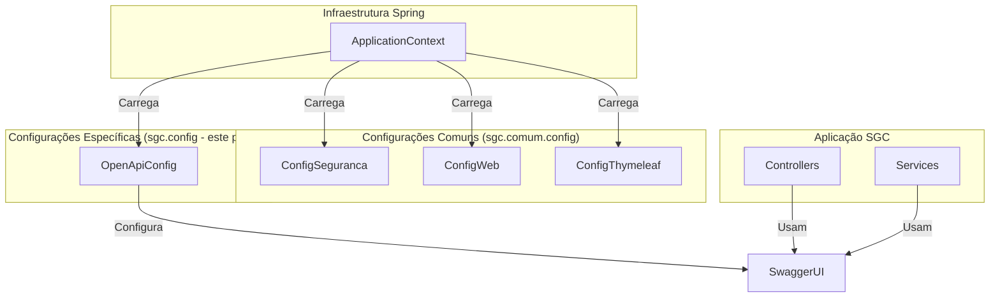

# Pacote Config

Última atualização: 2025-12-14

## Visão Geral

O pacote `config` centraliza as **classes de configuração do Spring** específicas do SGC. Estas classes são anotadas com `@Configuration` e definem beans e configurações que são aplicadas globalmente à aplicação.

**Nota:** Configurações gerais e transversais (como Spring Security, CORS, Thymeleaf) estão localizadas no pacote `sgc.comum.config`. Este pacote `sgc.config` contém configurações específicas de funcionalidades do domínio do SGC.

## Arquitetura

## Componentes Principais

### `OpenApiConfig`

- **Responsabilidade:** Configura a documentação OpenAPI (Swagger) da aplicação.
- **Funcionalidades:**
    - Define metadados da API (título, descrição, versão).
    - Configura informações de contato e licença.
    - Personaliza a interface do Swagger UI.
- **Acesso:** A documentação interativa fica disponível em:
    - **Swagger UI:** `http://localhost:10000/swagger-ui.html`
    - **Especificação OpenAPI:** `http://localhost:10000/api-docs`

### Configurações Externas

As seguintes propriedades podem ser customizadas via `application.yml`:

- `springdoc.info.title`: Título da API (padrão: "SGC API")
- `springdoc.info.description`: Descrição da API (padrão: "Sistema de Gestão de Competências")
- `springdoc.info.version`: Versão da API (padrão: "v1")

## Propósito e Uso

Este pacote mantém a separação de responsabilidades:

- **Configurações técnicas/transversais** (segurança, CORS, email) → `sgc.comum.config`
- **Configurações de funcionalidades específicas** (documentação, integrações) → `sgc.config`

Para adicionar novas configurações Spring:

1. Se for uma configuração transversal (afeta toda aplicação), adicione em `sgc.comum.config`.
2. Se for específica de uma funcionalidade de domínio, adicione em `sgc.config`.
3. Use `@Configuration` e siga o padrão de nomenclatura (sufixo `Config`).

## Detalhamento técnico (gerado em 2025-12-14)

Resumo detalhado dos artefatos, comandos e observações técnicas gerado automaticamente.
