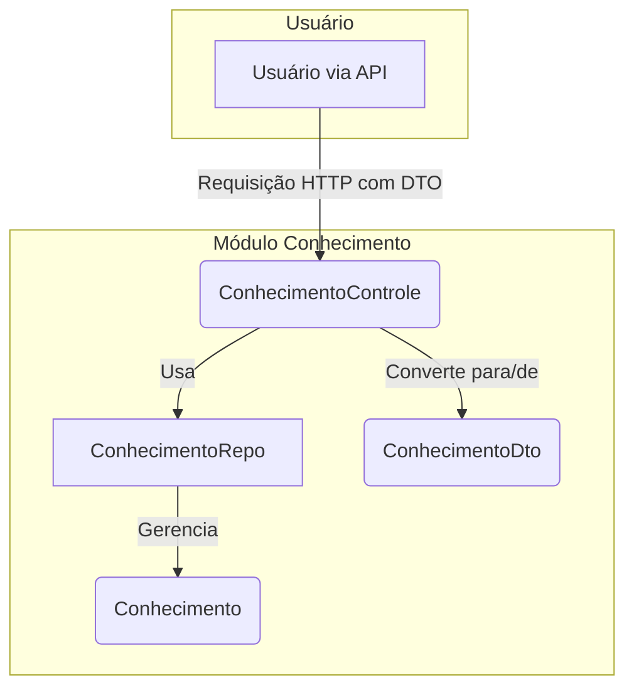

# Módulo de Conhecimentos - SGC

## Visão Geral
O pacote `conhecimento` é responsável pelo gerenciamento de **Conhecimentos**. No contexto do sistema SGC, um "Conhecimento" representa uma habilidade, um saber ou uma informação necessária para executar uma determinada `Atividade`.

Este pacote fornece a estrutura completa para o CRUD (Criar, Ler, Atualizar, Excluir) de conhecimentos, incluindo a entidade, o repositório, o controlador REST e os DTOs para a comunicação via API.

## Arquivos Principais

### 1. `Conhecimento.java`
**Localização:** `backend/src/main/java/sgc/conhecimento/modelo/Conhecimento.java`
- **Descrição:** Entidade JPA que representa um conhecimento. Mapeia a tabela `CONHECIMENTO`.
- **Campos Importantes:**
  - `descricao`: O texto que descreve o conhecimento.
  - `atividade`: A `Atividade` à qual este conhecimento está associado.

### 2. `ConhecimentoControle.java`
**Localização:** `backend/src/main/java/sgc/conhecimento/ConhecimentoControle.java`
- **Descrição:** Controlador REST que expõe os endpoints para gerenciar a entidade `Conhecimento`.
- **Endpoints Principais:**
  - `GET /api/conhecimentos`: Lista todos os conhecimentos.
  - `POST /api/conhecimentos`: Cria um novo conhecimento.
  - `PUT /api/conhecimentos/{id}`: Atualiza um conhecimento existente.
  - `DELETE /api/conhecimentos/{id}`: Exclui um conhecimento.

### 3. `ConhecimentoRepo.java`
**Localização:** `backend/src/main/java/sgc/conhecimento/modelo/ConhecimentoRepo.java`
- **Descrição:** Interface Spring Data JPA que fornece os métodos de acesso a dados para a entidade `Conhecimento`.

### 4. DTOs (`dto/`)
**Localização:** `backend/src/main/java/sgc/conhecimento/dto/`
- **Descrição:** Contém os Data Transfer Objects (DTOs), como `ConhecimentoDto`, utilizados para transferir dados entre o cliente (frontend) e o servidor de forma segura e desacoplada da entidade do banco de dados.

## Diagrama de Componentes


## Fluxo de uma Requisição
1.  **Requisição HTTP**: O cliente envia uma requisição para um dos endpoints do `ConhecimentoControle` (ex: `POST /api/conhecimentos` com um `ConhecimentoDto` no corpo).
2.  **Controlador**: O controller recebe a requisição e valida o DTO.
3.  **Mapeamento**: O DTO é convertido para uma entidade `Conhecimento`.
4.  **Repositório**: O controller invoca o `ConhecimentoRepo` para persistir a entidade no banco de dados.
5.  **Resposta HTTP**: O controller retorna uma resposta HTTP (ex: `201 Created`) com o DTO do conhecimento recém-criado.

## Como Usar
Para interagir com este módulo, utilize um cliente HTTP para fazer requisições aos endpoints expostos pelo `ConhecimentoControle`.

**Exemplo: Criar um novo conhecimento associado a uma atividade**
```http
POST /api/conhecimentos
Content-Type: application/json

{
  "descricao": "Conhecimento em desenvolvimento de APIs REST com Spring Boot",
  "atividadeId": 42
}
```

## Notas Importantes
- **Padrão DTO**: O uso do padrão Data Transfer Object é uma boa prática que evita expor a estrutura interna do banco de dados (entidades JPA) diretamente na API, aumentando a segurança e a flexibilidade.
- **Relacionamento com Atividade**: Cada `Conhecimento` está diretamente ligado a uma `Atividade`, formando a base para a construção do mapa de competências.