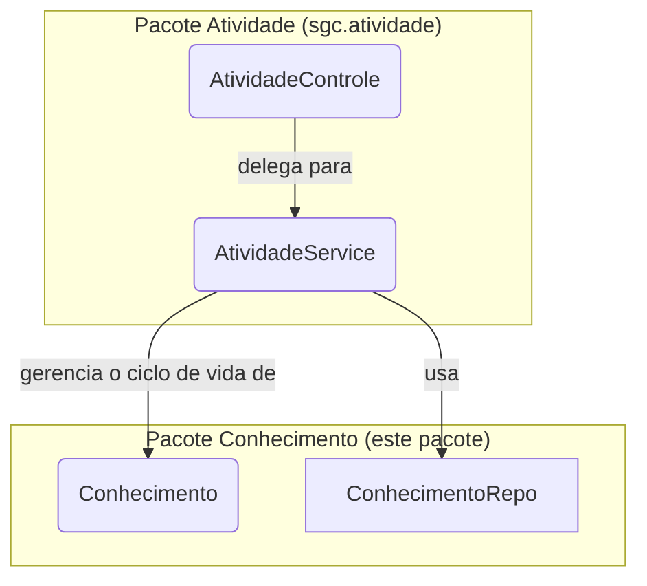

# Pacote Conhecimento (Modelo de Dados)

## Visão Geral
Este pacote contém a definição da entidade JPA `Conhecimento` e seus componentes associados, como o repositório (`ConhecimentoRepo`) e os DTOs.

**Nota Arquitetural Importante:** Este pacote **não possui uma camada de serviço ou de controle (`*Service`, `*Controle`)**. A lógica de negócio e a API REST para o gerenciamento de `Conhecimentos` foram centralizadas no módulo `atividade`.

## Arquitetura e Propósito
A entidade `Conhecimento` é tratada como um **recurso filho** da entidade `Atividade`. Isso significa que um conhecimento não existe de forma independente; ele está sempre associado a uma atividade específica.

Portanto, a responsabilidade de gerenciar o ciclo de vida de um `Conhecimento` (criar, ler, atualizar, excluir) pertence ao `AtividadeService` e é exposta através do `AtividadeControle`.

### Por que esta abordagem?
Gerenciar `Conhecimento` como um sub-recurso de `Atividade` torna a API mais semântica e alinhada com as práticas RESTful. Em vez de um endpoint genérico como `POST /api/conhecimentos`, a operação é feita através de um endpoint aninhado que deixa a relação explícita:

`POST /api/atividades/{atividadeId}/conhecimentos`

## Componentes Principais
- **`Conhecimento`**: A entidade JPA que representa um conhecimento necessário para executar uma `Atividade`.
- **`ConhecimentoRepo`**: O repositório Spring Data JPA para acesso direto à entidade `Conhecimento`. **Seu uso deve ser evitado fora do `AtividadeService`**.
- **`dto/`**: Contém os Data Transfer Objects (DTOs) usados pelo `AtividadeControle` para expor dados de conhecimento na API.

## Conclusão
Este pacote serve como um local para os **modelos de dados** de `Conhecimento`. Para toda a lógica de negócio, API e gerenciamento, consulte o pacote `sgc.atividade`.
