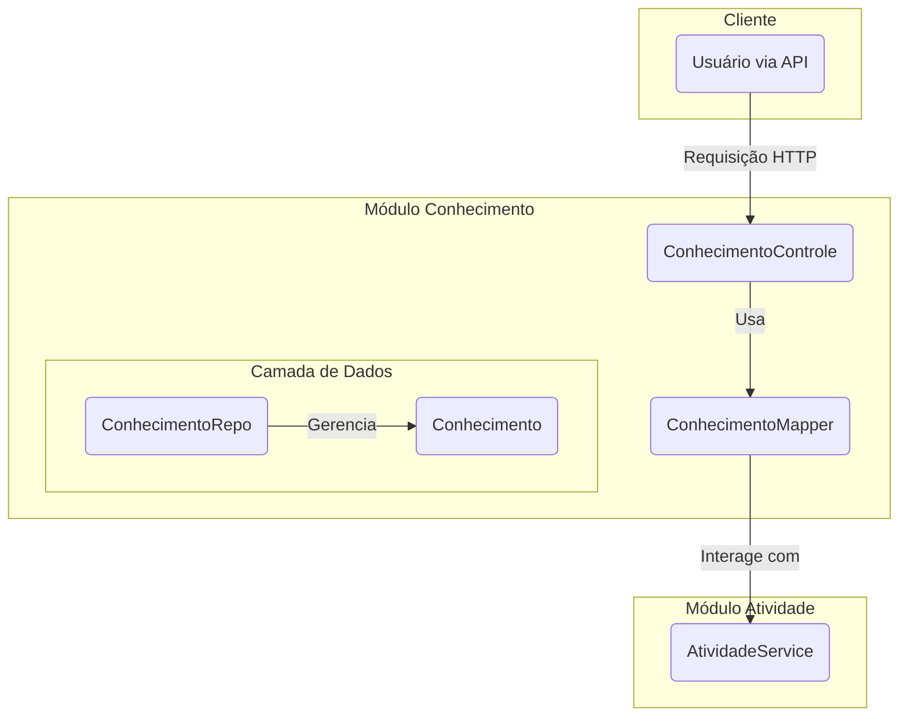

# Módulo de Conhecimento - SGC

## Visão Geral
Este pacote gerencia a entidade `Conhecimento`, que representa uma habilidade ou saber específico necessário para executar uma `Atividade`. O módulo fornece a lógica de negócio, os endpoints da API e a persistência de dados para todas as operações relacionadas a conhecimentos.

## Arquitetura e Componentes

- **`ConhecimentoControle.java`**: Controller REST que expõe os endpoints para as operações CRUD da entidade `Conhecimento`.
- **`dto/`**:
  - **`ConhecimentoDto.java`**: DTO padrão para representar a entidade `Conhecimento` na API.
  - **`ConhecimentoMapper.java`**: Interface MapStruct para a conversão entre a entidade `Conhecimento` e seus DTOs.
- **`modelo/`**:
  - **`Conhecimento.java`**: Entidade JPA que mapeia a tabela `CONHECIMENTO`.
  - **`ConhecimentoRepo.java`**: Repositório Spring Data JPA para acesso aos dados da entidade `Conhecimento`.

## Diagrama de Componentes


## Como Usar
Para gerenciar conhecimentos, interaja com os endpoints expostos pelo `ConhecimentoControle`.

**Exemplo: Criar um novo conhecimento**
```http
POST /api/conhecimentos
Content-Type: application/json

{
  "atividadeId": 1,
  "descricao": "Conhecimento sobre a arquitetura de microserviços."
}
```

## Notas Importantes
- **Relacionamento com Atividade**: Cada `Conhecimento` deve estar associado a uma `Atividade`.
- **Uso de DTOs**: A comunicação com a API é feita através de DTOs para desacoplar a representação externa da entidade de persistência.