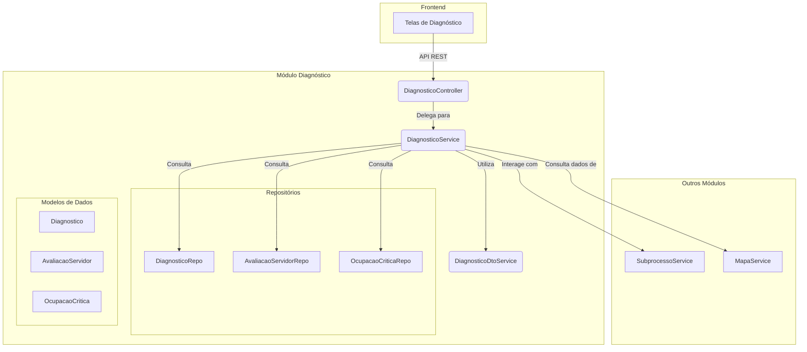

# Módulo de Diagnóstico

Última atualização: 2025-12-14

## Visão Geral

O módulo `diagnostico` é responsável pela funcionalidade de **Diagnóstico de Competências e Ocupações Críticas** do SGC. Ele permite que os servidores avaliem seu nível de domínio sobre as competências mapeadas e identifica ocupações críticas dentro de uma unidade organizacional.

Este módulo trabalha em conjunto com os mapas de competências já consolidados, permitindo que gestores e administradores obtenham insights sobre gaps de competências na equipe.

## Arquitetura e Componentes

O módulo segue a arquitetura padrão da aplicação, com camadas de Controle, Serviço e Modelo de Dados.

## Componentes Principais

### Controladores e Serviços

- **`DiagnosticoController`**: Expõe a API REST para o módulo de diagnóstico.
    - `GET /api/diagnosticos/{subprocessoId}`: Busca o diagnóstico completo de um subprocesso.
    - `POST /api/diagnosticos/{subprocessoId}/avaliacoes`: Salva ou atualiza uma avaliação de servidor.
    - `GET /api/diagnosticos/{subprocessoId}/avaliacoes/minhas`: Lista as avaliações do servidor logado.
    - `POST /api/diagnosticos/{subprocessoId}/avaliacoes/concluir`: Marca a autoavaliação do servidor como concluída.
    - `GET /api/diagnosticos/{subprocessoId}/ocupacoes-criticas`: Lista as ocupações identificadas como críticas.
    - `POST /api/diagnosticos/{subprocessoId}/ocupacoes-criticas`: Registra uma ocupação como crítica.

- **`DiagnosticoService`**: Contém a lógica de negócio principal, incluindo:
    - Criação e busca de diagnósticos.
    - Gerenciamento de avaliações de servidores sobre competências.
    - Cálculo de estatísticas e agregações (média de domínio, gaps identificados).
    - Identificação e registro de ocupações críticas.

- **`DiagnosticoDtoService`**: Serviço especializado para construção de DTOs complexos, mantendo o `DiagnosticoService` mais limpo e focado na lógica de negócio.

### Modelo de Dados (`model`)

- **`Diagnostico`**: Entidade JPA principal que representa um diagnóstico vinculado a um `Subprocesso`. Controla o estado geral do processo de diagnóstico.
- **`AvaliacaoServidor`**: Entidade que registra a autoavaliação de um servidor sobre uma competência específica, incluindo o nível de domínio e a necessidade de capacitação.
- **`OcupacaoCritica`**: Entidade que registra ocupações identificadas como críticas dentro de uma unidade, com justificativa e impacto.
- **Enums:**
    - **`SituacaoDiagnostico`**: Estados do diagnóstico (ex: `EM_ANDAMENTO`, `CONCLUIDO`).
    - **`NivelAvaliacao`**: Níveis de domínio de uma competência (ex: `NENHUM`, `BASICO`, `INTERMEDIARIO`, `AVANCADO`, `ESPECIALISTA`).
    - **`SituacaoServidorDiagnostico`**: Situação da participação do servidor (ex: `PENDENTE`, `EM_ANDAMENTO`, `CONCLUIDO`).
    - **`SituacaoCapacitacao`**: Indica se o servidor precisa de capacitação (ex: `NAO_NECESSITA`, `NECESSITA`, `URGENTE`).

### DTOs (`dto`)

- **`DiagnosticoDto`**: DTO para transporte de dados completos de um diagnóstico.
- **`AvaliacaoServidorDto`**: DTO para avaliação de um servidor sobre uma competência.
- **`OcupacaoCriticaDto`**: DTO para representação de uma ocupação crítica.
- **`SalvarAvaliacaoRequest`**: DTO de requisição para salvar/atualizar avaliações.

## Fluxo de Trabalho

### Autoavaliação de Servidor

1. O servidor acessa a tela de diagnóstico através do `Subprocesso`.
2. O sistema carrega o mapa de competências homologado da unidade.
3. O servidor avalia seu nível de domínio em cada competência e indica necessidade de capacitação.
4. As avaliações são salvas individualmente via `POST /avaliacoes`.
5. Ao finalizar, o servidor marca a autoavaliação como concluída via `POST /avaliacoes/concluir`.

### Identificação de Ocupações Críticas

1. Gestores e administradores analisam os resultados do diagnóstico.
2. Com base nos gaps identificados, registram ocupações críticas via `POST /ocupacoes-criticas`.
3. Cada ocupação crítica inclui descrição, justificativa e nível de impacto.

## Integração com Outros Módulos

- **`Subprocesso`**: O diagnóstico é vinculado a um subprocesso específico e utiliza o mapa homologado desse subprocesso.
- **`Mapa`**: As competências avaliadas vêm do mapa de competências consolidado.
- **`SGRH`**: Informações sobre servidores da unidade são obtidas via `SgrhService`.

## Detalhamento técnico (gerado em 2025-12-14)

Resumo detalhado dos artefatos, comandos e observações técnicas gerado automaticamente.
