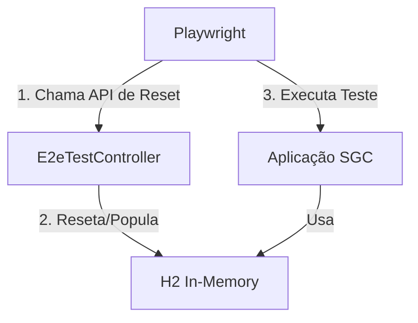

# Pacote E2E (Suporte a Testes End-to-End)

## Visão Geral

Este pacote contém classes de infraestrutura e suporte específicas para a execução de **Testes End-to-End (E2E)** no backend.

Estas classes **não fazem parte da lógica de produção** e são ativadas apenas quando o perfil Spring `e2e` está ativo.

## Arquitetura Simplificada

O ambiente E2E utiliza um único banco de dados H2 em memória. Os testes são executados sequencialmente (configurado no Playwright via `workers: 1`).

Antes de cada teste, o script de teste chama o endpoint `/api/e2e/dados-teste/recarregar` para resetar o banco de dados para um estado conhecido (executando `data-minimal.sql`).

## Componentes Principais

- **`E2eTestController`**: Controlador REST disponível apenas no perfil `e2e`.
  - `POST /api/e2e/dados-teste/recarregar`: Reseta o banco de dados.
  - Endpoints de debug e limpeza específica.
- **`E2eDatabaseConfig`**: Configura o datasource H2.
- **`E2eTestDatabaseService`**: Executa scripts SQL.

## Segurança

Este pacote é estritamente isolado. As classes aqui contidas devem ser anotadas com `@Profile("e2e")`.
