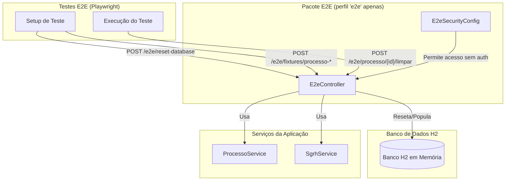

# Pacote E2E (End-to-End Testing Support)

Última atualização: 2025-12-14

## Visão Geral

O pacote `e2e` fornece **endpoints auxiliares e configurações específicas para testes end-to-end** (E2E) usando Playwright. Este código **só é ativado no perfil Spring `e2e`** e não deve ser utilizado em produção.

O objetivo principal é:

1. **Resetar o banco de dados** entre testes para garantir isolamento.
2. **Criar fixtures de dados** rapidamente via API, sem precisar simular toda a navegação UI.
3. **Limpar dados de testes** específicos de forma eficiente.

## Arquitetura



## Componentes Principais

### `E2eController`

Controlador REST que expõe endpoints auxiliares para testes E2E. **Só está disponível no perfil `e2e`**.

#### Endpoints

- **`POST /e2e/reset-database`**: Limpa todas as tabelas do banco de dados e reexecuta o script `seed.sql`.
    - Usado no início de cada suite de testes para garantir estado inicial limpo.
    - Desabilita referencial integrity temporariamente para truncar todas as tabelas.
    - Recarrega dados seed do arquivo `e2e/setup/seed.sql`.

- **`POST /e2e/processo/{codigo}/limpar`**: Remove um processo específico e **todas suas dependências** (subprocessos, mapas, análises, notificações, alertas, movimentações).
    - Útil para limpar dados de um teste específico sem resetar todo o banco.
    - Usa SQL nativo para garantir ordem correta de exclusão respeitando constraints.

- **`POST /e2e/fixtures/processo-mapeamento`**: Cria um processo de **Mapeamento** e opcionalmente o inicia.
    - Request body: `ProcessoFixtureRequest` (descricao, unidadeSigla, iniciar, diasLimite).
    - Retorna o `ProcessoDto` criado.
    - Permite criar processos rapidamente sem passar pela UI.

- **`POST /e2e/fixtures/processo-revisao`**: Cria um processo de **Revisão** e opcionalmente o inicia.
    - Mesma estrutura do endpoint de mapeamento.
    - Útil para testar fluxos de revisão.

#### Detalhes de Implementação

- **Contexto de Segurança:** Os métodos de fixture executam operações com contexto de segurança `ADMIN` simulado, permitindo criar processos mesmo sem autenticação na requisição HTTP.
- **Transacional:** Todos os endpoints são `@Transactional` para garantir atomicidade das operações.

### `E2eSecurityConfig`

Configuração de segurança customizada para o perfil `e2e`.

- **Permissões:** Permite acesso **sem autenticação** a todos os endpoints `/e2e/**`.
- **CORS:** Configurado para aceitar requisições do frontend local (`http://localhost:5173`).
- **Filtros:** Mantém o `FiltroAutenticacaoSimulado` para simular autenticação em outros endpoints da API durante testes.

## Uso em Testes E2E

### Setup Típico de Teste

```javascript
// playwright test example
test.beforeEach(async ({ request }) => {
  // Resetar banco antes de cada teste
  await request.post('http://localhost:10000/e2e/reset-database');
});

test('fluxo de mapeamento completo', async ({ page, request }) => {
  // Criar processo via API (mais rápido que UI)
  const response = await request.post('http://localhost:10000/e2e/fixtures/processo-mapeamento', {
    data: {
      descricao: 'Mapeamento Teste E2E',
      unidadeSigla: 'SEINFO',
      iniciar: true,
      diasLimite: 30
    }
  });
  
  const processo = await response.json();
  
  // Navegar e testar a UI
  await page.goto(`http://localhost:5173/processos/${processo.codigo}`);
  // ... asserções ...
});
```

### Limpeza após Teste

```javascript
test.afterEach(async ({ request }, testInfo) => {
  // Limpar processo específico se necessário
  if (testInfo.processoCodigo) {
    await request.post(`http://localhost:10000/e2e/processo/${testInfo.processoCodigo}/limpar`);
  }
});
```

## Segurança

**IMPORTANTE:** Este código **NUNCA** deve ser executado em produção:

- A anotação `@Profile("e2e")` garante que só seja carregado quando o perfil `e2e` está ativo.
- Os endpoints `/e2e/**` permitem operações destrutivas no banco de dados.
- Não há autenticação ou autorização nestes endpoints.

## Detalhamento técnico (gerado em 2025-12-14)

Resumo detalhado dos artefatos, comandos e observações técnicas gerado automaticamente.
