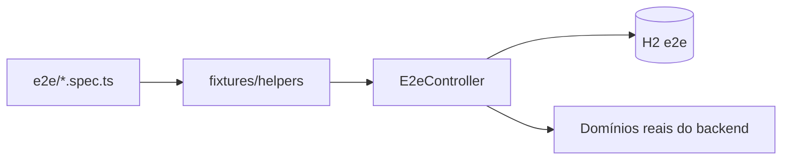

# Pacote `e2e` do backend

## Papel do pacote

`sgc.e2e` existe para suportar a suíte Playwright com endpoints e adaptações exclusivas de automação. Ele é parte do
backend, mas **não faz parte do produto funcional**: serve como adapter de teste para reset de estado, fixtures e
ajustes de segurança do ambiente E2E.

## Princípio de isolamento

Esse pacote só deve existir no perfil correto e em ambiente seguro.

Condições de ativação observáveis no código/configuração:

- perfil Spring `e2e`;
- `aplicacao.ambiente-testes=true`;
- banco H2 em memória validado em runtime.

Se essas condições não forem satisfeitas, os endpoints auxiliares não devem ser considerados disponíveis.

## Componentes principais

| Componente                           | Responsabilidade                                                                         |
|--------------------------------------|------------------------------------------------------------------------------------------|
| `E2eController`                      | expõe endpoints de reset, limpeza e fixtures                                             |
| `E2eSecurityConfig`                  | ajusta a segurança para `/e2e/**` sem alterar o comportamento funcional da API principal |
| `AtribuicaoTemporariaViewsE2eAspect` | sincroniza visões auxiliares usadas em cenários de atribuição temporária                 |

## O que a suíte usa daqui

Base de endpoints: `/e2e`

Exemplos importantes:

- `POST /e2e/reset-database`
- `POST /e2e/processo/{codigo}/limpar`
- `POST /e2e/processo/{codigo}/limpar-completo`
- `POST /e2e/fixtures/*`

Esses endpoints reduzem o custo dos cenários Playwright ao permitir preparação e limpeza de estado sem depender apenas
da UI.

## Relação com a suíte Playwright

```mermaid
graph LR
    Playwright[e2e/*.spec.ts] --> Fixtures[fixtures/helpers]
    Fixtures --> E2eController
    E2eController --> Banco[(H2 e2e)]
    E2eController --> Backend[Domínios reais do backend]
```

O ponto importante é que as fixtures do pacote `e2e` preparam o ambiente, mas os domínios de negócio exercitados
continuam sendo os domínios reais (`processo`, `subprocesso`, `mapa`, `organizacao`...).

## Regras operacionais

- nunca habilitar esse pacote fora do perfil `e2e`;
- não reutilizar endpoints `/e2e/*` em fluxos funcionais do produto;
- quando surgir nova fixture, preferir acompanhá-la de teste de backend próprio;
- manter o pacote como adapter fino, sem deslocar regras de negócio para cá.

## Testes relacionados

Cobertura direta em `src/test/java/sgc/e2e`:

- `E2eControllerTest`
- `E2eFixtureEndpointTest`
- `E2eSecurityConfigTest`
- `AtribuicaoTemporariaViewsE2eAspectIntegrationTest`

## Referências

- [README E2E da raiz](../../../../../../e2e/README.md)
- [Backend do SGC](../../../../../../backend/README.md)
