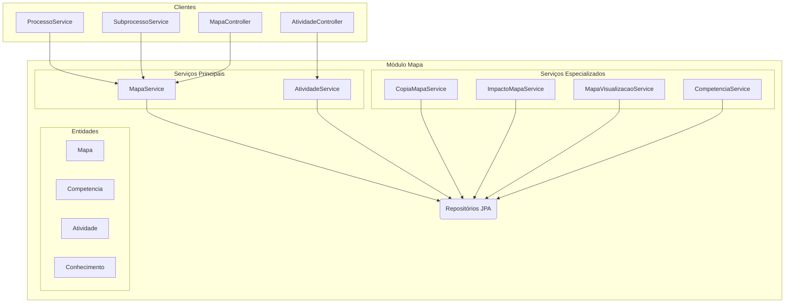

# Módulo de Mapa

## Visão Geral

Este é um dos módulos centrais do sistema, responsável por toda a gestão do **Mapa de Competências**. Um "Mapa" é o
artefato que agrega competências, atividades e conhecimentos de uma unidade organizacional.

O pacote organiza a lógica de negócio em componentes coesos com responsabilidades únicas.

## Arquitetura de Serviços



## Componentes Principais

### Serviços

| Serviço | Responsabilidade |
|---------|------------------|
| **`MapaService`** | CRUD de mapas + salvamento completo com vínculos e validação de integridade |
| **`AtividadeService`** | CRUD de atividades e conhecimentos |
| **`CompetenciaService`** | Gerencia ciclo de vida das competências |
| **`CopiaMapaService`** | Deep copy de mapas (usado em revisões) |
| **`ImpactoMapaService`** | Análise de diferenças entre mapas (CDU-12) |
| **`MapaVisualizacaoService`** | Constrói DTOs de visualização hierárquica |

### Controllers

- **`MapaController`**: Expõe a API REST para mapas (`/api/mapas`).
- **`AtividadeController`**: Expõe a API REST para atividades e conhecimentos (`/api/atividades`).

### Modelo de Dados (`model/`)

| Entidade | Descrição |
|----------|-----------|
| **`Mapa`** | Entidade raiz do agregado |
| **`Competencia`** | Competência técnica vinculada ao mapa |
| **`Atividade`** | Atividade desempenhada, vinculada ao mapa |
| **`Conhecimento`** | Conhecimento necessário para realizar uma atividade |

### DTOs (`dto/`) e Mappers (`mapper/`)

- DTOs para `Mapa`, `Competencia`, `Atividade`, `Conhecimento`
- Mappers MapStruct para conversão Entidade ↔ DTO

## Como Testar

Para executar apenas os testes deste módulo:
```bash
./gradlew :backend:test --tests "sgc.mapa.*"
```
