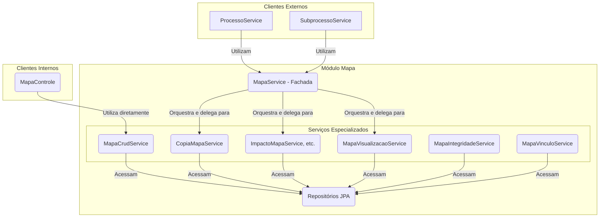

# Módulo de Mapa

## Visão Geral
Este é um dos módulos centrais do sistema, responsável por toda a gestão do **Mapa de Competências**. Um "Mapa" é o artefato que agrega competências, atividades e conhecimentos de uma unidade organizacional.

O pacote se destaca por sua arquitetura orientada a serviços, onde a lógica de negócio complexa é dividida em componentes coesos com responsabilidades únicas.

## Arquitetura de Serviços (Padrão Fachada Parcial)
O módulo utiliza o padrão **Service Facade**, mas de forma parcial. O `MapaService` atua como uma fachada para clientes externos ao módulo (como `ProcessoService`), orquestrando operações complexas. No entanto, o `MapaControle` interage diretamente com alguns serviços especializados (como o `MapaCrudService`) para operações de CRUD, contornando a fachada.

## Componentes Principais

### Camada de Fachada
- **`MapaService`**: O ponto de entrada para clientes **externos** ao módulo. Ele orquestra os outros serviços para executar operações de alto nível.

### Serviços Especializados
- **`MapaCrudService`**: Gerencia as operações de criação, atualização e exclusão (CRUD) das entidades do mapa.
- **`CopiaMapaService`**: Responsável por clonar um mapa existente. É utilizado pelo `ProcessoService`.
- **`ImpactoMapaService`**: Orquestra a análise de diferenças entre duas versões de um mapa.
- **`ImpactoAtividadeService` / `ImpactoCompetenciaService`**: Serviços granulares que analisam os impactos em atividades e competências, respectivamente.
- **`MapaVisualizacaoService`**: Constrói os DTOs de visualização complexos.
- **`MapaIntegridadeService`**: Contém regras de validação para garantir a integridade de um mapa.
- **`MapaVinculoService`**: Gerencia os vínculos entre as entidades do mapa.

### Outros Componentes
- **`MapaControle`**: Expõe a API REST. Para operações CRUD, delega diretamente para o `MapaCrudService`.
- **`modelo/`**: Contém as entidades JPA, como `Mapa` e `UnidadeMapa`.
- **`dto/`**: Contém os Data Transfer Objects.

## Fluxos de Trabalho Notáveis

### Salvando um Mapa (CRUD)
1.  O `MapaControle` recebe uma requisição com os dados do mapa.
2.  Ele chama diretamente o `MapaCrudService.criar(...)` ou `atualizar(...)`.

### Copiando um Mapa para Revisão
1.  O `ProcessoService` (de outro módulo) inicia um processo de revisão.
2.  Ele chama o `MapaService.copiarMapaVigente(...)` (a fachada).
3.  O `MapaService` delega a chamada para o `CopiaMapaService`.

Esta arquitetura, embora viole parcialmente o padrão de fachada, separa as responsabilidades de forma granular, com serviços focados em tarefas específicas.
