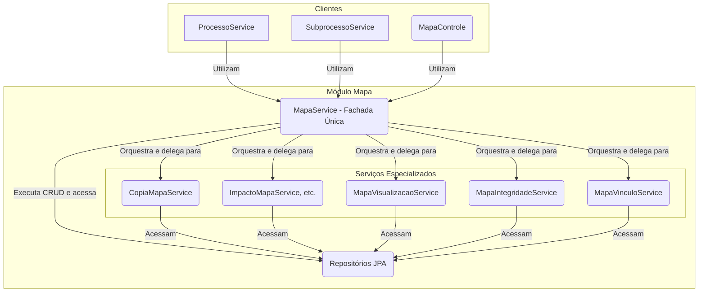

# Módulo de Mapa

## Visão Geral
Este é um dos módulos centrais do sistema, responsável por toda a gestão do **Mapa de Competências**. Um "Mapa" é o artefato que agrega competências, atividades e conhecimentos de uma unidade organizacional.

O pacote se destaca por sua arquitetura orientada a serviços, onde a lógica de negócio complexa é dividida em componentes coesos com responsabilidades únicas.

## Arquitetura de Serviços (Padrão Fachada)
O módulo utiliza o padrão **Service Facade**. O `MapaService` atua como uma fachada única para todos os clientes, sejam eles internos (como `MapaControle`) ou externos (como `ProcessoService`). Ele orquestra os serviços especializados para executar tanto operações de CRUD quanto lógicas de negócio mais complexas.

## Componentes Principais

### Camada de Fachada
- **`MapaService`**: O ponto de entrada único para o módulo. Ele gerencia as operações de CRUD e orquestra os outros serviços para executar operações de alto nível.

### Serviços Especializados
- **`CopiaMapaService`**: Responsável por clonar um mapa existente. É utilizado pelo `ProcessoService`.
- **`ImpactoMapaService`**: Orquestra a análise de diferenças entre duas versões de um mapa.
- **`ImpactoAtividadeService` / `ImpactoCompetenciaService`**: Serviços granulares que analisam os impactos em atividades e competências, respectivamente.
- **`MapaVisualizacaoService`**: Constrói os DTOs de visualização complexos.
- **`MapaIntegridadeService`**: Contém regras de validação para garantir a integridade de um mapa.
- **`MapaVinculoService`**: Gerencia os vínculos entre as entidades do mapa.

### Outros Componentes
- **`MapaControle`**: Expõe a API REST. Delega todas as suas operações para o `MapaService`.
- **`modelo/`**: Contém as entidades JPA, como `Mapa` e `UnidadeMapa`.
- **`dto/`**: Contém os Data Transfer Objects.

## Fluxos de Trabalho Notáveis

### Salvando um Mapa (CRUD)
1.  O `MapaControle` recebe uma requisição com os dados do mapa.
2.  Ele chama o `MapaService.criar(...)` ou `atualizar(...)`.

### Copiando um Mapa para Revisão
1.  O `ProcessoService` (de outro módulo) inicia um processo de revisão.
2.  Ele chama o `MapaService.copiarMapaVigente(...)`.
3.  O `MapaService` delega a chamada para o `CopiaMapaService`.

Esta arquitetura reforça o encapsulamento e a coesão, provendo um ponto de acesso único e claro para as funcionalidades do módulo.
