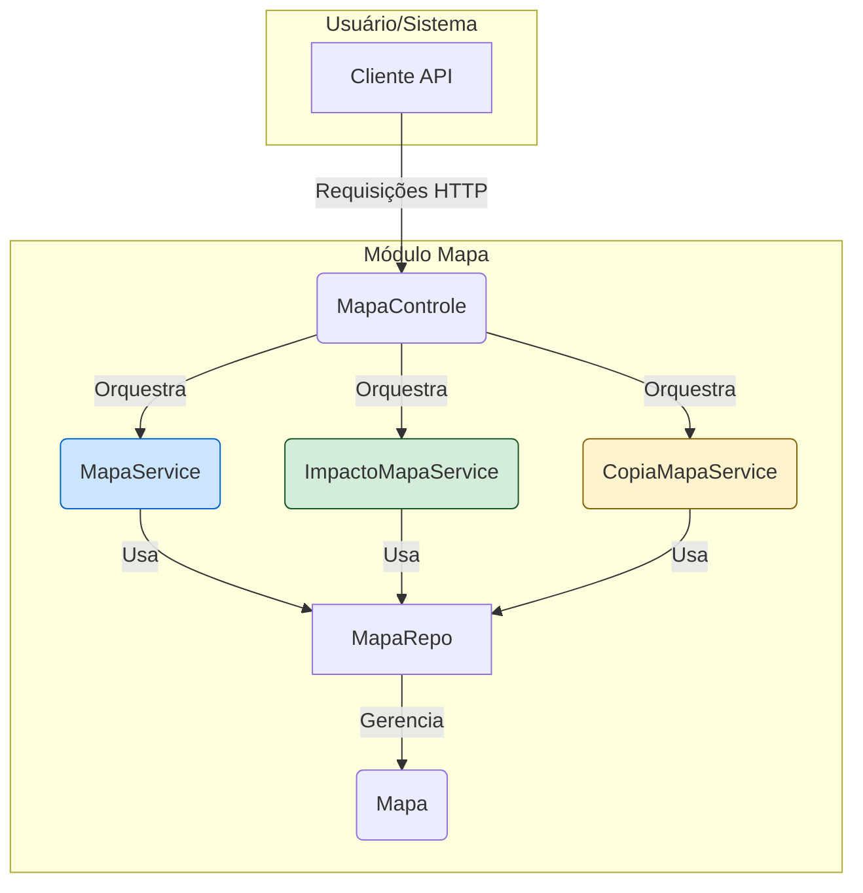

# Módulo de Mapa de Competências - SGC

## Visão Geral
O pacote `mapa` é um dos módulos mais críticos do sistema, responsável por toda a gestão do **Mapa de Competências**. Um "Mapa" é um artefato complexo que representa o conjunto de competências e atividades de uma unidade organizacional em um determinado período.

Este pacote vai muito além de um simples CRUD. Ele orquestra operações de negócio complexas, como a criação e o salvamento transacional de mapas, a validação de sua integridade, a cópia de mapas entre unidades e a análise de impacto de mudanças.

## Arquivos e Componentes Principais

### 1. Entidades Core (`modelo/`)
**Localização:** `backend/src/main/java/sgc/mapa/modelo/`
- **`Mapa.java`**: A entidade JPA central que representa o Mapa de Competências. Possui um ciclo de vida que inclui status como "disponibilizado" e "homologado", com timestamps para cada etapa, e está diretamente associado a uma `Unidade`.
- **`UnidadeMapa.java`**: Entidade que representa a associação entre um mapa e uma unidade, registrando o status do mapa para aquela unidade (ex: `MAPEAMENTO_CONCLUIDO`).

### 2. Serviços de Negócio
Este pacote se destaca pela sua arquitetura orientada a serviços, onde cada serviço tem uma responsabilidade de negócio bem definida.

- **`MapaService.java`**: O principal serviço para a manipulação de mapas. Suas funcionalidades chave incluem:
  - `obterMapaCompleto(...)`: Carrega um mapa com toda a sua árvore de objetos (atividades, conhecimentos, competências).
  - `salvarMapaCompleto(...)`: Executa o salvamento **atômico** de um mapa, garantindo que o mapa, suas competências, atividades e os vínculos sejam salvos de forma consistente dentro de uma única transação.
  - `validarMapaCompleto(...)`: Aplica regras de negócio para garantir a integridade de um mapa antes de ser disponibilizado.

- **`CopiaMapaService.java`**: Serviço especializado na clonagem de mapas. Sua principal função é `copiarMapaParaUnidade(...)`, que cria uma cópia exata de um mapa existente e a associa a uma nova unidade.

- **`ImpactoMapaService.java`**: Implementa a análise de impacto (CDU-12). Sua função `verificarImpactos(...)` compara o mapa atual de uma unidade com uma nova versão e identifica todas as diferenças (atividades adicionadas, removidas, alteradas) e as competências afetadas.

### 3. Controlador REST
- **`MapaControle.java`**: Expõe os endpoints da API para interagir com os serviços do módulo de mapa, orquestrando as chamadas para `MapaService`, `ImpactoMapaService`, etc.

### 4. DTOs (Data Transfer Objects) (`dto/`)
**Localização:** `backend/src/main/java/sgc/mapa/dto/`
- **Descrição:** Este sub-pacote contém DTOs complexos para lidar com as operações do serviço.
- **DTOs Notáveis:**
  - `MapaCompletoDto`: Uma estrutura de dados aninhada que representa o mapa completo, usado para transferir o mapa e suas relações para o frontend de uma só vez.
  - `SalvarMapaRequestDto`: DTO que encapsula todos os dados necessários para a operação de `salvarMapaCompleto`.
  - `ImpactoMapaDto`: DTO que estrutura o resultado da análise de impacto, separando os itens por tipo de mudança (inserido, removido, alterado).

## Fluxos de Operação

### Salvando um Mapa
1.  O frontend envia uma requisição complexa (`SalvarMapaRequestDto`) para o `MapaControle`.
2.  O controller invoca `MapaService.salvarMapaCompleto()`.
3.  Dentro de uma única transação (`@Transactional`), o serviço executa uma sequência de operações (atualiza mapa, exclui/atualiza/cria competências, recria vínculos) para garantir a consistência dos dados. Se qualquer etapa falhar, a transação inteira é revertida.

### Verificando o Impacto de Mudanças
1.  Uma requisição para o endpoint de impacto invoca `ImpactoMapaService.verificarImpactos()`.
2.  O serviço carrega o mapa vigente da unidade e o cadastro de atividades do subprocesso em análise.
3.  Ele compara as duas versões e monta o `ImpactoMapaDto` com as diferenças detalhadas.
4.  O DTO resultante é retornado para ser exibido ao usuário.

## Notas Importantes
- **Complexidade de Negócio**: Este pacote encapsula uma lógica de negócio significativa. A separação em múltiplos serviços é uma prática de design que mantém o código organizado e coeso.
- **Transacionalidade**: A natureza atômica da operação de salvamento (`salvarMapaCompleto`) é crucial para a integridade dos dados e é um pilar da arquitetura deste pacote.
- **DTOs Ricos**: O uso de DTOs complexos e específicos para cada operação é fundamental para gerenciar a complexidade das interações com este módulo.

## Diagrama de Componentes
