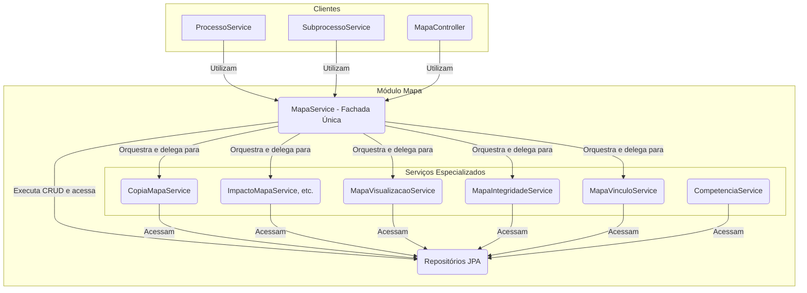

# Módulo de Mapa

Última atualização: 2025-12-14

## Visão Geral

Este é um dos módulos centrais do sistema, responsável por toda a gestão do **Mapa de Competências**. Um "Mapa" é o
artefato que agrega competências, atividades e conhecimentos de uma unidade organizacional.

O pacote se destaca por sua arquitetura orientada a serviços, onde a lógica de negócio complexa é dividida em
componentes coesos com responsabilidades únicas.

## Arquitetura de Serviços (Padrão Fachada)

O módulo utiliza o padrão **Service Facade**. O `MapaService` atua como uma fachada única para todos os clientes, sejam
eles internos (como `MapaController`) ou externos (como `ProcessoService`). Ele orquestra os serviços especializados
para executar tanto operações de CRUD quanto lógicas de negócio mais complexas.

## Componentes Principais

### Camada de Fachada

- **`MapaService`**: O ponto de entrada único para o módulo. Ele gerencia as operações de CRUD e orquestra os outros
  serviços para executar operações de alto nível.

### Serviços Especializados

- **`CompetenciaService`**: Gerencia o ciclo de vida das competências.
- **`CopiaMapaService`**: Responsável por clonar um mapa existente (deep copy), incluindo suas competências, atividades
  e conhecimentos. É utilizado pelo `ProcessoService` ao iniciar ciclos de revisão.
- **`ImpactoMapaService`**: Orquestra a análise de diferenças entre duas versões de um mapa.
- **`ImpactoAtividadeService` / `ImpactoCompetenciaService`**: Serviços granulares que analisam os impactos em
  atividades e competências, respectivamente.
- **`MapaVisualizacaoService`**: Constrói os DTOs de visualização hierárquica complexos para o frontend.
- **`MapaIntegridadeService`**: Contém regras de validação para garantir a integridade de um mapa (ex: regras de
  associação).
- **`MapaVinculoService`**: Gerencia os vínculos entre as entidades do mapa.

### Outros Componentes

- **`MapaController`**: Expõe a API REST. Delega todas as suas operações para o `MapaService`.
- **`model/`**: Contém as entidades JPA:
    - **`Mapa`**: A entidade raiz do agregado.
    - **`Competencia`**: Entidade que representa uma competência técnica.
- **`dto/`**: Contém os Data Transfer Objects (DTOs) para visualização e persistência.

## Fluxos de Trabalho Notáveis

### Salvando um Mapa (CRUD)

1. O `MapaController` recebe uma requisição com os dados do mapa via DTO.
2. O `MapaMapper` converte para entidade.
3. O controller chama `MapaService.criar(...)` ou `atualizar(...)`.

### Copiando um Mapa para Revisão

1. O `ProcessoService` (de outro módulo) inicia um processo de revisão.
2. Ele chama o `MapaService.copiarMapaVigente(...)`.
3. O `MapaService` delega a chamada para o `CopiaMapaService`, que duplica toda a estrutura do mapa.

## Detalhamento técnico (gerado em 2025-12-14)

Resumo detalhado dos artefatos, comandos e observações técnicas gerado automaticamente.
