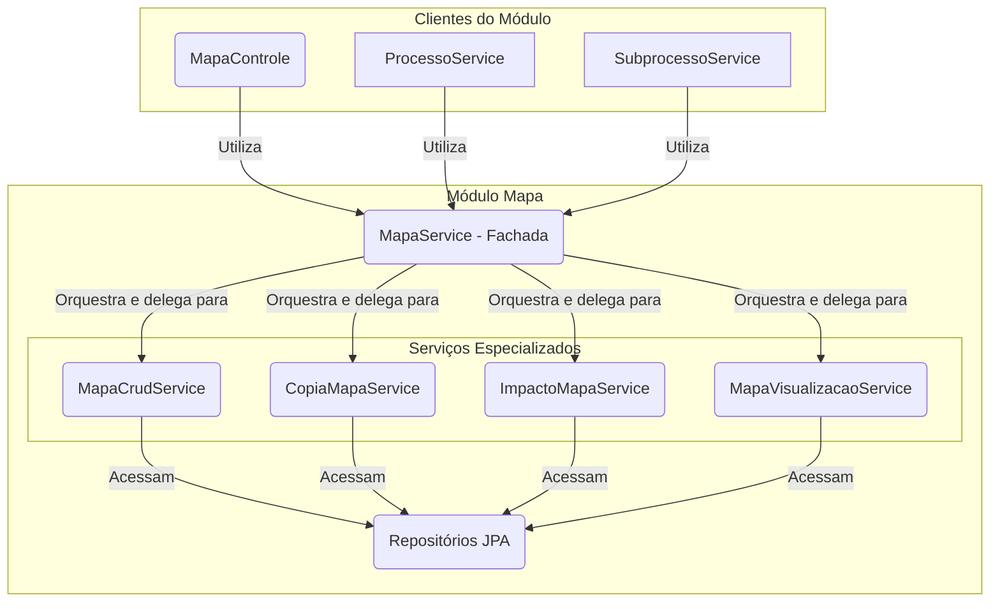

# Módulo de Mapa

## Visão Geral
Este é um dos módulos centrais do sistema, responsável por toda a gestão do **Mapa de Competências**. Um "Mapa" é o artefato que agrega competências, atividades e conhecimentos de uma unidade organizacional.

O pacote se destaca por sua arquitetura orientada a serviços, onde a lógica de negócio complexa é dividida em componentes coesos com responsabilidades únicas.

## Arquitetura de Serviços (Padrão Fachada)
O módulo utiliza o padrão **Service Facade**. O `MapaService` atua como uma fachada, orquestrando as operações e delegando a execução para serviços mais especializados. Isso simplifica a interação para os clientes do módulo (como o `MapaControle`) e mantém cada componente focado em uma única tarefa.

## Componentes Principais

### Camada de Fachada
- **`MapaService`**: O ponto de entrada principal do módulo. Ele não contém lógica de negócio complexa, mas orquestra os outros serviços para executar operações de alto nível, como `salvarMapaCompleto` ou `obterVisualizacao`.

### Serviços Especializados
- **`MapaCrudService`**: Gerencia as operações de criação, atualização e exclusão (CRUD) das entidades do mapa (`Mapa`, `Competencia`, `Atividade`, etc.). Garante a consistência dos dados dentro de uma única transação.
- **`CopiaMapaService`**: Responsável por clonar um mapa existente. É utilizado pelo `ProcessoService` quando um processo de "Revisão" é iniciado.
- **`ImpactoMapaService`**: Analisa as diferenças entre duas versões de um mapa para identificar impactos (itens adicionados, removidos ou alterados). É utilizado pelo `SubprocessoService`.
- **`MapaVisualizacaoService`**: Constrói os DTOs de visualização complexos (`MapaVisualizacaoDto`) que são usados para exibir o mapa na interface do usuário.

### Outros Componentes
- **`MapaControle`**: Expõe a API REST, recebendo requisições e delegando-as para o `MapaService`.
- **`modelo/`**: Contém as entidades JPA, como `Mapa` e `UnidadeMapa`.
- **`dto/`**: Contém os Data Transfer Objects, incluindo DTOs complexos como `MapaVisualizacaoDto` e `ImpactoMapaDto`.

## Fluxos de Trabalho Notáveis

### Salvando um Mapa
1.  O `MapaControle` recebe uma requisição com os dados do mapa.
2.  Ele chama o `MapaService.salvarMapaCompleto(...)`.
3.  O `MapaService` delega a operação para o `MapaCrudService`, que executa todas as operações de persistência de forma atômica e transacional.

### Copiando um Mapa para Revisão
1.  O `ProcessoService` (de outro módulo) inicia um processo de revisão.
2.  Ele chama o `MapaService.copiarMapaVigente(...)`.
3.  O `MapaService` delega a chamada para o `CopiaMapaService`, que executa a clonagem do mapa ativo da unidade.

Esta arquitetura garante que a lógica de negócio seja altamente coesa, testável e fácil de manter, mesmo com a complexidade das operações.