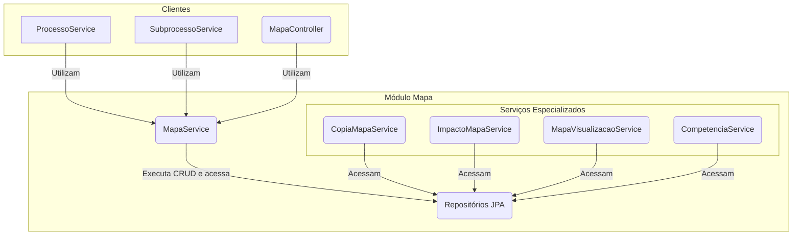

# Módulo de Mapa


## Visão Geral

Este é um dos módulos centrais do sistema, responsável por toda a gestão do **Mapa de Competências**. Um "Mapa" é o
artefato que agrega competências, atividades e conhecimentos de uma unidade organizacional.

O pacote organiza a lógica de negócio em componentes coesos com responsabilidades únicas.

## Arquitetura de Serviços

O módulo utiliza um conjunto enxuto de serviços especializados. O `MapaService` atua como fachada para operações de CRUD
e salvamento de mapas, enquanto serviços auxiliares tratam de funcionalidades específicas.



## Componentes Principais

### Serviços

| Serviço | Responsabilidade |
|---------|------------------|
| **`MapaService`** | CRUD de mapas + salvamento completo com vínculos e validação de integridade |
| **`CompetenciaService`** | Gerencia ciclo de vida das competências |
| **`CopiaMapaService`** | Deep copy de mapas (usado em revisões) |
| **`ImpactoMapaService`** | Análise de diferenças entre mapas (CDU-12) |
| **`MapaVisualizacaoService`** | Constrói DTOs de visualização hierárquica |

### Outros Componentes

- **`MapaController`**: Expõe a API REST. Delega todas as suas operações para o `MapaService`.
- **`model/`**: Contém as entidades JPA:
    - **`Mapa`**: A entidade raiz do agregado.
    - **`Competencia`**: Entidade que representa uma competência técnica.
- **`dto/`**: Contém os Data Transfer Objects (DTOs) para visualização e persistência.

## Fluxos de Trabalho Notáveis

### Salvando um Mapa (CRUD)

1. O `MapaController` recebe uma requisição com os dados do mapa via DTO.
2. O `MapaMapper` converte para entidade.
3. O controller chama `MapaService.criar(...)` ou `atualizar(...)`.

### Copiando um Mapa para Revisão

1. O `ProcessoService` (de outro módulo) inicia um processo de revisão.
2. Ele chama o `MapaService.copiarMapaVigente(...)`.
3. O `MapaService` delega a chamada para o `CopiaMapaService`, que duplica toda a estrutura do mapa.


## Como Testar

Para executar apenas os testes deste módulo:
```bash
./gradlew :backend:test --tests "sgc.mapa.*"
```
