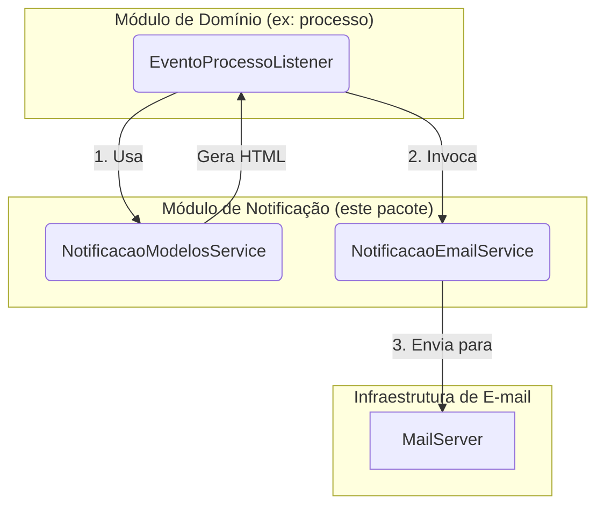

# Módulo de Notificação por E-mail

## Visão Geral

Este pacote é responsável pelo envio de **notificações por e-mail** para os usuários de forma robusta e desacoplada.

## Arquitetura

O módulo de notificação é consumido por listeners de eventos que orquestram a criação de alertas e o envio de e-mails.
Os listeners ficam nos respectivos módulos de domínio (ex: `sgc.processo.listener.EventoProcessoListener`).



### Fluxo de Trabalho:

1. **Captura do Evento:** Um listener de eventos de domínio (ex: `EventoProcessoListener`) captura o evento.
2. **Criação do E-mail:** O listener usa o `NotificacaoModelosService` para gerar o conteúdo HTML do e-mail.
3. **Envio do E-mail:** O listener invoca o `NotificacaoEmailService` para enviar o e-mail.

## Componentes Principais

- **`NotificacaoEmailService`**: Serviço responsável pela lógica de envio de e-mails (perfil de produção).
    - **Assíncrono (`@Async`):** O envio é executado em uma thread separada para não bloquear a requisição original.
    - **Persistência e Auditoria:** Salva um registro da `Notificacao` no banco de dados.

- **`NotificacaoModelosService`**: Serviço utilitário focado em construir o corpo HTML dos e-mails usando templates
  Thymeleaf.

- **`model/Notificacao`**: A entidade JPA que representa o registro de uma notificação enviada.

- **`dto/EmailDto`**: Objeto de transferência para encapsular dados de envio de e-mail.

## Mocks para Testes

Os mocks deste módulo estão em `src/test/java/sgc/notificacao/mock/`:

- `NotificacaoEmailServiceMock` - Mock para perfis `test` e `e2e`
- `NotificacaoModelosServiceMock` - Mock para perfil `test`

## Benefícios da Arquitetura

- **Desacoplamento:** Os serviços de negócio não sabem como as notificações são tratadas.
- **Robustez:** O envio assíncrono de e-mails torna o sistema resiliente a falhas temporárias na infraestrutura de
  e-mail.
- **Reusabilidade:** Os serviços de template e envio podem ser usados por qualquer listener de eventos.

## Como Testar

Para executar apenas os testes deste módulo (a partir do diretório `backend`):

```bash
./gradlew test --tests "sgc.notificacao.*"
```
